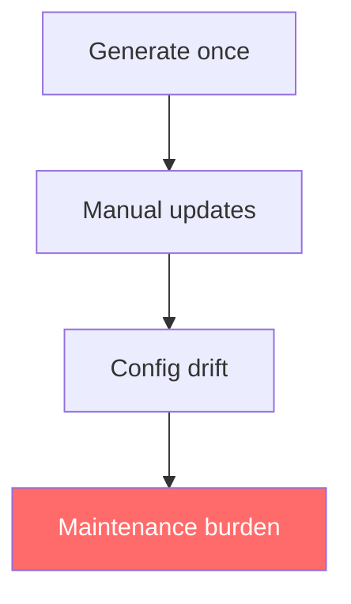
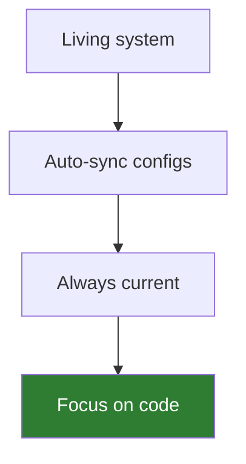
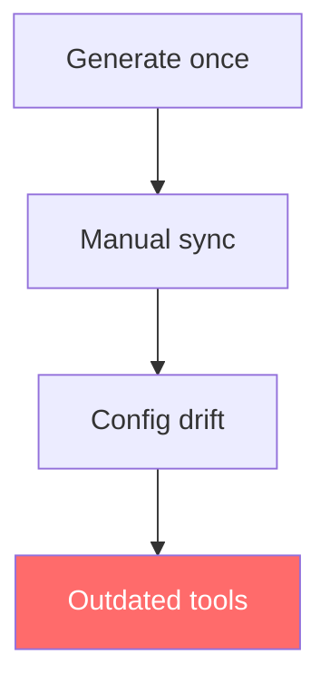
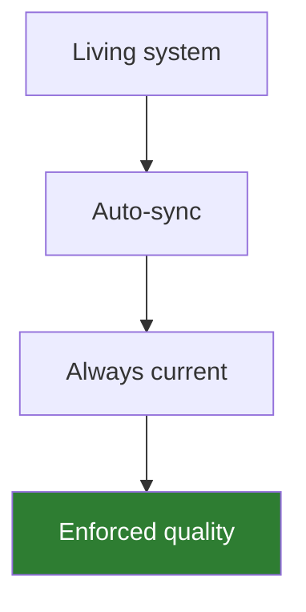
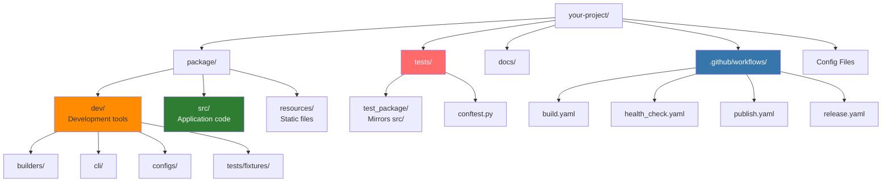

# pyrig

<!-- tooling -->
[](https://github.com/Winipedia/pyrig)
[](https://github.com/astral-sh/uv)
[](https://podman.io/)
[](https://pre-commit.com/)
[](https://www.mkdocs.org/)
<!-- code-quality -->
[](https://github.com/astral-sh/ruff)
[](https://github.com/astral-sh/ty)[](https://mypy-lang.org/)
[](https://github.com/PyCQA/bandit)
[](https://pytest.org/)
[](https://codecov.io/gh/Winipedia/pyrig)
<!-- package-info -->
[](https://pypi.org/project/pyrig/)
[](https://www.python.org/)
[](https://github.com/Winipedia/pyrig/blob/main/LICENSE)
<!-- ci/cd -->
[](https://github.com/Winipedia/pyrig/actions/workflows/health_check.yaml)
[](https://github.com/Winipedia/pyrig/actions/workflows/release.yaml)
<!-- documentation -->
[](https://Winipedia.github.io/pyrig)

---

> A Python toolkit that standardizes and automates project setup, configuration and development.

---

## What is pyrig?

**pyrig** is an opinionated Python project framework that enforces best practices and keeps your projects up-to-date automatically. Unlike traditional project templates, pyrig is a living system that manages your entire development lifecycle. Pyrig makes project development seamless and keeps you focused on your code. It allows even in bigger projects to not lose the overview. Its opinionated and best practices approach allows you to always know what belongs where and where to find things.

<table>
<tr>
<td width="50%">

**Traditional Templates**


</td>
<td width="50%">

**pyrig**


</td>
</tr>
</table>

### Key Features

- **Automated Setup** - Initialize production-ready projects in seconds with `pyrig init`
- **Living Configuration** - Configs stay synchronized automatically, no manual maintenance
- **Enforced Quality** - Strict linting, type checking, testing, and security scanning out of the box
- **Always Current** - Automatic dependency updates and latest tool versions via CI/CD
- **Multi-Package Support** - Build package ecosystems with cross-package discovery of ConfigFiles, Builders, fixtures, and CLI commands
- **Extensible Architecture** - Plugin system for custom ConfigFiles and Builders

### Philosophy

pyrig is designed for **serious, long-term Python projects** where code quality and maintainability matter. It makes opinionated choices about tooling and enforces best practices, so you can focus on building features instead of configuring tools and wondering what is the best way to do something.

**Core principle:** Use the best tools available that work correctly. pyrig chooses modern, fast, reliable tools and enforces them consistently across all projects. This eliminates tool debates and ensures every pyrig project follows the same high standards.

## Quick Start

### Prerequisites

- **GitHub account and repository** - pyrig is GitHub-only (no GitLab/Bitbucket support)
- **Git** with username matching your GitHub username
- **uv** package manager (10-100x faster than pip)
- **Podman** (for containerization, preferred over Docker)

### Installation

```bash
# Create a new GitHub repository (don't initialize with README)
# Clone it locally
git clone https://github.com/YourUsername/your-project.git
cd your-project

# Initialize with uv
uv init

# Add pyrig
uv add pyrig

# Initialize your project (this does everything!)
uv run pyrig init
```

That's it! You now have a fully configured project with:
- Automated testing with pytest (90% coverage requirement)
- Linting and formatting with ruff (ALL rules enabled)
- Type checking with ty and mypy (strict mode)
- Security scanning with bandit
- Pre-commit hooks for quality enforcement
- GitHub Actions CI/CD workflows
- Branch protection and repository security
- Containerfile for deployment
- Custom CLI commands via `dev/cli/subcommands.py` and `dev/cli/shared_subcommands.py`

### Next Steps

After initialization, start coding in `<package>/src/` and run:

```bash
uv run pyrig mktests    # Generate test skeletons
uv run pytest           # Run tests
git add .
git commit -m "Add feature"  # Pre-commit hooks run automatically
git push
```

## Documentation

- **[Documentation Index](docs/index.md)** - Full documentation
- **[Getting Started Guide](docs/getting-started.md)** - Complete guide to creating your first pyrig project
- **[Multi-Package Architecture](docs/multi-package-architecture.md)** - Build package ecosystems with cross-package discovery
- **[Configuration Files Reference](docs/config-files/index.md)** - Detailed documentation for every config file

## Technology Stack

pyrig uses cutting-edge Python tooling:

- **[uv](https://github.com/astral-sh/uv)** - Fast Python package manager
- **[ruff](https://github.com/astral-sh/ruff)** - Extremely fast linter and formatter
- **[ty](https://github.com/astral-sh/ty)** - Fast type checker
- **[mypy](https://mypy-lang.org/)** - Static type checker
- **[pytest](https://pytest.org/)** - Testing framework
- **[bandit](https://github.com/PyCQA/bandit)** - Security scanner
- **[pre-commit](https://pre-commit.com/)** - Git hook framework
- **[Podman](https://podman.io/)** - Daemonless container runtime
- **[GitHub Actions](https://github.com/features/actions)** - CI/CD platform

## What Makes pyrig Different?

<table>
<tr>
<td width="50%">

**Other Templates**


</td>
<td width="50%">

**pyrig**


</td>
</tr>
</table>

**Key Differences:**

| Feature | Other Templates | pyrig |
|---------|----------------|-------|
| Configuration | One-time generation | Living, auto-syncing |
| Best Practices | Suggested | Enforced |
| Updates | Manual | Automatic via CI/CD |
| Scope | Initial setup | Full lifecycle |
| Extensibility | Limited | Plugin architecture |

## Project Structure

pyrig creates a clean, organized structure:



## Requirements

- **Git** (any recent version)
- **uv** package manager (10-100x faster than pip)
- **GitHub account** (required - pyrig is GitHub-only)
- **Podman** (optional, for containerization - preferred over Docker)

## Tool Philosophy

pyrig makes opinionated choices about tooling:

- **Package Manager:** uv (10-100x faster than pip/poetry)
- **Linter/Formatter:** ruff (10-100x faster than black/pylint)
- **Type Checker:** ty + mypy (ty is fast, mypy is comprehensive)
- **Testing:** pytest (industry standard)
- **CI/CD:** GitHub Actions (best integration)
- **Container:** Podman preferred (daemonless, rootless, more secure)

**Why?** pyrig's philosophy is to use the best tools available that work correctly, and integrate deeply with them. This eliminates tool debates, ensures consistency, and provides the best performance.

**Will other tools be supported?** Very unlikely—supporting multiple tools would defeat pyrig's purpose. However, pyrig **will** switch tools when superior alternatives emerge (e.g., we switched from poetry to uv because uv is 10-100x faster).

**Can I customize?** Yes! You can override configs via subclassing or create empty config files to opt-out of specific tools. See [drawbacks documentation](docs/drawbacks.md#3-forced-tool-choices) for details.

## Contributing

Contributions are welcome! pyrig is built with pyrig itself, so you can explore the codebase to see how it works.

## License

MIT License - see [LICENSE](LICENSE) for details.

## Links

- **PyPI**: [pypi.org/project/pyrig](https://pypi.org/project/pyrig/)
- **Documentation**: [docs/](docs/)
- **Issues**: [github.com/Winipedia/pyrig/issues](https://github.com/Winipedia/pyrig/issues)
- **Source**: [github.com/Winipedia/pyrig](https://github.com/Winipedia/pyrig)
