# Architecture Overview

This document provides a comprehensive overview of pyrig's architecture, including visual diagrams of key systems and data flows.

## System Architecture

### High-Level Architecture

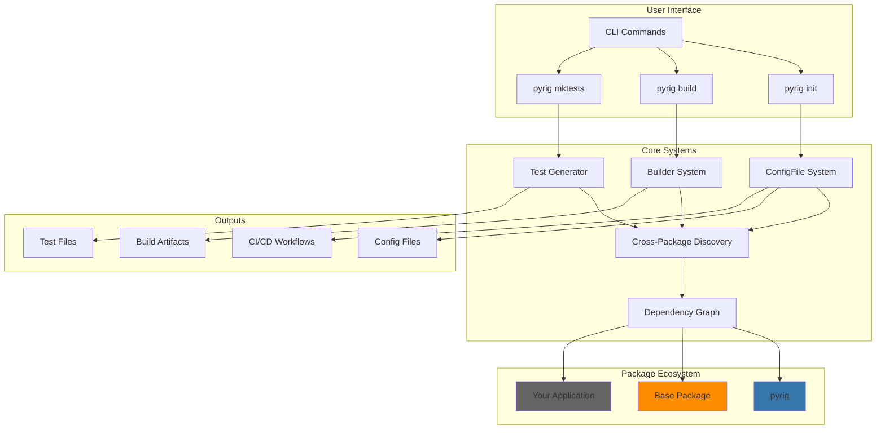

### Dependency Graph System

The dependency graph is the foundation of pyrig's multi-package architecture:

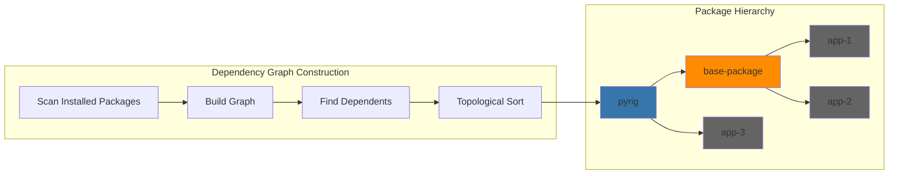

### ConfigFile Lifecycle

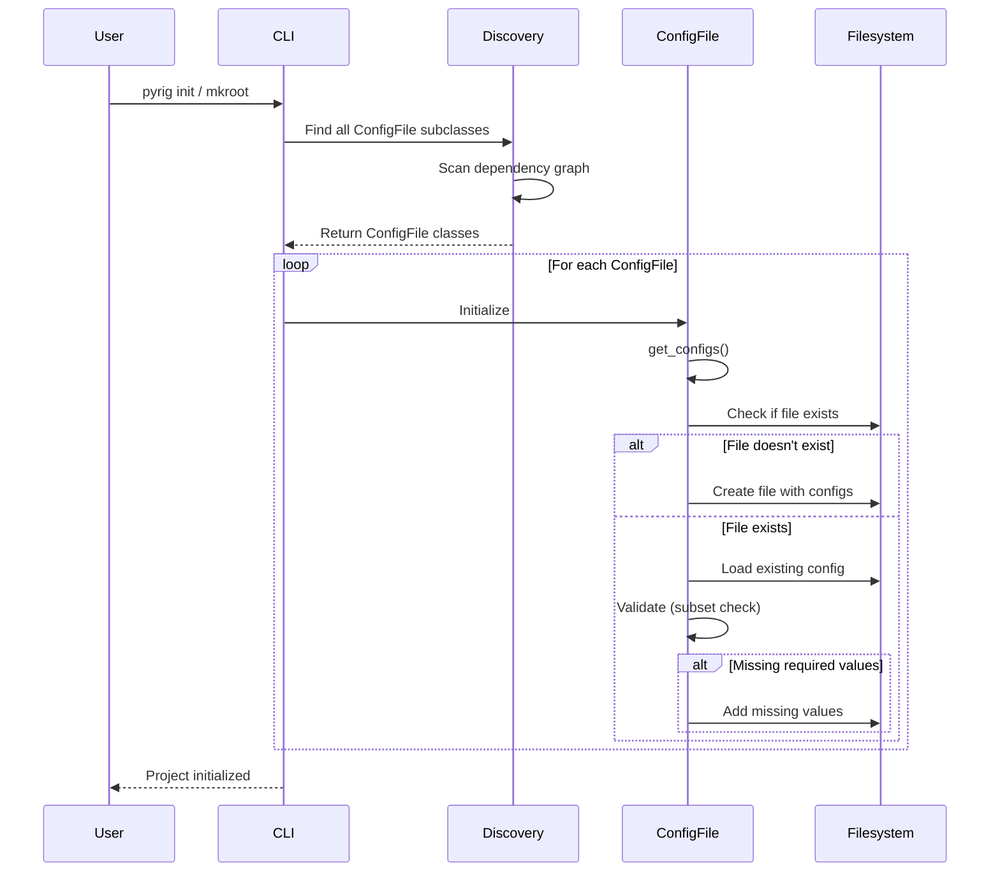

## Data Flow Diagrams

### Initialization Flow

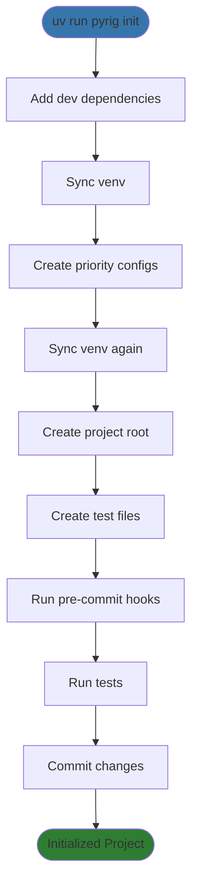

### Build Flow

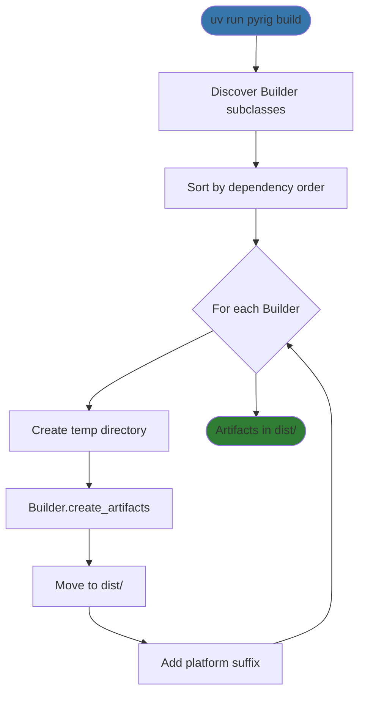

### Test Generation Flow

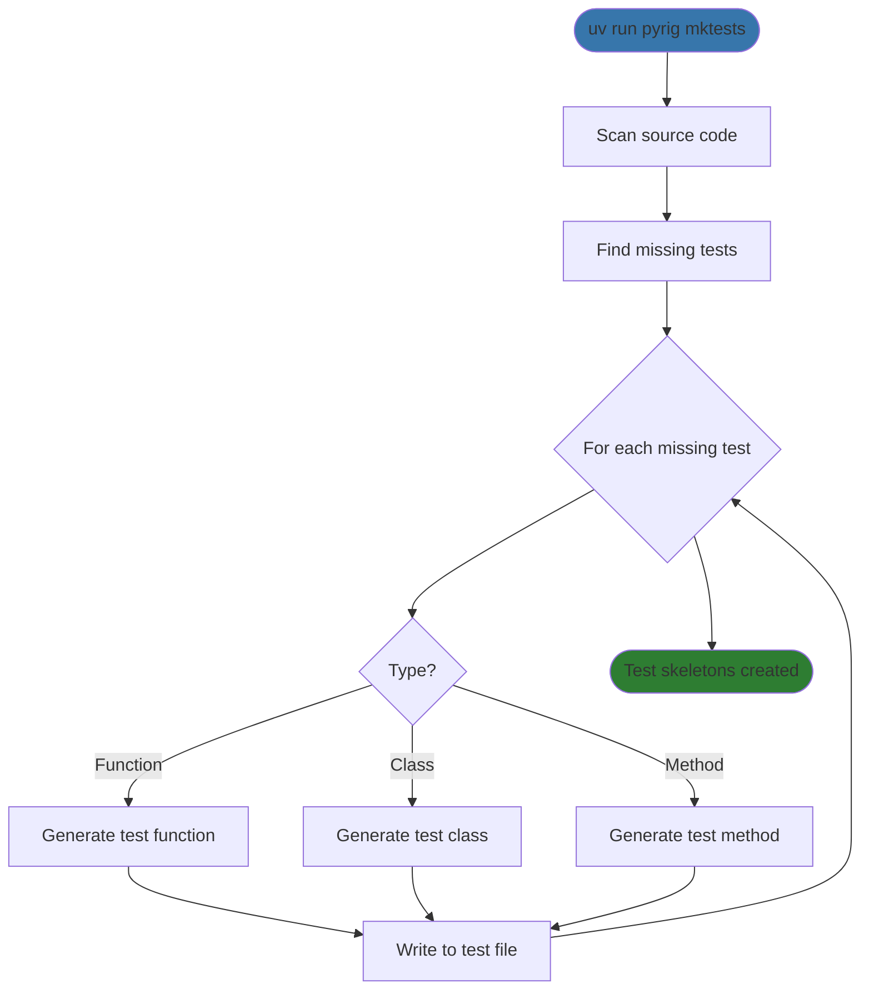

## Plugin Architecture

### ConfigFile Plugin System

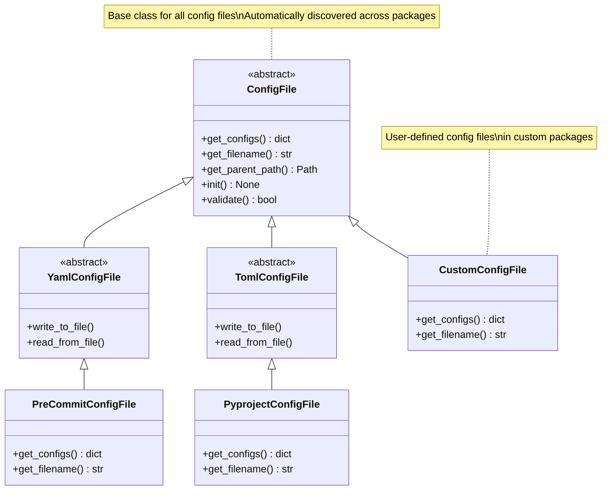

### Builder Plugin System

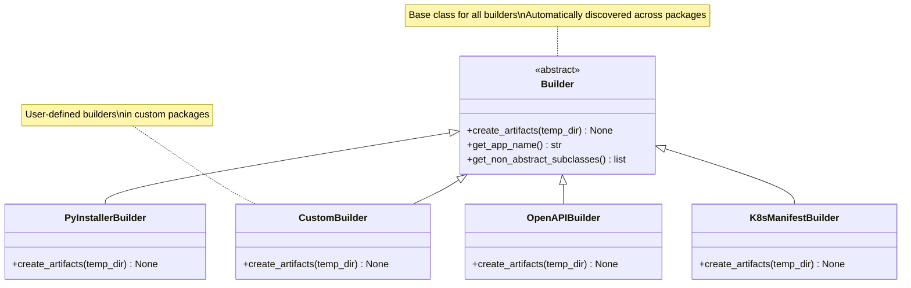

## Multi-Package Discovery

### Cross-Package Module Discovery

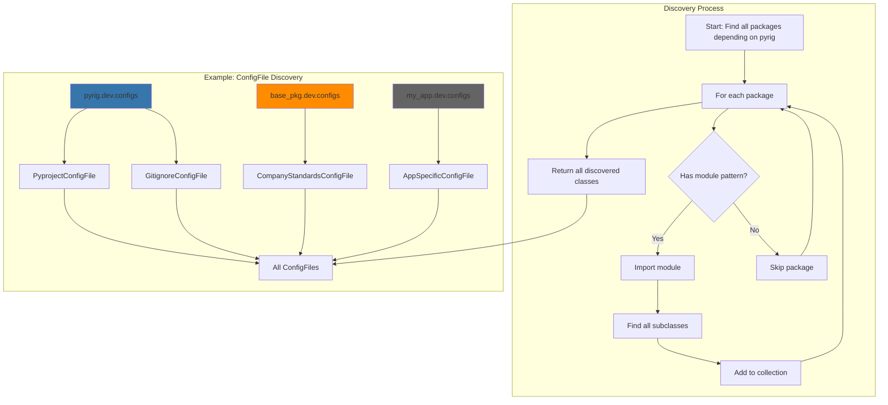

### Fixture Discovery and Registration

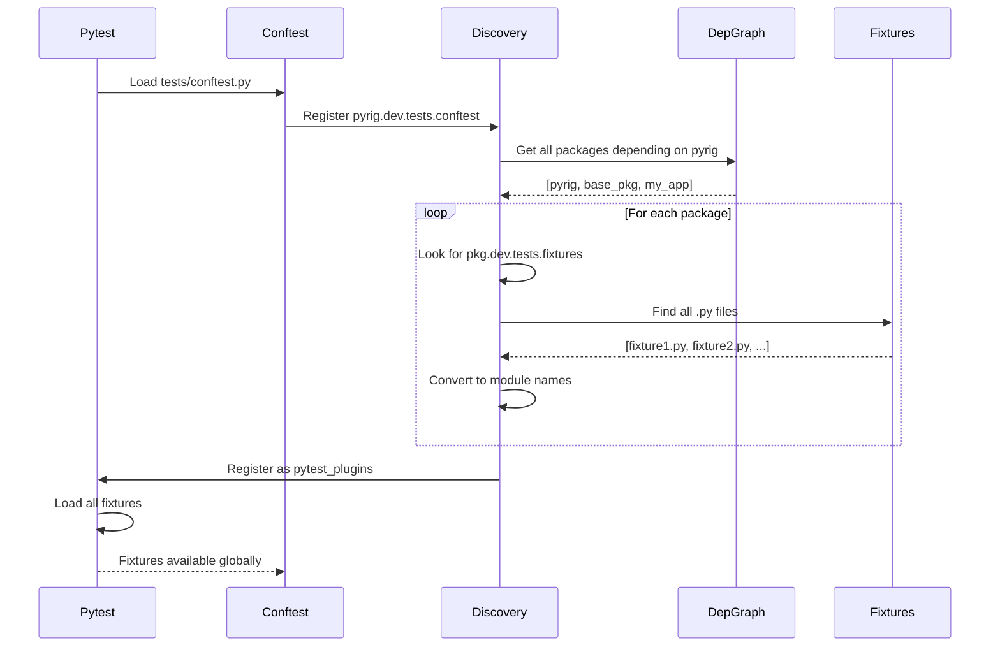

## Component Interaction

### CLI Command Flow

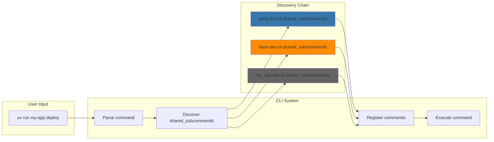

## See Also

- [Getting Started Guide](getting-started.md) - Initial project setup
- [Multi-Package Architecture](multi-package-architecture.md) - Detailed multi-package guide
- [Configuration Files Reference](config-files/) - All config file documentation

