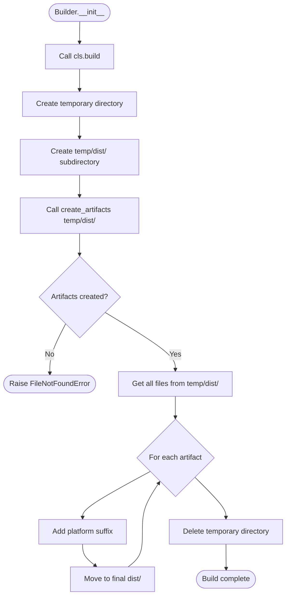

# Builder System

## Overview

The Builder system is pyrig's mechanism for generating distributable artifacts. Builders are classes that automatically create executables, documentation, configuration files, or any other build artifacts your project needs.

**Key Concept:** Builders are discovered automatically across your package ecosystem and invoked with a single command: `pyrig build`.

## How Builders Work

### The Base Class

All builders in pyrig are subclasses of the `Builder` abstract base class. The base class provides:

- **Automatic execution** - Instantiating a Builder triggers the build
- **Temporary directory management** - Safe isolated build environment
- **Artifact management** - Moves artifacts to `dist/` with platform suffixes
- **Cross-package discovery** - Finds builders across all dependent packages

### The Build Process

When you run `pyrig build`, each Builder goes through this process:



### Step-by-Step Breakdown

#### 1. **Instantiation Triggers Build**
```python
def __init__(self) -> None:
    self.__class__.build()
```
Simply creating an instance of a Builder automatically starts the build process.

#### 2. **Create Temporary Directory**
```python
with tempfile.TemporaryDirectory() as temp_build_dir:
    temp_dir_path = Path(temp_build_dir)
    temp_artifacts_dir = cls.get_temp_artifacts_path(temp_dir_path)
```
Creates an isolated temporary directory for the build. This ensures:
- No conflicts with existing files
- Clean build environment
- Automatic cleanup on completion

#### 3. **Invoke create_artifacts()**
```python
cls.create_artifacts(temp_artifacts_dir)
```
Calls your custom build logic. You write artifacts to the temporary directory.

#### 4. **Collect Artifacts**
```python
artifacts = cls.get_temp_artifacts(temp_artifacts_dir)
```
Finds all files created in the temporary directory.

#### 5. **Rename and Move**
```python
cls.rename_artifacts(artifacts)
```
Moves each artifact to `dist/` with a platform-specific suffix:
- `myapp` → `myapp-Linux` (on Linux)
- `myapp` → `myapp-Darwin` (on macOS)
- `myapp.exe` → `myapp-Windows.exe` (on Windows)

## Required Methods for Subclasses

Every Builder subclass must implement:

### `create_artifacts(temp_artifacts_dir: Path) -> None`

This is where you define your build logic.

```python
from pathlib import Path
from pyrig.dev.builders.base.base import Builder

class MyBuilder(Builder):
    @classmethod
    def create_artifacts(cls, temp_artifacts_dir: Path) -> None:
        """Create your artifacts here."""
        # Write artifacts to temp_artifacts_dir
        output_file = temp_artifacts_dir / "myapp"
        output_file.write_text("#!/usr/bin/env python\nprint('Hello')")
        output_file.chmod(0o755)
```

**Important:**
- Write all artifacts to `temp_artifacts_dir`
- Don't write to `dist/` directly
- The directory is guaranteed to exist
- All files in this directory will be moved to `dist/`

## Platform Suffix Handling

Artifacts are automatically renamed with platform suffixes:

```python
def rename_artifacts(cls, artifacts: list[Path]) -> None:
    artifacts_dir = cls.get_artifacts_dir()
    artifacts_dir.mkdir(parents=True, exist_ok=True)
    for artifact in artifacts:
        new_name = f"{artifact.stem}-{platform.system()}{artifact.suffix}"
        new_path = artifacts_dir / new_name
        shutil.move(str(artifact), str(new_path))
```

**Examples:**

| Original | Platform | Final Name |
|----------|----------|------------|
| `myapp` | Linux | `myapp-Linux` |
| `myapp` | Darwin | `myapp-Darwin` |
| `myapp.exe` | Windows | `myapp-Windows.exe` |
| `docs.zip` | Linux | `docs-Linux.zip` |

**Why platform suffixes?**
- Allows building on multiple platforms
- Prevents overwriting artifacts from different platforms
- Makes it clear which artifact is for which platform

## Automatic Discovery

pyrig automatically discovers all Builder subclasses in:

1. **pyrig's own builders** - Built-in builders (if any)
2. **Your project's builders** - Files in `{package}/dev/builders/`
3. **Dependency builders** - Builders from packages that depend on pyrig

### Discovery Process

```python
@classmethod
def get_non_abstract_subclasses(cls) -> list[type["Builder"]]:
    return get_all_nonabst_subcls_from_mod_in_all_deps_depen_on_dep(
        cls,
        pyrig,
        builders,
        discard_parents=True,
    )
```

This scans the dependency graph and finds all non-abstract Builder subclasses in `dev.builders` modules.

### Running All Builders

```python
@classmethod
def init_all_non_abstract_subclasses(cls) -> None:
    for builder_cls in cls.get_non_abstract_subclasses():
        builder_cls()
```

When you run `pyrig build`, this method instantiates every discovered Builder, triggering all builds.

## Helper Methods

The Builder base class provides several helper methods:

### `get_app_name() -> str`

Get the project name from pyproject.toml:

```python
@classmethod
def get_app_name(cls) -> str:
    return PyprojectConfigFile.get_project_name()
```

### `get_artifacts_dir() -> Path`

Get the final output directory (default: `dist/`):

```python
@classmethod
def get_artifacts_dir(cls) -> Path:
    return Path(cls.ARTIFACTS_DIR_NAME)
```

### `get_artifacts() -> list[Path]`

Get all artifacts from the final output directory:

```python
@classmethod
def get_artifacts(cls) -> list[Path]:
    return list(cls.get_artifacts_dir().glob("*"))
```

### `get_root_path() -> Path`

Get the project root directory:

```python
@classmethod
def get_root_path(cls) -> Path:
    src_pkg = get_src_package()
    src_path = ModulePath.pkg_type_to_dir_path(src_pkg)
    return src_path.parent
```

## PyInstallerBuilder

pyrig provides a specialized builder for creating standalone executables with PyInstaller:

### Overview

`PyInstallerBuilder` extends `Builder` with PyInstaller-specific functionality:

- **Automatic icon conversion** - Converts PNG to platform-appropriate format (ico/icns)
- **Resource bundling** - Includes resources from all dependent packages
- **Platform-specific configuration** - Handles Windows/macOS/Linux differences
- **One-file executables** - Creates single-file executables by default

### Required Methods

Subclasses must implement:

#### `get_additional_resource_pkgs() -> list[ModuleType]`

Return packages containing resources to bundle:

```python
from pyrig.dev.builders.pyinstaller import PyInstallerBuilder
import my_app.resources

class MyAppBuilder(PyInstallerBuilder):
    @classmethod
    def get_additional_resource_pkgs(cls) -> list[ModuleType]:
        return [my_app.resources]
```

**Automatically included:**
- Resources from `dev/artifacts/resources` directories
- Resources from all packages depending on pyrig

### How It Works

```python
@classmethod
def create_artifacts(cls, temp_artifacts_dir: Path) -> None:
    options = cls.get_pyinstaller_options(temp_artifacts_dir)
    run(options)
```

The builder:
1. Generates PyInstaller command-line options
2. Converts icon to appropriate format
3. Collects all resources
4. Runs PyInstaller
5. Outputs executable to temporary directory

### PyInstaller Options

Default options used:

```python
options = [
    str(cls.get_main_path()),           # Entry point
    "--name", cls.get_app_name(),       # Executable name
    "--clean",                           # Clean build
    "--noconfirm",                       # No confirmation
    "--onefile",                         # Single file
    "--noconsole",                       # No console window
    "--workpath", str(temp_workpath),   # Build directory
    "--specpath", str(temp_specpath),   # Spec file directory
    "--distpath", str(temp_distpath),   # Output directory
    "--icon", str(icon_path),           # Application icon
]
```

Plus `--add-data` for each resource package.

## Real-World Examples

### Example 1: Simple Script Builder

Create a shell script artifact:

```python
# my_project/dev/builders/script.py
from pathlib import Path
from pyrig.dev.builders.base.base import Builder

class ScriptBuilder(Builder):
    """Builds a deployment script."""

    @classmethod
    def create_artifacts(cls, temp_artifacts_dir: Path) -> None:
        script_content = f"""#!/bin/bash
# Deployment script for {cls.get_app_name()}

echo "Deploying {cls.get_app_name()}..."
# Add deployment logic here
"""
        script_path = temp_artifacts_dir / "deploy.sh"
        script_path.write_text(script_content)
        script_path.chmod(0o755)
```

**Result:** Creates `dist/deploy-Linux.sh` (or `-Darwin.sh`, `-Windows.sh`)

### Example 2: Documentation Builder

Generate API documentation:

```python
# my_project/dev/builders/docs.py
from pathlib import Path
from pyrig.dev.builders.base.base import Builder
import json

class DocsBuilder(Builder):
    """Builds API documentation as JSON."""

    @classmethod
    def create_artifacts(cls, temp_artifacts_dir: Path) -> None:
        # Generate documentation
        docs = {
            "project": cls.get_app_name(),
            "version": "1.0.0",
            "endpoints": [
                {"path": "/api/users", "method": "GET"},
                {"path": "/api/users", "method": "POST"},
            ]
        }

        docs_path = temp_artifacts_dir / "api-docs.json"
        docs_path.write_text(json.dumps(docs, indent=2))
```

**Result:** Creates `dist/api-docs-Linux.json`

### Example 3: Configuration Builder

Generate environment-specific configs:

```python
# my_project/dev/builders/config.py
from pathlib import Path
from pyrig.dev.builders.base.base import Builder
import yaml

class ConfigBuilder(Builder):
    """Builds deployment configurations."""

    @classmethod
    def create_artifacts(cls, temp_artifacts_dir: Path) -> None:
        environments = ["development", "staging", "production"]

        for env in environments:
            config = {
                "environment": env,
                "app_name": cls.get_app_name(),
                "debug": env == "development",
                "log_level": "DEBUG" if env == "development" else "INFO",
            }

            config_path = temp_artifacts_dir / f"config-{env}.yaml"
            config_path.write_text(yaml.dump(config))
```

**Result:** Creates:
- `dist/config-development-Linux.yaml`
- `dist/config-staging-Linux.yaml`
- `dist/config-production-Linux.yaml`

### Example 4: Archive Builder

Create a distributable archive:

```python
# my_project/dev/builders/archive.py
from pathlib import Path
from pyrig.dev.builders.base.base import Builder
import shutil

class ArchiveBuilder(Builder):
    """Builds a distributable archive."""

    @classmethod
    def create_artifacts(cls, temp_artifacts_dir: Path) -> None:
        # Create archive directory structure
        archive_name = f"{cls.get_app_name()}-release"
        archive_dir = temp_artifacts_dir / archive_name
        archive_dir.mkdir()

        # Copy files
        root = cls.get_root_path()
        shutil.copy(root / "README.md", archive_dir)
        shutil.copy(root / "LICENSE", archive_dir)

        # Create archive
        shutil.make_archive(
            str(temp_artifacts_dir / archive_name),
            'zip',
            temp_artifacts_dir,
            archive_name
        )

        # Remove directory (keep only zip)
        shutil.rmtree(archive_dir)
```

**Result:** Creates `dist/my-project-release-Linux.zip`

### Example 5: PyInstaller Executable

Create a standalone executable:

```python
# my_project/dev/builders/app.py
from pyrig.dev.builders.pyinstaller import PyInstallerBuilder
import my_project.resources

class AppBuilder(PyInstallerBuilder):
    """Builds standalone executable."""

    @classmethod
    def get_additional_resource_pkgs(cls) -> list[ModuleType]:
        return [my_project.resources]
```

**Result:** Creates `dist/my-project-Linux` (or `.exe` on Windows)

## Common Patterns

### Pattern 1: Multi-Artifact Builder

Create multiple artifacts in one builder:

```python
@classmethod
def create_artifacts(cls, temp_artifacts_dir: Path) -> None:
    # Create multiple artifacts
    (temp_artifacts_dir / "app.exe").write_bytes(b"...")
    (temp_artifacts_dir / "config.yaml").write_text("...")
    (temp_artifacts_dir / "README.txt").write_text("...")
```

All three files will be moved to `dist/` with platform suffixes.

### Pattern 2: Conditional Artifacts

Create different artifacts based on platform:

```python
import platform

@classmethod
def create_artifacts(cls, temp_artifacts_dir: Path) -> None:
    if platform.system() == "Windows":
        # Windows-specific artifact
        (temp_artifacts_dir / "installer.exe").write_bytes(b"...")
    else:
        # Unix-specific artifact
        (temp_artifacts_dir / "installer.sh").write_text("#!/bin/bash\n...")
```

### Pattern 3: Dynamic Naming

Use project metadata in artifact names:

```python
@classmethod
def create_artifacts(cls, temp_artifacts_dir: Path) -> None:
    from pyrig.dev.configs.pyproject import PyprojectConfigFile

    version = PyprojectConfigFile.get_version()
    app_name = cls.get_app_name()

    artifact_name = f"{app_name}-v{version}.tar.gz"
    # Create artifact with version in name
```

### Pattern 4: External Tool Integration

Run external build tools:

```python
import subprocess

@classmethod
def create_artifacts(cls, temp_artifacts_dir: Path) -> None:
    # Run external build tool
    subprocess.run([
        "docker", "build",
        "-t", cls.get_app_name(),
        "-f", "Containerfile",
        "."
    ], check=True)

    # Export image
    output = temp_artifacts_dir / "image.tar"
    subprocess.run([
        "docker", "save",
        "-o", str(output),
        cls.get_app_name()
    ], check=True)
```

## Running Builders

### CLI Command

```bash
# Build all artifacts
uv run pyrig build

# This discovers and runs all Builder subclasses
```

### Programmatically

```python
from pyrig.dev.builders.base.base import Builder

# Run all builders
Builder.init_all_non_abstract_subclasses()

# Run specific builder
from my_project.dev.builders.app import AppBuilder
AppBuilder()
```

### In CI/CD

Builders are automatically run in the Build workflow:

```yaml
- name: Build Artifacts
  run: uv run pyrig build
```

## Best Practices

### ✅ DO

- **Write to temp directory** - Always write to `temp_artifacts_dir`
- **Use helper methods** - Use `get_app_name()`, `get_root_path()`, etc.
- **Handle errors** - Raise exceptions if build fails
- **Create meaningful artifacts** - Name files clearly
- **Document your builder** - Add docstrings explaining what it builds
- **Test your builder** - Ensure it works on all target platforms

### ❌ DON'T

- **Don't write to dist/ directly** - Use the temp directory
- **Don't hardcode paths** - Use `get_root_path()` and relatives
- **Don't ignore platform differences** - Test on all platforms
- **Don't create empty artifacts** - Ensure files have content
- **Don't leave temp files** - Clean up any temporary files you create
- **Don't assume dependencies** - Check tools are available before using

## Troubleshooting

### Problem: No artifacts created

**Cause:** `create_artifacts()` didn't write any files to `temp_artifacts_dir`.

**Solution:** Ensure you're writing to the correct directory:

```python
@classmethod
def create_artifacts(cls, temp_artifacts_dir: Path) -> None:
    # ✅ Correct
    (temp_artifacts_dir / "myapp").write_text("content")

    # ❌ Wrong - writes to current directory
    Path("myapp").write_text("content")
```

### Problem: FileNotFoundError

**Cause:** No files found in temporary directory after build.

**Solution:** Check that `create_artifacts()` actually creates files:

```python
@classmethod
def create_artifacts(cls, temp_artifacts_dir: Path) -> None:
    output = temp_artifacts_dir / "myapp"
    output.write_text("content")

    # Debug: verify file exists
    assert output.exists(), f"Failed to create {output}"
```

### Problem: Builder not discovered

**Cause:** Builder class is abstract or not in the right location.

**Solution:** Ensure:
1. Class is in `{package}/dev/builders/` directory
2. Class extends `Builder` or `PyInstallerBuilder`
3. Class implements all abstract methods
4. Class is not marked as abstract

### Problem: Platform suffix incorrect

**Cause:** Running on different platform than expected.

**Solution:** Platform suffix is determined by `platform.system()`:
- Linux → `-Linux`
- macOS → `-Darwin`
- Windows → `-Windows`

This is automatic and cannot be changed.

## Related Documentation

- [builders-init.md](config-files/builders-init.md) - The builders package
- [architecture.md](architecture.md) - System architecture overview
- [build-workflow.md](config-files/build-workflow.md) - CI/CD build workflow

