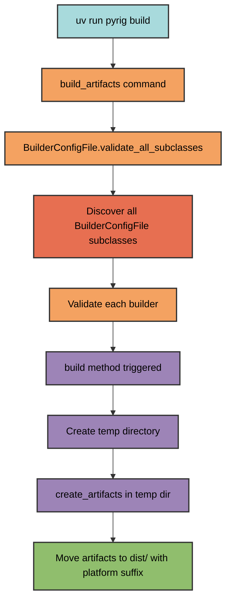
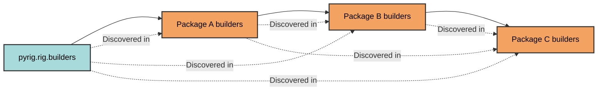

# Builder Architecture

pyrig's builder system uses automatic discovery to find and execute all
BuilderConfigFile subclasses across packages, enabling extensible artifact
creation.

## How It Works



## Builder Discovery

Builders are discovered through the dependency graph:



### Discovery Process

1. **Find all packages** depending on pyrig using dependency graph
2. **Locate builders modules** equivalent to `pyrig.rig.builders` in each
   package
3. **Find all BuilderConfigFile subclasses** in those modules
4. **Filter non-abstract classes** (discard parent classes, keep leaf
   implementations)
5. **Validate each builder** to trigger the build process

This means only the most specific (leaf) implementations are executed. If you
have a non-abstract BuilderConfigFile in package A and then subclass that class
in package B, then only the subclass in B will be executed. The same behavior
applies to ConfigFiles.

## BuilderConfigFile Base Class

The `BuilderConfigFile` abstract base class provides the framework for creating
custom builders. It inherits from `ListConfigFile` but repurposes the interface
for artifact generation rather than configuration file management.

See [ConfigFile Architecture](../configs/architecture.md) for details on the
parent class.

All builders must:

- Inherit from `BuilderConfigFile`
- Implement the `create_artifacts` method
- Be placed in a `rig/builders/` module

When validated, the builder automatically triggers the build process. Builds
happen in isolated temporary directories to avoid polluting the workspace.
Artifacts are moved to `dist/` with platform suffixes (e.g., `my-app-Linux`,
`my-app-Darwin`, `my-app-Windows`).

See the `BuilderConfigFile` docstrings for method details.

## Creating a Custom Builder

### Basic Example

```python
import shutil
from pathlib import Path
from pyrig.rig.builders.base.base import BuilderConfigFile

class DocumentationBuilder(BuilderConfigFile):
    def create_artifacts(self, temp_artifacts_dir: Path) -> None:
        """Build documentation as a zip file."""

        docs_dir = self.root_path() / "docs"
        output_zip = temp_artifacts_dir / "docs"

        shutil.make_archive(str(output_zip), 'zip', docs_dir)
```

### File Location

Place builders in your package's builders module:

```text
myapp/
└── rig/
    └── builders/
        ├── __init__.py
        └── documentation.py  # DocumentationBuilder defined here
```

Note: You actually should not need a documentation builder because pyrig will
host your documentation for you on GitHub Pages via the workflows and build them
via MkDocs. This is just an example of how subclassing the BuilderConfigFile
base class works.

### Automatic Discovery

When you run `uv run pyrig build`, pyrig:

1. Finds `myapp.rig.builders` module
2. Discovers `DocumentationBuilder` class
3. Validates it, triggering the build
4. Outputs `dist/docs-Linux.zip` (or platform-specific name)

## Multi-Package Example

```text
pyrig (no concrete builders)
│
Package A (depends on pyrig)
├── rig/
│   └── builders/
│       └── executable.py  # PyInstallerBuilder subclass
│
Package B (depends on Package A)
├── rig/
    └── builders/
        └── documentation.py  # Custom builder

Running `uv run pyrig build`:
✓ Discovers PyInstallerBuilder subclass from Package A
✓ Discovers DocumentationBuilder from Package B
✓ Builds both artifacts
✓ Outputs to dist/ with platform suffixes
```

## Helper Methods

The `BuilderConfigFile` class provides utilities for accessing project paths
such as the project root, source package, resources directory, and entry point.
These are particularly useful for PyInstaller builders and custom build
processes. See the class docstrings for the full list.

Note: If you set up your project correctly, you should never need to manually
execute `uv run pyrig build` because the CI/CD pipeline will automatically build
artifacts, upload them to GitHub, and add them to releases.
