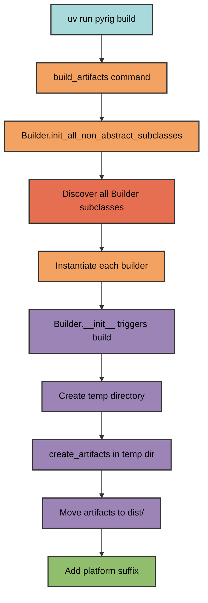
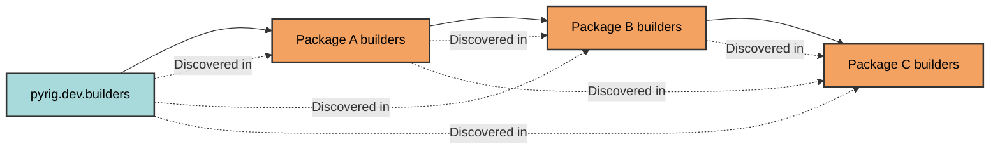

# Builder Architecture

pyrig's builder system uses automatic discovery to find and execute all Builder
subclasses across packages, enabling extensible artifact creation.

## How It Works



## Builder Discovery

Builders are discovered through the dependency graph:



### Discovery Process

1. **Find all packages** depending on pyrig using dependency graph
2. **Locate builders modules** equivalent to `pyrig.dev.builders` in each
   package
3. **Find all Builder subclasses** in those modules
4. **Filter non-abstract classes** (discard parent classes, keep leaf
   implementations)
5. **Instantiate each builder** to trigger the build process

This means only the most specific (leaf) implementations are executed. If you
have a non-abstract Builder in package A and then subclass that class in package
B, then only the subclass in B will be executed. The same behavior applies to
ConfigFiles.

## Builder Base Class

The `Builder` abstract base class provides the framework for creating custom
builders. All builders must:

- Inherit from `Builder`
- Implement the `create_artifacts` method
- Be placed in a `dev/builders/` module

When instantiated, the builder automatically triggers the build process.

### Key Methods

| Method                        | Purpose                                                    |
| ----------------------------- | ---------------------------------------------------------- |
| `create_artifacts`            | **Abstract** - Implement to define build logic             |
| `build`                       | Orchestrates temp directory, artifact creation, and moving |
| `get_artifacts_dir`           | Returns final output directory (default: `dist/`)          |
| `rename_artifacts`            | Adds platform suffix to artifacts                          |
| `get_non_abstract_subclasses` | Discovers all builders across packages                     |

## Build Process

The build process follows these steps:

### 1. Temporary Directory Creation

Builds happen in isolated temporary directories to avoid polluting the
workspace.

### 2. Artifact Creation

Your `create_artifacts` implementation writes artifacts to the temporary
directory.

### 3. Artifact Collection

All files in the temp directory are collected as artifacts.

### 4. Platform-Specific Naming

Artifacts are moved to `dist/` with platform suffixes:

- `my-app-Linux` on Linux
- `my-app-Darwin` on macOS
- `my-app-Windows` on Windows

## Creating a Custom Builder

### Basic Example

```python
import shutil
from pathlib import Path
from pyrig.dev.builders.base.base import Builder

class DocumentationBuilder(Builder):
    @classmethod
    def create_artifacts(cls, temp_artifacts_dir: Path) -> None:
        """Build documentation as a zip file."""

        docs_dir = cls.get_root_path() / "docs"
        output_zip = temp_artifacts_dir / "docs"

        shutil.make_archive(str(output_zip), 'zip', docs_dir)
```

### File Location

Place builders in your package's builders module:

```text
myapp/
└── dev/
    └── builders/
        ├── __init__.py
        └── documentation.py  # DocumentationBuilder defined here
```

Note: You actually should not need a documentation builder because pyrig will
host your documentation for you on GitHub Pages via the workflows and build them
via MkDocs. This is just an example of how subclassing the Builder base class
works.

### Automatic Discovery

When you run `uv run pyrig build`, pyrig:

1. Finds `myapp.dev.builders` module
2. Discovers `DocumentationBuilder` class
3. Instantiates it, triggering the build
4. Outputs `dist/docs-Linux.zip` (or platform-specific name)

## Multi-Package Example

```text
pyrig (no concrete builders)
│
Package A (depends on pyrig)
├── builders/
│   └── executable.py  # PyInstallerBuilder subclass
│
Package B (depends on Package A)
├── builders/
    └── documentation.py  # Custom builder

Running `uv run pyrig build`:
✓ Discovers ExecutableBuilder from Package A
✓ Discovers DocumentationBuilder from Package B
✓ Builds both artifacts
✓ Outputs to dist/ with platform suffixes
```

## Helper Methods

The `Builder` class provides utilities for accessing project paths:

| Method                 | Returns                          |
| ---------------------- | -------------------------------- |
| `get_app_name()`       | Project name from pyproject.toml |
| `get_root_path()`      | Project root directory           |
| `get_main_path()`      | Path to main.py entry point      |
| `get_resources_path()` | Path to resources directory      |
| `get_src_pkg_path()`   | Path to source package           |

These are particularly useful for PyInstaller builders and custom build
processes.

Note: If you set up your project correctly, you should never need to manually
execute `uv run pyrig build` because the CI/CD pipeline will automatically build
artifacts, upload them to GitHub, and add them to releases.
