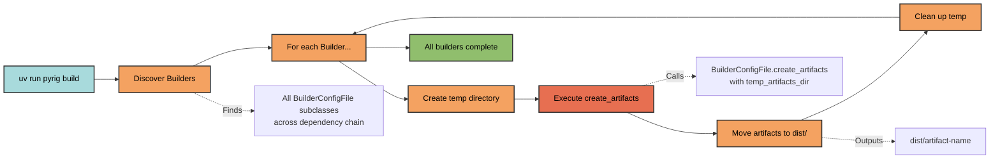

# Builder Documentation

pyrig provides an extensible builder system for creating distributable
artifacts. Builders are automatically discovered and executed across all
packages in the dependency chain.

## Documentation Pages

### [Builder Architecture](architecture.md)

Learn how the builder system works:

- Automatic builder discovery
- Multi-package support
- Build process flow
- Artifact management

### [PyInstaller Builder](pyinstaller.md)

Use the built-in PyInstaller builder for creating standalone executables:

- Creating executables from Python projects
- Resource bundling
- Icon management
- Platform-specific builds
- Customization options

## Quick Overview

The builder system provides:

- **Automatic discovery** of all `BuilderConfigFile` subclasses across packages
- **Multi-package support** through dependency graph traversal
- **Platform-specific artifacts** with automatic naming
- **Temporary build isolation** for clean builds
- **Built-in PyInstaller support** for executable creation

### Builder Execution Flow



## Quick Start

Build all artifacts:

```bash
uv run pyrig build
```

This discovers and executes all non-abstract `BuilderConfigFile` subclasses in
your project and its dependencies that also depend on pyrig.

## Creating a Custom Builder

Subclass `BuilderConfigFile` and implement `create_artifacts`:

```python
from pathlib import Path
from pyrig.dev.builders.base.base import BuilderConfigFile

class MyBuilder(BuilderConfigFile):
    @classmethod
    def create_artifacts(cls, temp_artifacts_dir: Path) -> None:
        """Create your artifacts."""
        output_file = temp_artifacts_dir / "my-artifact.zip"
        # Create your artifact
        output_file.write_text("artifact content")
```

Place this in `myapp/dev/builders/my_builder.py` and it will be automatically
discovered when running `uv run pyrig build`. Any other file location within the
`dev/builders` module will also work.
