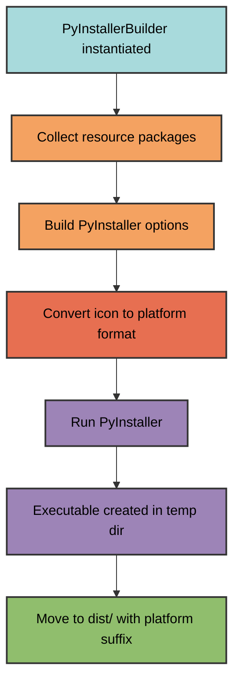
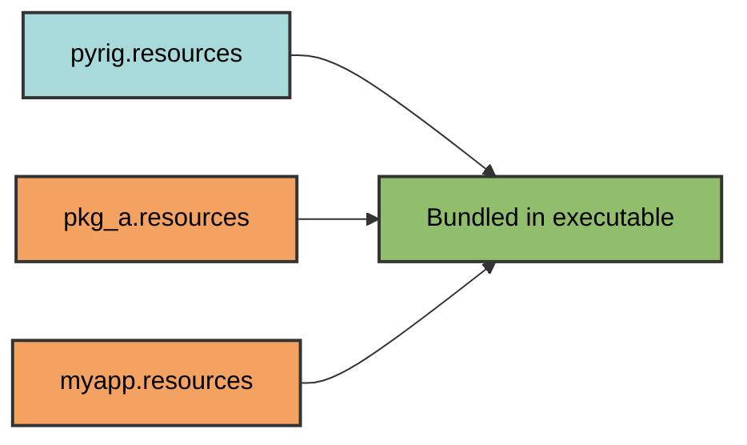

# PyInstaller Builder

pyrig provides `PyInstallerBuilder`, an abstract builder for creating standalone
executables from Python projects using PyInstaller.

Note: The entire reason your main.py file is generated with a
`if __name__ == "__main__":` guard is so that it can be used as an executable
entry point. PyInstaller needs to execute that file to create a proper
executable. We also kept it because it is a Python standard. However, we prefer
using the CLI framework for running code.

## Overview

`PyInstallerBuilder` handles:

- **Executable creation** with PyInstaller
- **Resource bundling** from multiple packages
- **Icon conversion** to platform-specific formats
- **Platform-specific configuration** (Windows/macOS/Linux)
- **Automatic resource discovery** across dependency chain

## Quick Start

### 1. Create a Builder Subclass

```python
from types import ModuleType
from pyrig.dev.builders.pyinstaller import PyInstallerBuilder
import myapp.resources

class MyAppBuilder(PyInstallerBuilder):
    @classmethod
    def get_additional_resource_pkgs(cls) -> list[ModuleType]:
        """Specify packages containing resources to bundle."""
        return [myapp.resources]
```

A use case we had was that we needed to add the migrations folder for a database
once as we had it not located in the resources directory, which is autoincluded
by PyInstallerBuilder.

### 2. Add an Icon

Place `icon.png` in your resources directory:

```text
myapp/
└── resources/
    └── icon.png  # 256x256 PNG recommended
```

Note: You can also override `get_app_icon_png_path` to use a different icon at a
custom location. However, it's recommended to keep it in the resources
directory.

### 3. Build

```bash
uv run pyrig build
```

Output: `dist/myapp-Linux` (or `myapp-Darwin`, `myapp-Windows`)

## How It Works



## Resource Bundling

### Automatic Resource Discovery

Resources are automatically collected from:

1. **All packages depending on pyrig** - their `resources` modules
2. **Your additional packages** - specified in `get_additional_resource_pkgs`



### Resource Package Structure

```text
myapp/
└── resources/
    ├── __init__.py
    ├── icon.png
    ├── config.json
    └── templates/
        └── default.html
```

All files in resource packages are bundled into the executable as additional
data files via the same relative path using the pyinstaller method from its
utils hooks:

```python
from PyInstaller.utils.hooks import collect_data_files

datas = collect_data_files('myapp.resources')
```

## Icon Management

### Icon Conversion

PyInstaller requires platform-specific icon formats:

- **Windows**: `.ico`
- **macOS**: `.icns`
- **Linux**: `.png` (PyInstaller ignores the `--icon` parameter on Linux,
but the icon is still processed for consistency)

`PyInstallerBuilder` automatically converts your `icon.png` to the appropriate
format for Windows and macOS. On Linux, the PNG icon is passed through without
conversion, but PyInstaller will not embed it in the executable as Linux
executables do not support embedded icons.

### Custom Icon Location

Override `get_app_icon_png_path` to use a different icon:

```python
from pathlib import Path
from types import ModuleType
from pyrig.dev.builders.pyinstaller import PyInstallerBuilder
import myapp.another_resources_pkg

class MyAppBuilder(PyInstallerBuilder):
    @classmethod
    def get_additional_resource_pkgs(cls) -> list[ModuleType]:
        return [myapp.another_resources_pkg]

    @classmethod
    def get_app_icon_png_path(cls) -> Path:
        """Use custom icon location."""
        return cls.get_root_path() / "assets" / "custom-icon.png"
```

## PyInstaller Options

The builder generates these PyInstaller options:

| Option        | Value                            | Purpose                                       |
| ------------- | -------------------------------- | --------------------------------------------- |
| (positional)  | `cls.get_main_path()`            | Entry point script (main.py)                  |
| `--name`      | Project name from pyproject.toml | Executable name                               |
| `--onefile`   | Enabled                          | Single executable file                        |
| `--noconsole` | Enabled                          | No console window (GUI mode)                  |
| `--clean`     | Enabled                          | Clean build cache                             |
| `--noconfirm` | Enabled                          | Replace output directory without confirmation |
| `--icon`      | Platform-specific icon           | Application icon                              |
| `--add-data`  | All resource packages            | Bundle resources                              |
| `--workpath`  | Temp directory                   | Build artifacts location                      |
| `--specpath`  | Temp directory                   | Spec file location                            |
| `--distpath`  | Temp directory                   | Output location                               |

### Customizing Options

Override `get_pyinstaller_options` for full control:

```python
class MyAppBuilder(PyInstallerBuilder):
    @classmethod
    def get_additional_resource_pkgs(cls) -> list[ModuleType]:
        return [myapp.resources]

    @classmethod
    def get_pyinstaller_options(cls, temp_artifacts_dir: Path) -> list[str]:
        """Customize PyInstaller options."""
        options = super().get_pyinstaller_options(temp_artifacts_dir)

        # Remove --noconsole to show console
        options.remove("--noconsole")

        # Add hidden imports
        options.extend(["--hidden-import", "my_hidden_module"])

        return options
```

## Advanced Methods Reference

The following methods are available for advanced customization:

### Resource Management

- **`get_default_additional_resource_pkgs()`**:
    Returns resource packages from all pyrig-dependent packages (automatic)
- **`get_all_resource_pkgs()`**:
    Combines default and additional resource packages
- **`get_add_datas()`**: Builds the `--add-data` arguments for PyInstaller

### Path Management

- **`get_temp_workpath(temp_dir: Path)`**:
    Returns the temporary work directory for PyInstaller
- **`get_temp_specpath(temp_dir: Path)`**:
    Returns the temporary spec file directory
- **`get_temp_distpath(temp_dir: Path)`**:
    Returns the temporary distribution output path

### Icon Management

- **`get_app_icon_png_path()`**:
    Returns the path to the source PNG
    icon file (default: `<src_pkg>/resources/icon.png`)
- **`get_app_icon_path(temp_dir: Path)`**:
    Returns the platform-appropriate icon path
- **`convert_png_to_format(file_format: str, temp_dir_path: Path)`**:
    Converts the icon to the specified format

Override these methods for fine-grained control over the build process.

## Advanced Customization

### Multiple Resource Packages

```python
import myapp.resources
import myapp.templates
import myapp.data

class MyAppBuilder(PyInstallerBuilder):
    @classmethod
    def get_additional_resource_pkgs(cls) -> list[ModuleType]:
        return [
            myapp.resources,
            myapp.templates,
            myapp.data,
        ]
```

### Console Application

```python
class MyConsoleAppBuilder(PyInstallerBuilder):
    @classmethod
    def get_additional_resource_pkgs(cls) -> list[ModuleType]:
        return [myapp.resources]

    @classmethod
    def get_pyinstaller_options(cls, temp_artifacts_dir: Path) -> list[str]:
        options = super().get_pyinstaller_options(temp_artifacts_dir)
        options.remove("--noconsole")  # Show console window
        return options
```

### Custom Output Directory

```python
class MyAppBuilder(PyInstallerBuilder):
    ARTIFACTS_DIR_NAME = "build/executables"  # Custom output directory

    @classmethod
    def get_additional_resource_pkgs(cls) -> list[ModuleType]:
        return [myapp.resources]
```

## Multi-Package Example

```text
pyrig (base package)
├── resources/
│   └── base-config.json
│
Package A (depends on pyrig)
├── resources/
│   └── pkg-a-data.json
│
My App (depends on Package A)
├── dev/
│   └── builders/
│       └── executable.py  # MyAppBuilder
└── resources/
    ├── icon.png
    └── app-config.json

Running `uv run pyrig build`:
✓ Discovers MyAppBuilder
✓ Bundles pyrig.resources (base-config.json)
✓ Bundles pkg_a.resources (pkg-a-data.json)
✓ Bundles myapp.resources (icon.png, app-config.json)
✓ Converts icon.png to platform format
✓ Creates executable: dist/myapp-Linux
```

## Requirements

PyInstaller builder requires PyInstaller and Pillow (for icon conversion). These
dependencies are included automatically when you add `pyrig-dev` to your
development dependencies:

```toml
[dependency-groups]
dev = [
    "pyrig-dev>=0.1.1",
]
```

The `pyrig-dev` package includes all necessary build tools including PyInstaller
and Pillow.
