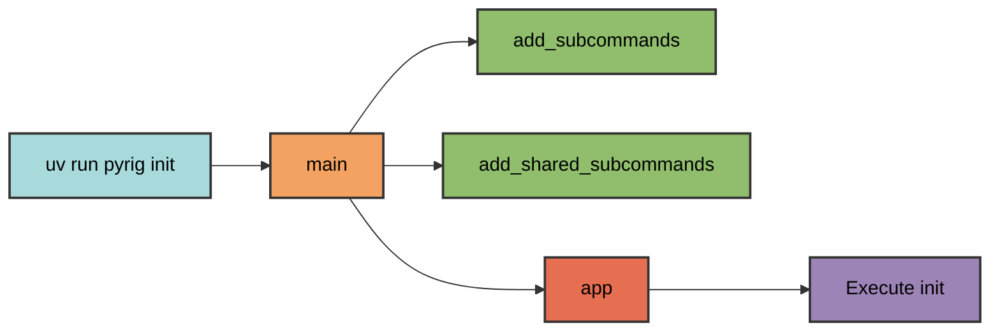
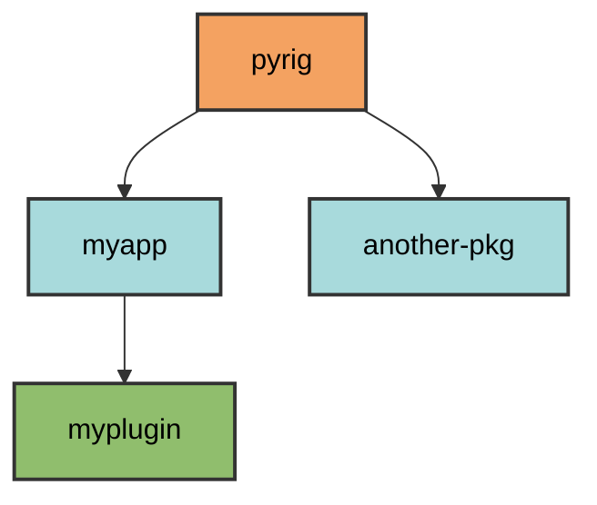
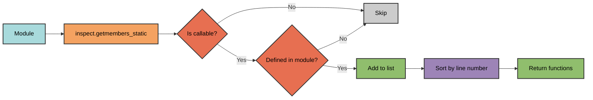
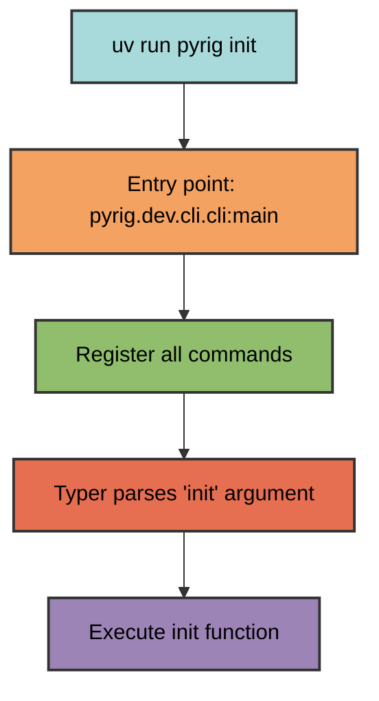

# CLI Architecture

The pyrig CLI uses dynamic command discovery to automatically register commands
from module functions. This enables both pyrig's built-in commands and
project-specific commands in packages that depend on pyrig.

## Entry Point

Commands are invoked through the console script entry point defined in
`pyproject.toml`:

```toml
[project.scripts]
pyrig = "pyrig.dev.cli.cli:main"
```

Running `uv run pyrig <command>` calls the `main()` function in
`pyrig/dev/cli/cli.py`.

## Command Registration Flow

The `main()` function orchestrates command discovery in three steps:

1. **Register project-specific commands** - Discovers commands from the current
   package's `subcommands` module
2. **Register shared commands** - Discovers commands from all packages in the
   dependency chain
3. **Execute Typer application** - Runs the CLI with all registered commands

### Global Options

The CLI provides global options that apply to all commands through a Typer
callback that runs before any command executes, configuring the logging system:

- **Default (no flags)**: INFO level with clean formatting
- **`-v`**: DEBUG level with level prefix
- **`-vv`**: DEBUG level with module names
- **`-vvv`**: DEBUG level with timestamps and full details
- **`-q/--quiet`**: WARNING level (only warnings and errors)

**Important**: Global options must be specified **before** the command name:

```bash
uv run pyrig -v build      # Correct
uv run pyrig build -v      # Incorrect
```



### Project-Specific Commands

The `add_subcommands()` function discovers commands for the current package:

1. **Extract package name** from `sys.argv[0]`
2. **Register main entry point**
Imports and registers `main()` from `<package>.main`
3. **Replace module names** to find the package's `subcommands` module
4. **Import the subcommands module** for the package
5. **Extract all functions** from the module
6. **Register each function** as a Typer command


Example: When running `uv run myapp deploy`, the system:

- Detects package name: `myapp`
- Imports and registers `main()` from `myapp/main.py`
- Replaces `pyrig.dev.cli.subcommands` → `myapp.dev.cli.subcommands`
- Imports `myapp/dev/cli/subcommands.py`
- Registers all functions as commands (e.g., `deploy`, `status`, etc.)

### Shared Commands

The `add_shared_subcommands()` function discovers commands across the package
ecosystem:

1. **Build a dependency graph** of all installed packages
2. **Find all packages** that depend on pyrig
3. **For each package**, import its `shared_subcommands` module
4. **Register all functions** from each module

This enables commands like `version` to work in any package that depends on
pyrig.

## Module Name Replacement

The system uses module name replacement to support multi-package architectures:

```python
get_module_name_replacing_start_module(pyrig.dev.cli.subcommands, "myapp")
# Returns: "myapp.dev.cli.subcommands"
```

This allows any package depending on pyrig to define its own commands by
following the same module structure.

## Dependency Graph

The `DependencyGraph` class builds a directed graph of package dependencies:

```python
graph = DependencyGraph.cached()
packages = graph.get_all_depending_on("pyrig", include_self=True)
# Returns: [<module 'pyrig'>, <module 'myapp'>, ...] in topological order
# (list of imported ModuleType objects, not strings)
```



This enables discovery of all packages in the pyrig ecosystem and their
corresponding command modules.

## Function Discovery

The `get_all_functions_from_module()` utility extracts all functions defined in
a module:

- Uses `inspect.getmembers_static()` to find all module members
- Filters to only callable functions
- Excludes imported functions (only functions defined in the module)
- Sorts by definition order (line number)



This automatic discovery means adding a new command requires only defining a
function in the appropriate module.

## Import Strategy

The system uses a fallback import strategy for robustness:

1. **Try normal import** by module name
2. **Fall back to file-based import** if the module isn't in `sys.path`

This handles edge cases where modules may not be properly installed or are in
development mode. Mainly can be important when files are created during init and
are not seen by normal imports yet.

## Command Execution

Once registered, Typer handles argument parsing and command execution:



The function's docstring becomes the command's help text, and Typer
automatically generates argument parsing from the function signature.

The pyrig CLI system is designed for project automation and development
workflows, not for building complex CLI applications. It provides a convenient
way to execute project commands without the verbosity of
`python -m myapp.subpkg.subpkg2.module` or the boilerplate of
`if __name__ == "__main__":` guards. Simply define functions in your
`subcommands.py` module and they become accessible as `uv run myapp <command>`.
I suppose if done right you can also use it to build some more complex CLI apps
on top of it but that is not the intended primary use case.
