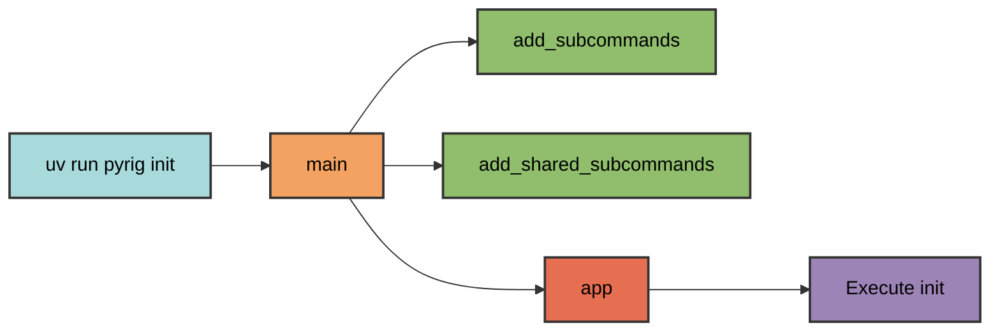
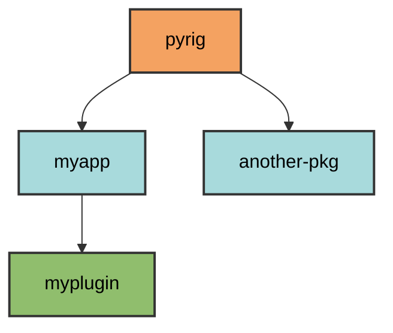
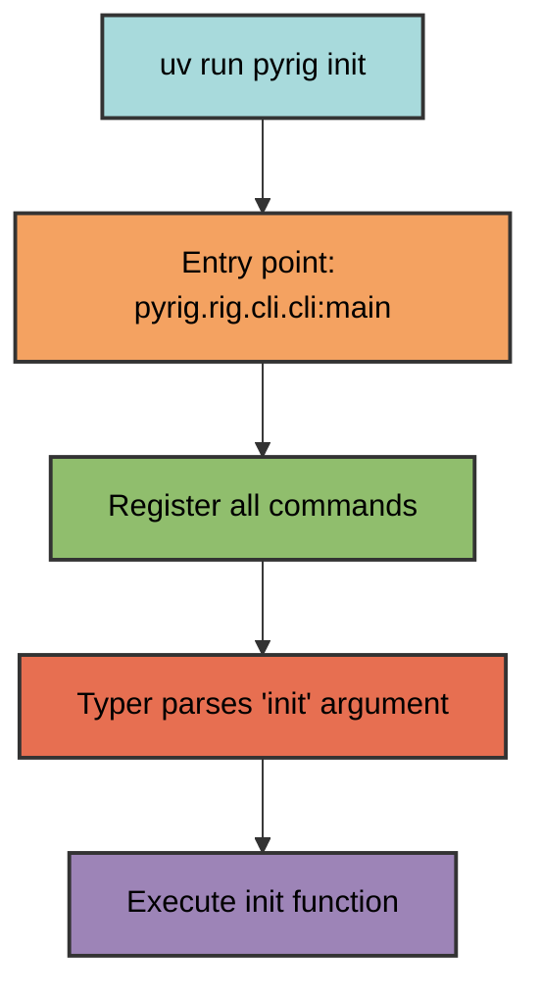

# CLI Architecture

The pyrig CLI uses dynamic command discovery to automatically register commands
from module functions. This enables both pyrig's built-in commands and
project-specific commands in packages that depend on pyrig.

## Entry Point

Commands are invoked through the console script entry point defined in
`pyproject.toml`:

```toml
[project.scripts]
pyrig = "pyrig.rig.cli.cli:main"
```

Running `uv run pyrig <command>` calls the `main()` function in
`pyrig/dev/cli/cli.py`.

## Command Registration Flow

The `main()` function orchestrates command discovery in three steps:

1. **Register project-specific commands** - Discovers commands from the current
   package's `subcommands` module
2. **Register shared commands** - Discovers commands from all packages in the
   dependency chain
3. **Execute Typer application** - Runs the CLI with all registered commands

### Global Options

The CLI provides global options that apply to all commands through a Typer
callback that runs before any command executes, configuring the logging system:

- **Default (no flags)**: INFO level with clean formatting
- **`-v`**: DEBUG level with level prefix
- **`-vv`**: DEBUG level with module names
- **`-vvv`**: DEBUG level with timestamps and full details
- **`-q/--quiet`**: WARNING level (only warnings and errors)

**Important**: Global options must be specified **before** the command name:

```bash
uv run pyrig -v build      # Correct
uv run pyrig build -v      # Incorrect
```



### Project-Specific Commands

Each package can define its own CLI commands by creating a `subcommands` module
at `<package>.dev.cli.subcommands`. When the CLI runs, it:

1. Determines the current package from the invocation
2. Registers the package's `main()` entry point
3. Discovers and registers all functions from the package's `subcommands` module

Example: When running `uv run myapp deploy`:

- The CLI detects package name: `myapp`
- Imports and registers `main()` from `myapp.main`
- Imports `myapp.dev.cli.subcommands`
- Registers all functions as commands (e.g., `deploy`, `status`)

### Shared Commands

Shared commands are available across all pyrig-based projects. They are defined
in `<package>.dev.cli.shared_subcommands` modules and automatically discovered
across the entire dependency chain from pyrig to the current package.

Commands are registered in dependency order (pyrig first). If multiple packages
define the same command name, the last one registered takes precedence.

This enables commands like `version` to work in any package that depends on
pyrig, while adapting to each project's context.

## Module Name Replacement

The system uses module name replacement to support multi-package architectures.
Given a module path within pyrig (e.g., `pyrig.rig.cli.subcommands`), the CLI
can derive the equivalent path in any dependent package (e.g.,
`myapp.dev.cli.subcommands`).

This allows any package depending on pyrig to define its own commands by
following the same module structure.

## Dependency Graph

The CLI uses a `DependencyGraph` to discover all packages that depend on pyrig.
This graph is built from installed Python distributions and sorted in
topological order (dependencies before dependents).



This enables discovery of all packages in the pyrig ecosystem and their
corresponding command modules.

## Function Discovery

Functions are automatically discovered from subcommand modules. The system
extracts only functions defined directly in the module (excluding imports) and
registers them as CLI commands in their source definition order.

This means adding a new command requires only defining a function in the
appropriate module—no registration boilerplate is needed.

## Import Strategy

The system uses a fallback import strategy for robustness:

1. **Try normal import** by module name
2. **Fall back to file-based import** if the module isn't in `sys.path`

This handles edge cases where modules may not be properly installed or are in
development mode. Mainly can be important when files are created during init and
are not seen by normal imports yet.

## Command Execution

Once registered, Typer handles argument parsing and command execution:



The function's docstring becomes the command's help text, and Typer
automatically generates argument parsing from the function signature.

The pyrig CLI system is designed for project automation and development
workflows. It provides a convenient way to execute project commands without the
verbosity of `python -m myapp.subpkg.subpkg2.module` or the boilerplate of
`if __name__ == "__main__":` guards. Simply define functions in your
`subcommands.py` module and they become accessible as `uv run myapp <command>`.
