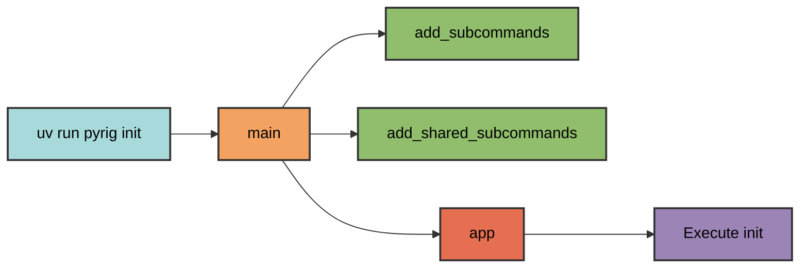
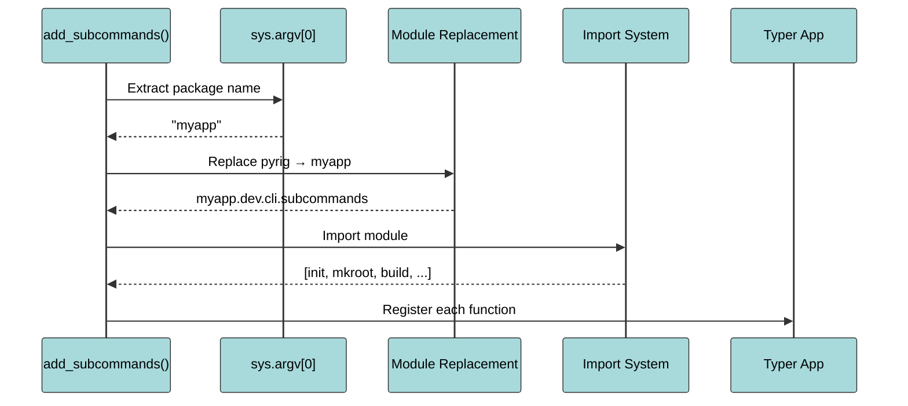
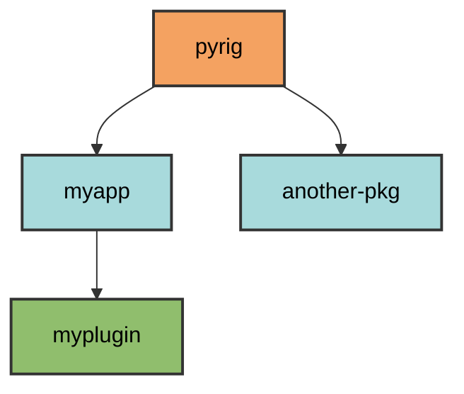
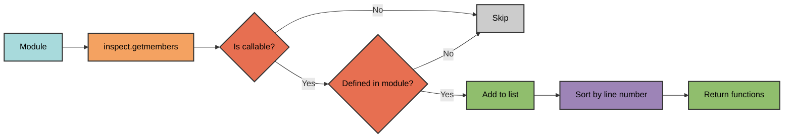
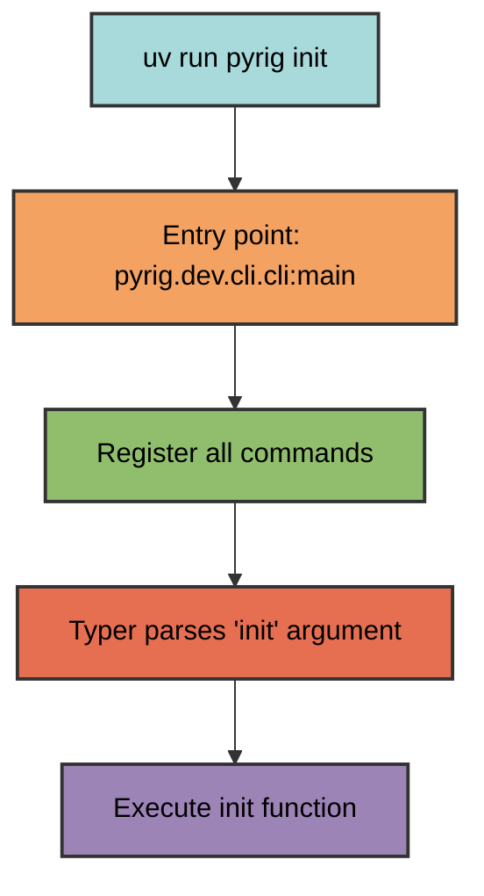

# CLI Architecture

The pyrig CLI uses dynamic command discovery to automatically register commands from module functions. This enables both pyrig's built-in commands and project-specific commands in packages that depend on pyrig.

## Entry Point

Commands are invoked through the console script entry point defined in `pyproject.toml`:

```toml
[project.scripts]
pyrig = "pyrig.dev.cli.cli:main"
```

Running `uv run pyrig <command>` calls the `main()` function in `pyrig/dev/cli/cli.py`.

## Command Registration Flow

The `main()` function orchestrates command discovery in three steps:

```python
def main() -> None:
    add_subcommands()           # Register project-specific commands
    add_shared_subcommands()    # Register shared commands
    app()                       # Execute Typer application
```



### Project-Specific Commands

The `add_subcommands()` function discovers commands for the current package:

1. **Extract package name** from `sys.argv[0]`
2. **Replace module names** to find the package's equivalent modules
3. **Import the subcommands module** for the package
4. **Extract all functions** from the module
5. **Register each function** as a Typer command



Example: When running `uv run myapp init`, the system:
- Detects package name: `myapp`
- Replaces `pyrig.dev.cli.subcommands` → `myapp.dev.cli.subcommands`
- Imports `myapp/dev/cli/subcommands.py`
- Registers all functions as commands

### Shared Commands

The `add_shared_subcommands()` function discovers commands across the package ecosystem:

1. **Build a dependency graph** of all installed packages
2. **Find all packages** that depend on pyrig
3. **For each package**, import its `shared_subcommands` module
4. **Register all functions** from each module

This enables commands like `version` to work in any package that depends on pyrig.

## Module Name Replacement

The system uses module name replacement to support multi-package architectures:

```python
get_module_name_replacing_start_module(pyrig.dev.cli.subcommands, "myapp")
# Returns: "myapp.dev.cli.subcommands"
```

This allows any package depending on pyrig to define its own commands by following the same module structure.

## Dependency Graph

The `DependencyGraph` class builds a directed graph of package dependencies:

```python
graph = DependencyGraph()
packages = graph.get_all_depending_on("pyrig", include_self=True)
# Returns: [pyrig, myapp, myplugin] in topological order
```



This enables discovery of all packages in the pyrig ecosystem and their corresponding command modules.

## Function Discovery

The `get_all_functions_from_module()` utility extracts all functions defined in a module:

- Uses `inspect.getmembers()` to find all module members
- Filters to only callable functions
- Excludes imported functions (only functions defined in the module)
- Sorts by definition order (line number)



This automatic discovery means adding a new command requires only defining a function in the appropriate module.

## Import Strategy

The system uses a fallback import strategy for robustness:

1. **Try normal import** by module name
2. **Fall back to file-based import** if the module isn't in `sys.path`

This handles edge cases where modules may not be properly installed or are in development mode. Mainly can be important when files are created during init and are not seen by normal imports yet.

## Command Execution

Once registered, Typer handles argument parsing and command execution:



The function's docstring becomes the command's help text, and Typer automatically generates argument parsing from the function signature.

You will not be building a crazy CLI package with this or an cli based application, but it comes quite in handy for building a CLI for your project and have some simple commands that can be executed from the command line because lets be honest no one like doing `python -m myapp.subpkg.subpkg2.module` instead of `uv run myapp init`. Also you dont need the classic `if __name__ == "__main__":` boilerplate anymore this way.

