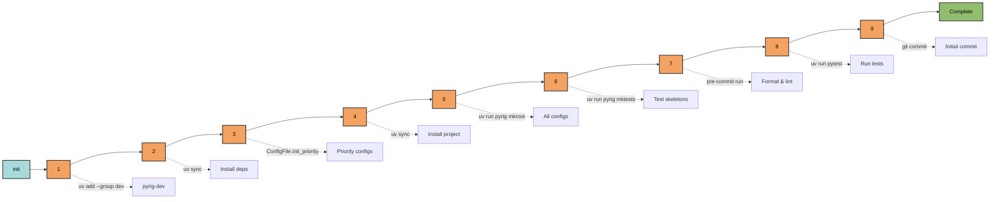

# init

Complete project initialization command that sets up a new pyrig project from scratch.

## Usage

```bash
uv run pyrig init
```

## What It Does

The `init` command runs a comprehensive setup process in 9 sequential steps:



### 1. Adding Dev Dependencies
Installs the `pyrig-dev` package group to the project.

### 2. Syncing Venv
Installs all dependencies including the newly added dev dependencies.

### 3. Creating Priority Config Files
Creates essential config files that must exist before other setup steps:
- `pyproject.toml` - Project metadata and dependencies
- `.gitignore` - Git ignore patterns
- `LICENSE` - Project license
- And other foundational configuration files

### 4. Syncing Venv (Again)
Ensures the venv reflects the newly created config files and uv installs the project itself.
Activates the cli of my-app.

### 5. Creating Project Root
Generates all config files and directory structure by calling `mkroot` internally. See [mkroot](mkroot.md) for details.

### 6. Creating Test Files
Generates test skeletons for all code by calling `mktests` internally. See [mktests](mktests.md) for details.

### 7. Running Pre-commit Hooks
Runs all pre-commit hooks to format and lint the code:
- Ruff formatting and linting
- Type checking with mypy
- Security scanning with bandit
- Documentation updates

### 8. Running Tests
Validates everything works by running the full test suite with pytest.

### 9. Committing Initial Changes
Creates an initial git commit with message: `pyrig: Initial commit`.

## When to Use

Use `init` when:
- Starting a new project from scratch
- Setting up a fresh clone of a pyrig-based project
- Resetting a project to a clean state

## Autouse Fixture

This command does **not** run in an autouse fixture. It's a manual setup command.
It should only be used once at the beginning when creating a new project.

## Related

- [mkroot](mkroot.md) - Called internally by init (step 5)
- [mktests](mktests.md) - Called internally by init (step 6)
- [Configs Documentation](../../configs/index.md) - Details on all config files created

