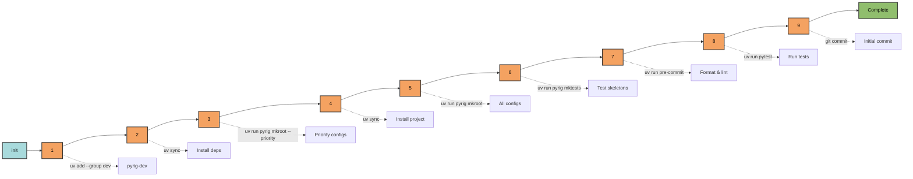

# init

Complete project initialization command that sets up a new pyrig project from
scratch.

## Usage

```bash
uv run pyrig init

# With verbose output to see detailed progress
uv run pyrig -v init

# With full debug logging
uv run pyrig -vvv init
```

## What It Does

The `init` command runs a comprehensive setup process in 9 sequential steps:



### 1. Adding Dev Dependencies

Adds the `pyrig-dev` package to the dev dependency group.

### 2. Syncing Venv

Installs all dependencies including the newly added dev dependencies.

### 3. Creating Priority Config Files

Some config files need to exist before others and before some specific processes
can run. So they are created with a priority system.
Creates essential config files with `get_priority() > 0`, grouped by priority:

- **Priority 30**: `LICENSE` - Must exist before pyproject.toml for license
  detection
- **Priority 20**: `pyproject.toml` - Project metadata and dependencies
- **Priority 10**: `myapp/dev/configs/__init__.py`,
  `myapp/dev/tests/fixtures/__init__.py`, and `myapp/dev/management/__init__.py`
  \- Package structure files (initialized in parallel)

Priority groups are processed sequentially (highest first), with files in the
same group initialized in parallel. These files are required before other setup
steps can proceed. 0 is the default priority for files that can be created
whenever after the priority files are created.

### 4. Syncing Venv (Again)

Ensures the venv reflects the newly created config files. This step installs the
project itself, making the project's CLI commands available (e.g.,
`uv run myapp <command>`).

### 5. Creating Project Root

Generates all config files and directory structure by calling `mkroot`
internally. See [mkroot](mkroot.md) for details.

### 6. Creating Test Files

Generates test skeletons for all code by calling `mktests` internally. See
[mktests](mktests.md) for details.

### 7. Running Pre-commit Hooks

Installs pre-commit hooks, stages all files with git, and runs
formatters/linters to ensure the codebase follows style guidelines:

- Ruff formatting and linting
- Type checking with ty
- Security scanning with bandit
- Documentation updates

### 8. Running Tests

Validates everything works by running the full test suite with pytest.

### 9. Committing Initial Changes

Creates an initial git commit with message: `pyrig: Initial commit`.

## When to Use

Use `init` when:

- Starting a new project from scratch
- Setting up a fresh clone of a pyrig-based project
- Resetting a project to a clean state

## Autouse Fixture

This command does **not** run in an autouse fixture. It's a manual setup
command. It should only be used once at the beginning when creating a new
project.

## Related

- [mkroot](mkroot.md) - Called internally by init (step 5)
- [mktests](mktests.md) - Called internally by init (step 6)
- [Configs Documentation](../../configs/index.md) - Details on all config files
  created
