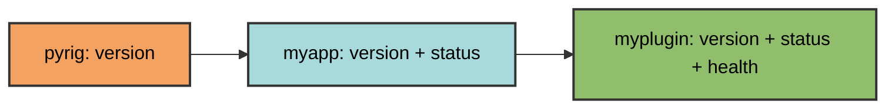

# Shared Subcommands

Shared subcommands are CLI commands available across all packages in the pyrig
ecosystem. They are defined in `<package>/dev/cli/shared_subcommands.py` and
automatically discovered in all dependent packages.

## Purpose

Shared subcommands enable cross-package functionality:

- Commands work in any package that depends on pyrig
- Each package can add its own shared commands
- Commands are inherited through the dependency chain

## Defining Shared Commands

Add a public function to your package's `dev/cli/shared_subcommands.py` module.
Each public function is automatically discovered and registered as a Typer CLI
command.

Pyrig includes a built-in `version` command that demonstrates the pattern:

- Uses `get_project_name_from_argv()` to detect which project invoked the CLI
- Retrieves and displays that project's version (not pyrig's version)
- Works in any package without modification

This command works in any package:

```bash
uv run pyrig version        # Output: pyrig version X.Y.Z
uv run myapp version        # Output: myapp version X.Y.Z

# With verbose output (global options work with shared commands too)
uv run pyrig -v version     # Shows debug information
```

## Discovery Mechanism

Shared commands are discovered through dependency graph traversal:

1. **Extract current package name** from `sys.argv[0]`
2. **Traverse the dependency chain** from pyrig to the current package
3. **Import each package's** `dev.cli.shared_subcommands` module
4. **Register all public functions** from each module

Commands are registered in dependency order (pyrig first). If multiple packages
define a command with the same name, the last one registered takes precedence.


Example dependency chain:

```text
myplugin
  ↓ (depends on)
myapp
  ↓ (depends on)
pyrig
```

Running `uv run myplugin version` discovers shared commands from:

- `pyrig.rig.cli.shared_subcommands`
- `myapp.dev.cli.shared_subcommands`
- `myplugin.dev.cli.shared_subcommands`

## Context-Aware Commands

Shared commands can adapt to the calling package using
`get_project_name_from_argv()` from `pyrig.src.cli`. This utility extracts the
package name from `sys.argv[0]`, enabling commands to behave differently based
on which project invoked them.

## Adding Shared Commands

To add a shared command to your package:

1. **Create the module** at `dev/cli/shared_subcommands.py` (created
   automatically by `uv run pyrig mkroot`)
2. **Define public functions** — each becomes a CLI command
3. **Use `get_project_name_from_argv()`** to adapt behavior to the calling
   package

```python
import typer
from pyrig.src.cli import get_project_name_from_argv

def status() -> None:
    """Display project status."""
    typer.echo(f"Status for {get_project_name_from_argv()}: OK")
```

## Inheritance

Packages inherit shared commands from their dependencies:



- **pyrig** defines `version`
- **myapp** (depends on pyrig) inherits `version` and adds `status`
- **myplugin** (depends on myapp) inherits both `version` and `status`

## Built-in Shared Commands

pyrig includes these shared commands:

- **`version`** - Display package version

## Global Options

All shared commands support the same global options as regular commands:

```bash
# Verbose output
uv run myapp -v version

# Quiet mode
uv run myapp -q version
```

**Note**: Global options (`-v`, `-vv`, `-vvv`, `-q`) must be specified
**before** the command name. See
[CLI Architecture](architecture.md#global-options) for details on logging
levels.

## Difference from Subcommands

| Aspect    | Subcommands              | Shared Subcommands               |
| --------- | ------------------------ | -------------------------------- |
| Location  | `dev/cli/subcommands.py` | `dev/cli/shared_subcommands.py`  |
| Scope     | Package-specific         | Cross-package                    |
| Discovery | Current package only     | All packages in dependency chain |
| Use case  | Project operations       | Ecosystem-wide utilities         |
