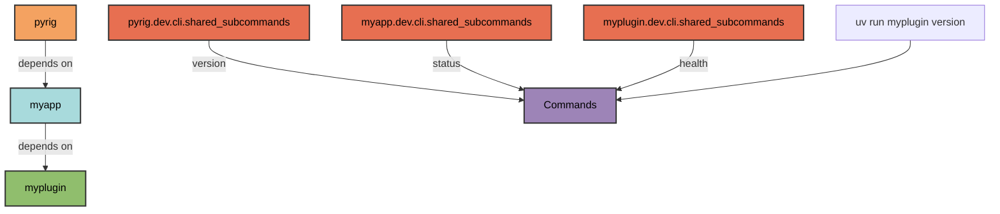
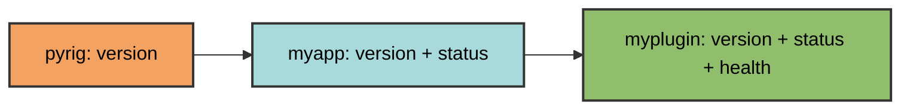

# Shared Subcommands

Shared subcommands are CLI commands available across all packages in the pyrig ecosystem. They are defined in `dev/cli/shared_subcommands.py` and automatically discovered in all dependent packages.

## Purpose

Shared subcommands enable cross-package functionality:

- Commands work in any package that depends on pyrig
- Each package can add its own shared commands
- Commands are inherited through the dependency chain

## Defining Shared Commands

Add a function to `shared_subcommands.py`:

Pyrig already has a version command that is available in all packages.
```python
def version() -> None:
    """Display the version information."""
    project_name = get_project_name_from_argv()
    typer.echo(f"{project_name} version {get_version(project_name)}")
```

This command works in any package:

```bash
uv run pyrig version        # Output: pyrig version 2.2.29
uv run myapp version        # Output: myapp version 1.0.0
```

## Discovery Mechanism

Shared commands are discovered through dependency graph traversal:

1. **Build dependency graph** of all installed packages
2. **Find all packages** depending on pyrig
3. **Import each package's** `shared_subcommands` module
4. **Register all functions** from each module



Example dependency chain:

```
pyrig
  ↓ (depends on)
myapp
  ↓ (depends on)
myplugin
```

Running `uv run myplugin version` discovers shared commands from:
- `pyrig.dev.cli.shared_subcommands`
- `myapp.dev.cli.shared_subcommands`
- `myplugin.dev.cli.shared_subcommands`

## Context-Aware Commands

Shared commands can adapt to the calling package:

```python
def version() -> None:
    """Display the version information."""
    project_name = get_project_name_from_argv()  # Detects calling package
    typer.echo(f"{project_name} version {get_version(project_name)}")
```

The `get_project_name_from_argv()` utility extracts the package name from `sys.argv[0]`, enabling context-aware behavior.

## Adding Shared Commands

To add a shared command to your package:

1. **Create the module** at `dev/cli/shared_subcommands.py`
2. **Define functions** for your shared commands
3. **Use context utilities** to adapt to the calling package

Example:

```python
from pyrig.dev.utils.cli import get_project_name_from_argv
import typer

def status() -> None:
    """Display project status."""
    project_name = get_project_name_from_argv()
    typer.echo(f"Status for {project_name}: OK")
```

## Inheritance

Packages inherit shared commands from their dependencies:



- **pyrig** defines `version`
- **myapp** (depends on pyrig) inherits `version` and adds `status`
- **myplugin** (depends on myapp) inherits both `version` and `status`

## Built-in Shared Commands

pyrig includes these shared commands:

- **`version`** - Display package version

## Difference from Subcommands

| Aspect | Subcommands | Shared Subcommands |
|--------|-------------|-------------------|
| Location | `dev/cli/subcommands.py` | `dev/cli/shared_subcommands.py` |
| Scope | Package-specific | Cross-package |
| Discovery | Current package only | All packages in dependency chain |
| Use case | Project operations | Ecosystem-wide utilities |
