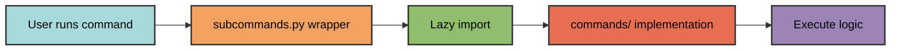

# Subcommands

Project-specific CLI commands are defined in the `dev/cli/subcommands.py` module. All functions in this module are automatically registered as CLI commands.

## Defining Commands

Add a function to `subcommands.py` to create a new command:

```python
def mkroot() -> None:
    """Creates the root of the project.
    
    This inits all ConfigFiles and creates __init__.py files for the src
    and tests package where they are missing.
    """
    from pyrig.dev.cli.commands.create_root import make_project_root
    
    make_project_root()
```

The function name becomes the command name (converted to kebab-case), and the docstring becomes the help text.

## Command Pattern

Follow this pattern for all subcommands:

1. **Define a simple wrapper function** in `subcommands.py`
2. **Use lazy imports** to avoid circular dependencies
3. **Delegate to implementation** in `dev/cli/commands/`
4. **Add comprehensive docstring** for CLI help



Example:

```python
def build() -> None:
    """Build all artifacts.

    Invokes every subclass of Builder in the builder package.
    """
    from pyrig.dev.cli.commands.build_artifacts import build_artifacts

    build_artifacts()
```

## Automatic Registration

Functions are discovered and registered automatically:

- **No manual registration** required
- **Functions only** - classes and variables are ignored
- **Defined in module** - imported functions are excluded
- **Sorted by definition order** - commands appear in the order they're defined

## Command Naming

Function names are converted to CLI command names:

- `mkroot` → `pyrig mkroot`
- `mktests` → `pyrig mktests`
- `protect_repo` → `pyrig protect-repo`

## Multi-Package Support

When a package depends on pyrig, it can define its own subcommands:

```
myapp/
  dev/
    cli/
      subcommands.py  # Define myapp-specific commands here
```


Running `uv run myapp <command>` will discover and execute commands from `myapp.dev.cli.subcommands`.

## Built-in Commands

pyrig includes these built-in subcommands:

- **`init`** - Complete project setup
- **`mkroot`** - Create project structure and config files
- **`mktests`** - Generate test skeletons
- **`mkinits`** - Create `__init__.py` files
- **`build`** - Build all artifacts
- **`protect-repo`** - Configure repository protection
