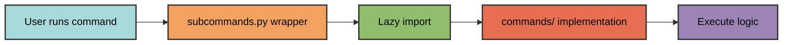
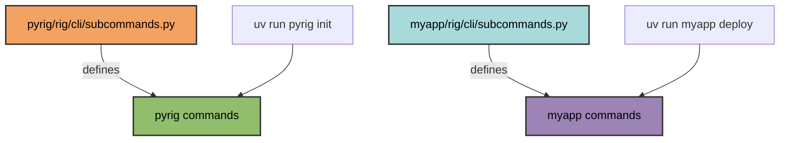

# Subcommands

Project-specific CLI commands are defined in the `rig/cli/subcommands.py`
module. All public functions in this module are automatically registered as CLI
commands.

## Defining Commands

Add a public function to `subcommands.py` to create a new command. The function
name becomes the command name (underscores are converted to hyphens), and the
docstring becomes the help text.

Use `typer.Option` to add command-line options with flags. See the existing
commands in `pyrig/rig/cli/subcommands.py` for examples.

## Command Pattern

Follow this pattern for all subcommands:

1. **Define a wrapper function** in `subcommands.py`
2. **Use lazy imports** to avoid circular dependencies and missing dev
   dependencies
3. **Delegate to implementation** in `rig/cli/commands/`
4. **Add a docstring** for CLI help text



## Automatic Registration

The CLI system automatically discovers and registers three types of commands:

1. **Main entry point** - The `main()` function from `<package>.main`
2. **Subcommands** - All public functions from `<package>.rig.cli.subcommands`
3. **Shared subcommands** - All public functions
    from `<package>.rig.cli.shared_subcommands` across all packages
    in the dependency chain (see [Shared Subcommands](shared-subcommands.md))

Functions are discovered and registered automatically:

- **No manual registration** required
- **Functions only** - classes and variables are ignored
- **Defined in module** - imported functions are excluded
- **Sorted by definition order** - commands appear in the order they're defined

For implementation details on command discovery, see the docstrings in
`pyrig/rig/cli/cli.py`.

## Command Naming

Function names are converted to CLI command names:

- `mkroot` → `pyrig mkroot`
- `mktests` → `pyrig mktests`
- `protect_repo` → `pyrig protect-repo`

## Multi-Package Support

When a package depends on pyrig, it can define its own subcommands:

```text
myapp/
  rig/
    cli/
      subcommands.py  # Define myapp-specific commands here
```



Running `uv run myapp <command>` will discover and execute commands from
`myapp.rig.cli.subcommands`.

## Built-in Commands

pyrig includes these built-in subcommands:

- **`init`** - Complete project setup
- **`mkroot`** - Create project structure and config files
- **`mktests`** - Generate test skeletons
- **`mkinits`** - Create `__init__.py` files
- **`build`** - Build all artifacts
- **`protect-repo`** - Configure repository protection

pyrig also includes this shared subcommand (available in all dependent
projects):

- **`version`** - Display the current project's version
