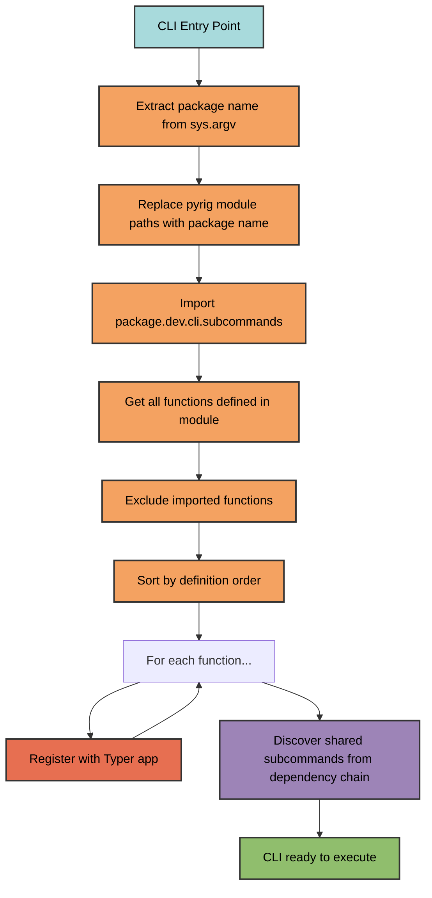

# Subcommands

Project-specific CLI commands are defined in the `dev/cli/subcommands.py`
module. All public functions in this module are automatically registered as CLI
commands.

## Defining Commands

Add a function to `subcommands.py` to create a new command:

```python
import typer

def mkroot(
    *,
    priority: bool = typer.Option(
        default=False,
        help="Only create priority config files.",
    ),
) -> None:
    """Create or update project configuration files and directory structure.

    Discovers all ConfigFile subclasses across the project and its dependencies,
    then initializes each one to create or update configuration files. Generates
    the complete project structure including pyproject.toml, .gitignore, GitHub
    workflows, pre-commit hooks, and other configuration files.

    The command is idempotent: safe to run multiple times, overwrites incorrect
    files but respects opt-out markers.

    Args:
        priority: If True, only creates high-priority config files (e.g.,
            LICENSE, pyproject.toml). Used during `init` to create essential
            files before installing dependencies. Default: False.

    Example:
        $ uv run pyrig mkroot
        $ uv run pyrig mkroot --priority

    Note:
        Config files are created in parallel within each priority group for
        performance. The command is automatically called twice by `pyrig init`.
    """
    # local imports in pyrig to avoid cli failure
    # when installing without dev deps, as some pyrig commands are
    # dependend on dev deps and can only be used in a dev env
    from pyrig.dev.cli.commands.create_root import make_project_root

    make_project_root(priority=priority)
```

The function name becomes the command name (Typer automatically converts
underscores to hyphens), and the docstring becomes the help text.

### Adding Command-Line Arguments

Use `typer.Option` to add command-line arguments with flags:

```python
import typer

def deploy(
    *,
    environment: str = typer.Option(
        default="staging",
        help="Deployment environment (staging, production).",
    ),
    dry_run: bool = typer.Option(
        default=False,
        help="Perform a dry run without making changes.",
    ),
) -> None:
    """Deploy the application to the specified environment."""
    from myapp.dev.cli.commands.deploy import deploy_app

    deploy_app(environment=environment, dry_run=dry_run)
```

This creates a command with options:

```bash
uv run myapp deploy --environment production
uv run myapp deploy --dry-run
uv run myapp deploy --environment staging --dry-run
```

## Command Pattern

Follow this pattern for all subcommands:

1. **Define a simple wrapper function** in `subcommands.py`
2. **Use lazy imports** to avoid circular dependencies
3. **Delegate to implementation** in `dev/cli/commands/`
4. **Add comprehensive docstring** for CLI help


Example:

```python
def build() -> None:
    """Build all distributable artifacts for the project.

    Discovers and invokes all BuilderConfigFile subclasses across the project
    and its dependencies.
    """
    from pyrig.dev.cli.commands.build_artifacts import build_artifacts

    build_artifacts()
```

## Automatic Registration

The CLI system automatically discovers and registers three types of commands:

1. **Main entry point** - The `main()` function from `<package>.main`
2. **Subcommands** - All public functions from `<package>.dev.cli.subcommands`
3. **Shared subcommands** - All public functions
    from `<package>.dev.cli.shared_subcommands` across all packages
    in the dependency chain (see [Shared Subcommands](shared-subcommands.md))

Functions are discovered and registered automatically:

- **No manual registration** required
- **Functions only** - classes and variables are ignored
- **Defined in module** - imported functions are excluded
- **Sorted by definition order** - commands appear in the order they're defined

### Discovery Process



## Command Naming

Function names are converted to CLI command names:

- `mkroot` → `pyrig mkroot`
- `mktests` → `pyrig mktests`
- `protect_repo` → `pyrig protect-repo`

## Multi-Package Support

When a package depends on pyrig, it can define its own subcommands:

```text
myapp/
  dev/
    cli/
      subcommands.py  # Define myapp-specific commands here
```


Running `uv run myapp <command>` will discover and execute commands from
`myapp.dev.cli.subcommands`.

## Built-in Commands

pyrig includes these built-in subcommands:

- **`init`** - Complete project setup
- **`mkroot`** - Create project structure and config files
- **`mktests`** - Generate test skeletons
- **`mkinits`** - Create `__init__.py` files
- **`build`** - Build all artifacts
- **`protect-repo`** - Configure repository protection

pyrig also includes this shared subcommand (available in all dependent
projects):

- **`version`** - Display the current project's version
