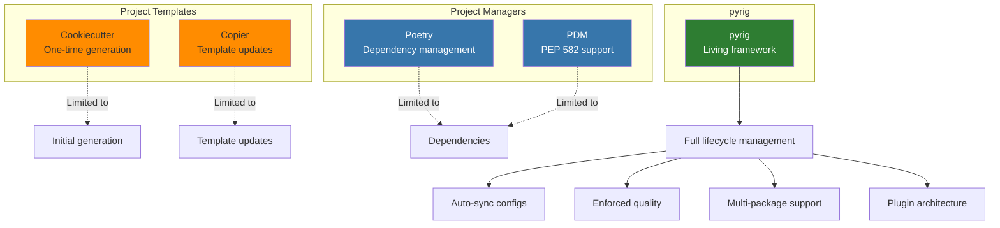
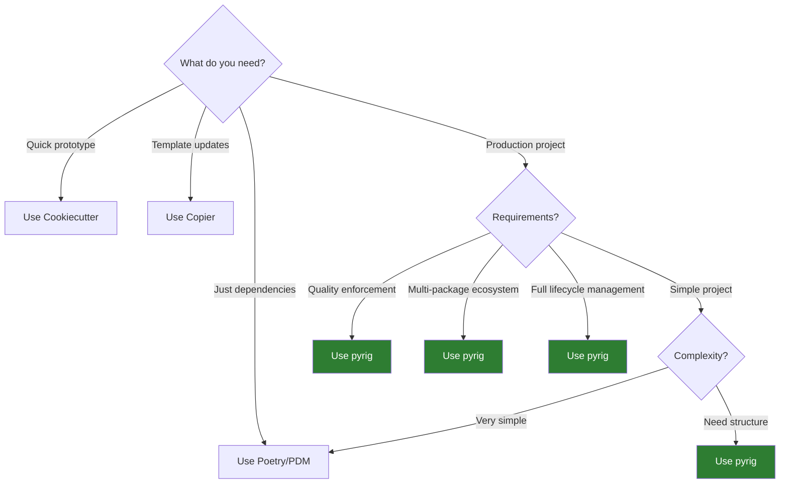

# pyrig vs Other Tools

This document compares pyrig with other popular Python project management tools and templates.

## Quick Comparison

## Detailed Comparison

### pyrig vs Cookiecutter

| Feature | Cookiecutter | pyrig |
|---------|-------------|-------|
| **Initial Setup** | Fast template generation | Automated full project setup |
| **Configuration Management** | One-time only | Living, auto-syncing |
| **Updates** | Manual re-generation | Automatic via `pyrig mkroot` |
| **Quality Enforcement** | None | Strict linting, typing, testing |
| **CI/CD** | Manual setup | Automated GitHub Actions |
| **Multi-Package Support** | No | Yes, with cross-package discovery |
| **Plugin System** | No | Yes, ConfigFiles and Builders |
| **Learning Curve** | Low | Medium |
| **Best For** | Quick prototypes | Production projects |

**When to use Cookiecutter:**
- Quick one-off projects
- Experimenting with different structures
- Need maximum flexibility

**When to use pyrig:**
- Long-term production projects
- Team projects requiring consistency
- Projects needing strict quality standards

### pyrig vs Copier

| Feature | Copier | pyrig |
|---------|--------|-------|
| **Initial Setup** | Template generation | Automated full project setup |
| **Configuration Management** | Template updates | Living, auto-syncing |
| **Updates** | `copier update` | Automatic validation + `pyrig mkroot` |
| **Quality Enforcement** | Template-dependent | Built-in and enforced |
| **CI/CD** | Template-dependent | Automated GitHub Actions |
| **Multi-Package Support** | No | Yes, with cross-package discovery |
| **Plugin System** | Template-based | ConfigFile and Builder plugins |
| **Learning Curve** | Low-Medium | Medium |
| **Best For** | Updateable templates | Living project frameworks |

**When to use Copier:**
- Need template updates
- Want flexibility in structure
- Multiple different project types

**When to use pyrig:**
- Want automatic config synchronization
- Need enforced quality standards
- Building package ecosystems

### pyrig vs Poetry

| Feature | Poetry | pyrig |
|---------|--------|-------|
| **Dependency Management** | Excellent | Uses uv (faster) |
| **Project Structure** | Basic | Comprehensive |
| **Configuration Management** | pyproject.toml only | All config files |
| **Quality Tools** | Manual setup | Automated and enforced |
| **CI/CD** | Manual setup | Automated GitHub Actions |
| **Multi-Package Support** | No | Yes, with cross-package discovery |
| **Plugin System** | Poetry plugins | ConfigFile and Builder plugins |
| **Learning Curve** | Low | Medium |
| **Best For** | Dependency management | Full project lifecycle |

**When to use Poetry:**
- Only need dependency management
- Want simple pyproject.toml management
- Don't need strict quality enforcement

**When to use pyrig:**
- Need full project management
- Want automated quality enforcement
- Building multi-package ecosystems

### pyrig vs PDM

| Feature | PDM | pyrig |
|---------|-----|-------|
| **Dependency Management** | PEP 582 support | Uses uv |
| **Project Structure** | Basic | Comprehensive |
| **Configuration Management** | pyproject.toml only | All config files |
| **Quality Tools** | Manual setup | Automated and enforced |
| **CI/CD** | Manual setup | Automated GitHub Actions |
| **Multi-Package Support** | No | Yes, with cross-package discovery |
| **Plugin System** | PDM plugins | ConfigFile and Builder plugins |
| **Learning Curve** | Low-Medium | Medium |
| **Best For** | PEP 582 projects | Full project lifecycle |

**When to use PDM:**
- Want PEP 582 support
- Need flexible dependency management
- Don't need strict quality enforcement

**When to use pyrig:**
- Need full project management
- Want automated quality enforcement
- Building multi-package ecosystems

## Feature Matrix

| Feature | Cookiecutter | Copier | Poetry | PDM | pyrig |
|---------|-------------|--------|--------|-----|-------|
| Initial Setup | ✓ | ✓ | ✓ | ✓ | ✓ |
| Living Configuration | ✗ | ~ | ✗ | ✗ | ✓ |
| Auto-Sync Configs | ✗ | ✗ | ✗ | ✗ | ✓ |
| Quality Enforcement | ✗ | ~ | ✗ | ✗ | ✓ |
| Automated CI/CD | ✗ | ~ | ✗ | ✗ | ✓ |
| Multi-Package Support | ✗ | ✗ | ✗ | ✗ | ✓ |
| Plugin Architecture | ✗ | ~ | ~ | ~ | ✓ |
| Test Generation | ✗ | ✗ | ✗ | ✗ | ✓ |
| Branch Protection | ✗ | ✗ | ✗ | ✗ | ✓ |
| Container Support | ~ | ~ | ✗ | ✗ | ✓ |

Legend: ✓ = Full support, ~ = Partial/Template-dependent, ✗ = Not supported

## Use Case Recommendations

