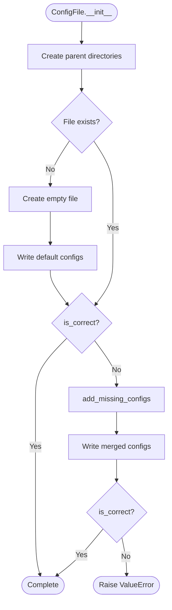

# ConfigFile System

## Overview

The ConfigFile system is the foundation of pyrig's "living configuration" philosophy. ConfigFiles are classes that automatically create, validate, and update configuration files throughout your project.

**Key Concept:** Configuration files are not static - they are managed by code that ensures they stay correct and synchronized with your project's requirements.

## How ConfigFiles Work

### The Base Class

All configuration files in pyrig are managed by subclasses of the `ConfigFile` abstract base class. The base class provides:

- **Automatic creation** - Creates files that don't exist
- **Subset validation** - Ensures required configuration is present
- **Intelligent merging** - Adds missing values without overwriting user changes
- **Format-specific handling** - YAML, TOML, Python, Markdown, plain text

### The Initialization Process

When you run `pyrig init` or `pyrig mkroot`, each ConfigFile goes through this process:



### Step-by-Step Breakdown

#### 1. **Create Parent Directories**
```python
self.get_path().parent.mkdir(parents=True, exist_ok=True)
```
Ensures the directory structure exists before creating the file.

#### 2. **Create File if Missing**
```python
if not self.get_path().exists():
    self.get_path().touch()
    self.dump(self.get_configs())
```
If the file doesn't exist, create it with the default configuration from `get_configs()`.

#### 3. **Validate Existing Files**
```python
if not self.is_correct():
    config = self.add_missing_configs()
    self.dump(config)
```
If the file exists but is missing required values, merge them in.

#### 4. **Final Verification**
```python
if not self.is_correct():
    msg = f"Config file {self.get_path()} is not correct."
    raise ValueError(msg)
```
If the file still isn't correct after merging, something is wrong - raise an error.

## Subset Validation

### What is Subset Validation?

**Subset validation** means the expected configuration must be a **subset** of the actual configuration. This allows:

- ✅ **User additions** - Users can add extra keys/values
- ✅ **User customization** - Users can extend configurations
- ❌ **Missing required values** - Required keys must be present
- ❌ **Contradicting values** - Required values must match (for non-dict/list types)

### How It Works

The `is_correct()` method checks if the file is valid:

```python
def is_correct(cls) -> bool:
    return cls.is_unwanted() or cls.is_correct_recursively(
        cls.get_configs(), cls.load()
    )
```

**Two ways a file can be "correct":**

1. **Empty file** (`is_unwanted()`) - User opted out of this config
2. **Superset of expected** (`is_correct_recursively()`) - Contains all required values

### Recursive Subset Checking

The validation recursively compares nested structures:

**For dictionaries:**
- All keys in expected config must exist in actual config
- Values are compared recursively

**For lists:**
- All items in expected list must exist somewhere in actual list
- Order doesn't matter - items are matched by content

**For primitives:**
- Values must be equal

### Example: Valid Configurations

**Expected config:**
```yaml
app_name: my-project
database:
  host: localhost
  port: 5432
```

**Valid actual config (superset):**
```yaml
app_name: my-project
database:
  host: localhost
  port: 5432
  username: admin  # ✅ Extra key allowed
  password: secret  # ✅ Extra key allowed
debug: true  # ✅ Extra top-level key allowed
```

**Invalid actual config (missing required):**
```yaml
app_name: my-project
database:
  host: localhost
  # ❌ Missing required 'port' key
```

## Intelligent Config Merging

When a file is missing required values, `add_missing_configs()` merges them in:

### The Merging Process

```python
def add_missing_configs(cls) -> dict[str, Any] | list[Any]:
    current_config = cls.load()
    expected_config = cls.get_configs()
    nested_structure_is_subset(
        expected_config,
        current_config,
        cls.add_missing_dict_val,  # Called when dict key is missing
        cls.insert_missing_list_val,  # Called when list item is missing
    )
    return current_config
```

### Merging Dictionaries

```python
def add_missing_dict_val(expected_dict, actual_dict, key):
    expected_val = expected_dict[key]
    actual_val = actual_dict.get(key)
    actual_dict.setdefault(key, expected_val)
    
    if isinstance(expected_val, dict) and isinstance(actual_val, dict):
        actual_val.update(expected_val)
    else:
        actual_dict[key] = expected_val
```

**Behavior:**
- If key is missing → Add it with expected value
- If both are dicts → Recursively merge
- Otherwise → Replace with expected value

### Merging Lists

```python
def insert_missing_list_val(expected_list, actual_list, index):
    actual_list.insert(index, expected_list[index])
```

**Behavior:**
- Insert missing item at the expected index

## Format-Specific Base Classes

pyrig provides specialized base classes for different file formats:

### YamlConfigFile

For YAML configuration files (`.yaml`):

```python
from pyrig.dev.configs.base.base import YamlConfigFile
from pathlib import Path

class MyYamlConfig(YamlConfigFile):
    @classmethod
    def get_parent_path(cls) -> Path:
        return Path("config")

    @classmethod
    def get_filename(cls) -> str:
        return "app"

    @classmethod
    def get_configs(cls) -> dict:
        return {
            "setting1": "value1",
            "setting2": "value2",
        }
```

**Features:**
- Uses PyYAML for parsing
- Preserves key order (no sorting)
- Handles nested dictionaries and lists

### YmlConfigFile

For YAML configuration files with `.yml` extension:

```python
from pyrig.dev.configs.base.base import YmlConfigFile
from pathlib import Path

class MyYmlConfig(YmlConfigFile):
    @classmethod
    def get_parent_path(cls) -> Path:
        return Path("config")

    @classmethod
    def get_filename(cls) -> str:
        return "mkdocs"

    @classmethod
    def get_configs(cls) -> dict:
        return {
            "site_name": "My Project",
            "nav": [{"Home": "index.md"}],
        }
```

**Features:**
- Extends `YamlConfigFile` with `.yml` extension
- Uses PyYAML for parsing (same as YamlConfigFile)
- Preserves key order (no sorting)
- Handles nested dictionaries and lists

**Note:** The only difference between `YmlConfigFile` and `YamlConfigFile` is the file extension (`.yml` vs `.yaml`). Use `YmlConfigFile` when the tool or convention requires `.yml` extension (e.g., MkDocs uses `mkdocs.yml`).

### TomlConfigFile

For TOML configuration files (`.toml`):

```python
from pyrig.dev.configs.base.base import TomlConfigFile
from pathlib import Path

class MyTomlConfig(TomlConfigFile):
    @classmethod
    def get_parent_path(cls) -> Path:
        return Path(".")

    @classmethod
    def get_filename(cls) -> str:
        return "config"

    @classmethod
    def get_configs(cls) -> dict:
        return {
            "tool": {
                "myapp": {
                    "version": "1.0.0",
                }
            }
        }
```

**Features:**
- Uses tomlkit for parsing
- Preserves formatting and comments
- Only accepts dict configurations (not lists)

### TextConfigFile

For plain text files that can be extended by users:

```python
from pyrig.dev.configs.base.base import TextConfigFile
from pathlib import Path

class MyTextConfig(TextConfigFile):
    @classmethod
    def get_parent_path(cls) -> Path:
        return Path(".")

    @classmethod
    def get_filename(cls) -> str:
        return "notes"

    @classmethod
    def get_file_extension(cls) -> str:
        return "txt"

    @classmethod
    def get_content_str(cls) -> str:
        return "# Required header\n\n"
```

**Features:**
- Validates that required content is present
- Allows users to add additional content
- Uses substring matching for validation

### MarkdownConfigFile

For Markdown files (`.md`):

```python
from pyrig.dev.configs.base.base import MarkdownConfigFile
from pathlib import Path

class MyMarkdownConfig(MarkdownConfigFile):
    @classmethod
    def get_parent_path(cls) -> Path:
        return Path("docs")

    @classmethod
    def get_filename(cls) -> str:
        return "README"

    @classmethod
    def get_content_str(cls) -> str:
        return "# My Project\n\nProject description.\n"
```

**Features:**
- Extends TextConfigFile
- Automatically uses `.md` extension
- Validates required content is present

### PythonConfigFile

For Python source files (`.py`):

```python
from pyrig.dev.configs.base.base import PythonConfigFile
from pathlib import Path

class MyPythonConfig(PythonConfigFile):
    @classmethod
    def get_parent_path(cls) -> Path:
        return Path("my_package")

    @classmethod
    def get_filename(cls) -> str:
        return "config"

    @classmethod
    def get_content_str(cls) -> str:
        return '"""Configuration module."""\n\nDEFAULT_VALUE = 42\n'
```

**Features:**
- Extends TextConfigFile
- Automatically uses `.py` extension
- Validates required code is present

## Opting Out of ConfigFiles

Users can opt out of any ConfigFile by creating an empty file:

```bash
# Opt out of a config file
touch config/app.yaml
# Leave it empty - pyrig will respect this
```

**How it works:**

```python
def is_unwanted(cls) -> bool:
    return (
        cls.get_path().exists()
        and cls.get_path().read_text(encoding="utf-8") == ""
    )
```

If a file exists and is empty, `is_correct()` returns `True` and no validation is performed.

## Required Methods for Subclasses

Every ConfigFile subclass must implement:

### 1. `get_parent_path() -> Path`

Returns the directory where the config file should be created.

```python
@classmethod
def get_parent_path(cls) -> Path:
    return Path("config")  # Creates file in config/ directory
```

### 2. `get_configs() -> dict | list`

Returns the expected configuration structure.

```python
@classmethod
def get_configs(cls) -> dict:
    return {
        "key1": "value1",
        "key2": {
            "nested": "value2"
        }
    }
```

### 3. `load() -> dict | list`

Loads and parses the configuration file from disk.

```python
@classmethod
def load(cls) -> dict:
    return yaml.safe_load(cls.get_path().read_text(encoding="utf-8")) or {}
```

**Note:** Format-specific base classes (YamlConfigFile, YmlConfigFile, TomlConfigFile, etc.) already implement this.

### 4. `dump(config: dict | list) -> None`

Writes configuration to the file.

```python
@classmethod
def dump(cls, config: dict) -> None:
    with cls.get_path().open("w") as f:
        yaml.safe_dump(config, f, sort_keys=False)
```

**Note:** Format-specific base classes already implement this.

### 5. `get_file_extension() -> str`

Returns the file extension (without the dot).

```python
@classmethod
def get_file_extension(cls) -> str:
    return "yaml"
```

**Note:** Format-specific base classes already implement this.

## Optional Methods

### `get_filename() -> str`

Override to customize the filename (without extension):

```python
@classmethod
def get_filename(cls) -> str:
    return "my-config"  # Creates my-config.yaml
```

**Default:** Uses the class name converted to snake_case.

### `is_correct() -> bool`

Override for custom validation logic:

```python
@classmethod
def is_correct(cls) -> bool:
    # Custom validation
    config = cls.load()
    return "required_key" in config and config["required_key"] == "expected_value"
```

**Default:** Uses subset validation.

## Automatic Discovery

pyrig automatically discovers all ConfigFile subclasses in:

1. **pyrig's own configs** - Built-in configuration files
2. **Your project's configs** - Files in `{package}/dev/configs/`
3. **Dependency configs** - ConfigFiles from packages that depend on pyrig

### Discovery Process

```python
@classmethod
def get_all_subclasses(cls) -> list[type["ConfigFile"]]:
    return get_all_nonabst_subcls_from_mod_in_all_deps_depen_on_dep(
        cls,
        pyrig,
        configs,
        discard_parents=True,
    )
```

This scans the dependency graph and finds all non-abstract ConfigFile subclasses in `dev.configs` modules.

## Initialization Order

ConfigFiles are initialized in three phases:

### Phase 1: Priority Files

These files must exist before others can be initialized:

```python
@classmethod
def get_priority_config_files(cls) -> list[type["ConfigFile"]]:
    return [
        GitIgnoreConfigFile,
        PyprojectConfigFile,
        LicenceConfigFile,
        MainConfigFile,
        ConfigsInitConfigFile,
        BuildersInitConfigFile,
        ZeroTestConfigFile,
    ]
```

**Why priority?**
- `PyprojectConfigFile` - Other configs read from it
- `GitIgnoreConfigFile` - Prevents committing generated files
- `MainConfigFile` - Entry point for the package

### Phase 2: Ordered Files

These files have dependencies on each other:

```python
@classmethod
def get_ordered_config_files(cls) -> list[type["ConfigFile"]]:
    return [
        FixturesInitConfigFile,
        ConftestConfigFile,
    ]
```

**Why ordered?**
- `ConftestConfigFile` imports from `FixturesInitConfigFile`

### Phase 3: All Remaining Files

All other ConfigFiles are initialized in arbitrary order.

## Real-World Examples

### Example 1: Extending pyproject.toml

Add custom tool configuration to pyproject.toml:

```python
# my_project/dev/configs/custom_pyproject.py
from pyrig.dev.configs.pyproject import PyprojectConfigFile

class CustomPyprojectConfigFile(PyprojectConfigFile):
    """Extends pyproject.toml with custom settings."""

    @classmethod
    def get_configs(cls) -> dict:
        config = super().get_configs()

        # Add custom tool configuration
        config["tool"]["myapp"] = {
            "api_url": "https://api.example.com",
            "timeout": 30,
        }

        return config
```

**Result:** `pyproject.toml` will contain both pyrig's configuration and your custom `[tool.myapp]` section.

### Example 2: Environment-Specific Configs

Create separate configs for different environments:

```python
# my_project/dev/configs/environments.py
from pathlib import Path
from pyrig.dev.configs.base.base import YamlConfigFile

class DevelopmentConfigFile(YamlConfigFile):
    @classmethod
    def get_parent_path(cls) -> Path:
        return Path("config/environments")

    @classmethod
    def get_filename(cls) -> str:
        return "development"

    @classmethod
    def get_configs(cls) -> dict:
        return {
            "environment": "development",
            "debug": True,
            "log_level": "DEBUG",
            "database": {
                "host": "localhost",
                "port": 5432,
            }
        }

class ProductionConfigFile(YamlConfigFile):
    @classmethod
    def get_parent_path(cls) -> Path:
        return Path("config/environments")

    @classmethod
    def get_filename(cls) -> str:
        return "production"

    @classmethod
    def get_configs(cls) -> dict:
        return {
            "environment": "production",
            "debug": False,
            "log_level": "WARNING",
            "database": {
                "host": "db.example.com",
                "port": 5432,
            }
        }
```

**Result:** Creates `config/environments/development.yaml` and `config/environments/production.yaml`.

### Example 3: Custom Validation

Implement custom validation logic:

```python
# my_project/dev/configs/validated_config.py
from pathlib import Path
from pyrig.dev.configs.base.base import YamlConfigFile

class ValidatedConfigFile(YamlConfigFile):
    @classmethod
    def get_parent_path(cls) -> Path:
        return Path("config")

    @classmethod
    def get_filename(cls) -> str:
        return "app"

    @classmethod
    def get_configs(cls) -> dict:
        return {
            "version": "1.0.0",
            "port": 8080,
        }

    @classmethod
    def is_correct(cls) -> bool:
        if cls.is_unwanted():
            return True

        config = cls.load()

        # Custom validation: port must be between 1024 and 65535
        if "port" in config:
            port = config["port"]
            if not (1024 <= port <= 65535):
                return False

        # Still check subset validation
        return super().is_correct()
```

### Example 4: Dynamic Configuration

Generate configuration based on project state:

```python
# my_project/dev/configs/dynamic_config.py
from pathlib import Path
from pyrig.dev.configs.base.base import YamlConfigFile
from pyrig.dev.configs.pyproject import PyprojectConfigFile

class DynamicConfigFile(YamlConfigFile):
    @classmethod
    def get_parent_path(cls) -> Path:
        return Path("config")

    @classmethod
    def get_filename(cls) -> str:
        return "metadata"

    @classmethod
    def get_configs(cls) -> dict:
        # Read from pyproject.toml
        project_name = PyprojectConfigFile.get_project_name()
        version = PyprojectConfigFile.get_version()

        return {
            "project": project_name,
            "version": version,
            "generated_at": "runtime",
        }
```

## Common Patterns

### Pattern 1: Conditional Configuration

Add configuration only if certain conditions are met:

```python
@classmethod
def get_configs(cls) -> dict:
    config = {"base": "value"}

    # Add optional configuration
    if Path("features/advanced.py").exists():
        config["advanced_features"] = True

    return config
```

### Pattern 2: Merging Multiple Sources

Combine configuration from multiple sources:

```python
@classmethod
def get_configs(cls) -> dict:
    base_config = super().get_configs()

    # Load additional config from file
    if Path("config/overrides.yaml").exists():
        overrides = yaml.safe_load(Path("config/overrides.yaml").read_text())
        base_config.update(overrides)

    return base_config
```

### Pattern 3: Template-Based Configuration

Generate configuration from templates:

```python
@classmethod
def get_configs(cls) -> dict:
    template = {
        "app_name": PyprojectConfigFile.get_project_name(),
        "version": PyprojectConfigFile.get_version(),
        "author": PyprojectConfigFile.get_author(),
    }
    return template
```

## Best Practices

### ✅ DO

- **Use appropriate base classes** - YamlConfigFile, YmlConfigFile, TomlConfigFile, etc.
- **Implement required methods** - get_parent_path(), get_configs()
- **Use subset validation** - Allow user customization
- **Document config options** - Add docstrings explaining settings
- **Test config files** - Ensure they generate correctly
- **Respect user changes** - Don't overwrite user customizations
- **Use dynamic values** - Read from PyprojectConfigFile when possible

### ❌ DON'T

- **Don't hardcode values** - Use configuration or read from other sources
- **Don't make configs stateful** - Keep them simple and deterministic
- **Don't create circular dependencies** - Keep configs independent
- **Don't override user changes** - Subset validation prevents this
- **Don't ignore validation failures** - Fix the root cause
- **Don't create unnecessary files** - Only create what's needed

## Troubleshooting

### Problem: ConfigFile keeps resetting my changes

**Cause:** Your changes contradict the expected configuration.

**Solution:** Extend the configuration instead of replacing it:

```python
# ❌ Wrong - replaces expected value
{
    "port": 3000  # Expected: 8080
}

# ✅ Right - extends configuration
{
    "port": 8080,  # Keep expected value
    "custom_port": 3000  # Add your custom value
}
```

### Problem: ConfigFile validation fails

**Cause:** The file is missing required values or has incorrect structure.

**Solution:** Check what's expected:

```python
# See what's expected
from my_project.dev.configs.my_config import MyConfigFile
print(MyConfigFile.get_configs())

# See what's actual
print(MyConfigFile.load())
```

### Problem: ConfigFile not discovered

**Cause:** File is not in the right location or not a proper subclass.

**Solution:** Ensure:
1. File is in `{package}/dev/configs/` directory
2. Class extends a ConfigFile base class
3. Class is not abstract

## Related Documentation

- [configs-init.md](config-files/configs-init.md) - The configs package
- [architecture.md](architecture.md) - System architecture overview
- [getting-started.md](getting-started.md) - Initial setup guide

