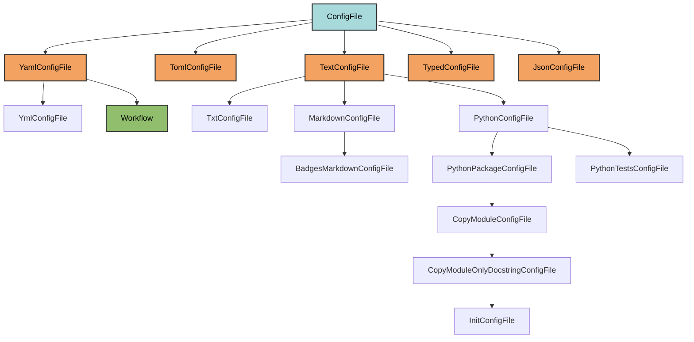
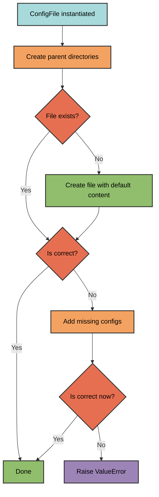
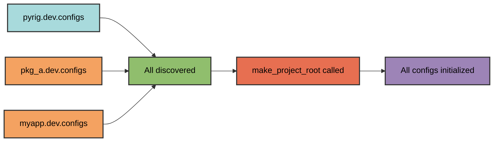

# Configuration File Architecture

pyrig's ConfigFile system provides automatic creation, validation, and updating
of project configuration files through a declarative class-based architecture.

## Core Concepts

### ConfigFile Base Class

The `ConfigFile` abstract base class is the foundation of the configuration
system. All config files inherit from it or one of its format-specific
subclasses.

When you run `pyrig mkroot` or `pyrig init`, all ConfigFile subclasses are
automatically discovered and initialized, creating the complete project
configuration.



### Required Methods

Every ConfigFile subclass must implement:

| Method                 | Purpose                                    | Returns          |
| ---------------------- | ------------------------------------------ | ---------------- |
| `get_parent_path()`    | Directory containing the file              | `Path`           |
| `get_file_extension()` | File extension without dot                 | `str`            |
| `get_configs()`        | Expected configuration structure           | `dict` or `list` |
| `_load()`              | Parse file content (internal)              | `dict` or `list` |
| `_dump(config)`        | Write configuration to file (internal)     | `None`           |

**Note**: Subclasses implement `_load()` and `_dump()` (internal methods).
Users call `load()` and `dump()` (public API with caching).

### Caching System

The `load()` method uses `@functools.cache` to avoid redundant file reads:

- **First call**: Reads file via `_load()` and caches the result
- **Subsequent calls**: Returns cached data without disk I/O
- **Cache invalidation**: `dump()` clears the cache before and after writing

This provides significant performance improvements when config files
are accessed multiple times, while ensuring data consistency after writes.

## Initialization Process

When a ConfigFile is instantiated, it follows this process:



**Note**: Config files are grouped by priority and initialized by group (highest
priority first). Within each priority group, files are initialized in parallel
using ThreadPoolExecutor for improved performance.

### Validation Logic

A config file is considered correct if:

1. **Empty file** - User opted out of this configuration file
2. **Superset validation** - Actual config contains all expected keys/values

The validation recursively checks that the expected configuration is a subset of
the actual configuration. Only use lists and dicts to define your configuration
structure.

### Smart Merging

When configs are missing or incorrect, the system intelligently merges them:

- **Dict values** - Missing keys are added. **Important**: Keys with incorrect
  values are overwritten with the expected values from `get_configs()`. This
  ensures required configuration is always correct.
- **List values** - Missing items are inserted at the correct index
- **User additions** - Preserved during merge (extra keys in dicts, extra items
  in lists)

**Customizing default values**: To change default values, subclass the specific
config file and override the `get_configs()` method. Keep the class name the
same (filename is derived from it) unless you also override `get_filename()`.
Import the base class using:
`from pyrig.dev.configs.some.config_file import MainConfigFile as BaseMainCF`
and subclass it.

## Automatic Discovery

ConfigFile subclasses are automatically discovered across all packages depending
on pyrig:



Discovery uses `get_all_nonabst_subcls_from_mod_in_all_deps_depen_on_dep` with
`discard_parents=True`, meaning only leaf implementations are initialized. This
way you can subclass a config file and only your subclass will be initialized.
This makes it easy to adjust any config file to your liking.

Note: I highly recommend doing any changes to config files via a subclass and
not directly in the file itself. This way you can regenerate the file at any
time and it will not overwrite your changes. Also this way packages that will
later depend on your package will automatically get your config file adjustments
as well.

### Initialization Order

Config files are initialized during `pyrig mkroot` or `pyrig init` using a
priority-based system that balances correctness with performance.

#### Priority System

Each ConfigFile subclass can override `get_priority()` to specify initialization
order:

```python
@classmethod
def get_priority(cls) -> float:
    """Return priority for this config file.

    Higher numbers are processed first. 
    Return 0 (default) if order doesn't matter.
    """
    return 0  # Default: no priority
```

**Priority values in pyrig**:

- `LicenceConfigFile`: 30 (must exist before pyproject.toml for license
  detection)
- `PyprojectConfigFile`: 20 (must exist before other configs that read from it)
- `ConfigsInitConfigFile`: 10 (creates package structure)
- `FixturesInitConfigFile`: 10 (must exist before conftest.py)
- All others: 0 (no specific order required)

#### How Initialization Works

The initialization process groups config files by priority and processes each
group:

1. **Grouping**: All config files are grouped by their priority value
2. **Sequential group processing**: Priority groups are processed in order
   (highest priority first)
3. **Parallel within groups**: All files within the same priority group are
   initialized in parallel using ThreadPoolExecutor

**Example execution order**:

- Priority 30 group (LICENSE) - Initialized first
- Priority 20 group (pyproject.toml) - Initialized second
- Priority 10 group (ConfigsInitConfigFile, FixturesInitConfigFile) -
  Initialized third, both in parallel
- Priority 0 group (all other configs) - Initialized last, all in parallel

**Key methods**:

- `ConfigFile.init_all_subclasses()` - Initialize all discovered config files
- `ConfigFile.init_priority_subclasses()` - Initialize only files with
  priority > 0
- `ConfigFile.get_all_subclasses()` - Discover all config files (sorted by
  priority)
- `ConfigFile.get_priority_subclasses()` - Get only config files with priority >
  0

**Priority-only initialization**:

```bash
uv run pyrig mkroot --priority
```

This creates only the essential files (priority > 0) during initial project
setup, useful when you need core files before installing dependencies.

#### Performance Benefits

The hybrid priority-based approach provides:

- **Correctness** - Dependencies are respected through priority ordering
- **Performance** - Files without dependencies initialize concurrently
- **Flexibility** - Same priority = can run in parallel, different priority =
  guaranteed order

This is significantly faster for projects with many config files while ensuring
dependencies (like LICENSE before pyproject.toml) are always met.

## Format-Specific Subclasses

These subclasses implement common methods for specific file formats, simplifying
ConfigFile creation. They provide implementations for `_load()`, `_dump()`, and
`get_file_extension()` so you only need to define the file location and expected
content.

### JsonConfigFile

For JSON configuration files using Python's json module:

```python
from pathlib import Path
from typing import Any
from pyrig.dev.configs.base.json import JsonConfigFile

class MyConfigFile(JsonConfigFile):
    @classmethod
    def get_parent_path(cls) -> Path:
        return Path("config")

    @classmethod
    def get_configs(cls) -> dict[str, Any]:
        return {"key": "value"}
```

Creates `config/my_config.json`.

### YamlConfigFile

For YAML configuration files using PyYAML:

```python
from pathlib import Path
from typing import Any
from pyrig.dev.configs.base.yaml import YamlConfigFile

class MyConfigFile(YamlConfigFile):
    @classmethod
    def get_parent_path(cls) -> Path:
        return Path("config")

    @classmethod
    def get_configs(cls) -> dict[str, Any]:
        return {"key": "value"}
```

Creates `config/my_config.yaml`.

### TomlConfigFile

For TOML files using tomlkit (preserves formatting):

```python
from pathlib import Path
from typing import Any
from pyrig.dev.configs.base.toml import TomlConfigFile

class MyConfigFile(TomlConfigFile):
    @classmethod
    def get_parent_path(cls) -> Path:
        return Path(".")

    @classmethod
    def get_configs(cls) -> dict[str, Any]:
        return {"tool": {"myapp": {"setting": "value"}}}
```

Creates `my_config.toml` with pretty formatting.

### TextConfigFile

For plain text files with required content. "Text" here means files that cannot
be represented as structured data (dicts/lists). This includes `.py`, `.txt`,
`.md` files, etc. Files like `.yaml`, `.json`, `.toml` that can be represented
as dicts/lists should use their specific subclasses instead.

```python
from pathlib import Path
from pyrig.dev.configs.base.text import TextConfigFile

class MyConfigFile(TextConfigFile):
    @classmethod
    def get_parent_path(cls) -> Path:
        return Path(".")

    @classmethod
    def get_content_str(cls) -> str:
        return "# Required header\n"

    @classmethod
    def get_file_extension(cls) -> str:
        return "someext"
```

Creates `my_config.someext`. The file is considered correct if it contains the
required content anywhere within it. You can add your own content before or
after the required content.

### PythonConfigFile

For Python source files:

```python
from pathlib import Path
from pyrig.dev.configs.base.python import PythonConfigFile

class MyConfigFile(PythonConfigFile):
    @classmethod
    def get_parent_path(cls) -> Path:
        return Path("myapp/src")

    @classmethod
    def get_content_str(cls) -> str:
        return '"""Module docstring."""\n\ndef main():\n    pass\n'
```

Creates `myapp/src/my_config.py`.

### Workflow

For GitHub Actions workflow files in `.github/workflows/`:

```python
from typing import Any
from pyrig.dev.configs.base.workflow import Workflow

class MyWorkflow(Workflow):
    @classmethod
    def get_workflow_triggers(cls) -> dict[str, Any]:
        """Define when the workflow runs."""
        triggers = super().get_workflow_triggers()
        triggers.update(cls.on_push())  # Trigger on push
        return triggers

    @classmethod
    def get_jobs(cls) -> dict[str, Any]:
        """Define the workflow jobs."""
        return {
            "my-job": {
                "runs-on": cls.UBUNTU_LATEST,
                "steps": [
                    cls.step_checkout(),
                    cls.step_setup_python(),
                    {"name": "Run tests", "run": "pytest"}
                ]
            }
        }
```

Creates `.github/workflows/my_workflow.yaml`. The Workflow class provides many
helper methods for building jobs, steps, triggers, and matrix strategies. See
the workflow documentation for details.

## Advanced Subclasses

### CopyModuleConfigFile

Copies entire module content from pyrig to your project:

```python
from types import ModuleType
from pyrig.dev.configs.base.py_package import CopyModuleConfigFile
from pyrig.dev.cli import subcommands

class SubcommandsConfigFile(CopyModuleConfigFile):
    @classmethod
    def get_src_module(cls) -> ModuleType:
        return subcommands
```

Creates `myapp/dev/cli/subcommands.py` with full content from
`pyrig.dev.cli.subcommands`.

### CopyModuleOnlyDocstringConfigFile

Copies only the docstring, allowing custom implementation:

```python
from types import ModuleType
from pyrig.dev.configs.base.py_package import CopyModuleOnlyDocstringConfigFile
from pyrig.dev.cli import shared_subcommands

class SharedSubcommandsConfigFile(CopyModuleOnlyDocstringConfigFile):
    @classmethod
    def get_src_module(cls) -> ModuleType:
        return shared_subcommands
```

Creates `myapp/dev/cli/shared_subcommands.py` with only the docstring.

### InitConfigFile

Creates `__init__.py` files with docstrings:

```python
from types import ModuleType
from pyrig.dev.configs.base.init import InitConfigFile
from pyrig.dev import configs

class ConfigsInitConfigFile(InitConfigFile):
    @classmethod
    def get_src_module(cls) -> ModuleType:
        return configs
```

Creates `myapp/dev/configs/__init__.py` with the docstring from
`pyrig.dev.configs`.

## Filename Derivation

Filenames are automatically derived from class names:

| Class Name            | Filename     |
| --------------------- | ------------ |
| `MyConfigFile`        | `my_config`  |
| `PyprojectConfigFile` | `pyproject`  |
| `DotEnvConfigFile`    | `dot_env`    |
| `GitIgnoreConfigFile` | `git_ignore` |

The system:

1. Removes abstract parent class suffixes (`ConfigFile`, `YamlConfigFile`, etc.)
2. Converts to snake_case
3. Adds the file extension

Override `get_filename()` for custom names:

```python
@classmethod
def get_filename(cls) -> str:
    return ""  # Creates ".env" instead of "dot_env.env"
```

## Opt-Out Mechanism

Users can opt out of any config file by emptying it. An empty file is considered
"unwanted" and validation passes. There are few exceptions (e.g., README.md is
always required). You can override `is_unwanted()` to customize this behavior.

**Note**: Deleting a file will just lead to it being recreated. Emptying it is
the only way to opt out.

## Custom Validation

Override `is_correct()` for custom validation logic, pyrig does this in many of
its own config files:

```python
@classmethod
def is_correct(cls) -> bool:
    """Check if config contains required structure."""
    content = cls.get_file_content()
    return super().is_correct() or (
        "required_string" in content
        and "another_required_string" in content
    )
```

## Best Practices

1. **Inherit from format-specific classes** - Use `YamlConfigFile`,
   `TomlConfigFile`, etc.
2. **Keep configs minimal** - Only specify required values
3. **Allow user customization** - Validation checks for supersets, not exact
   matches
4. **Use priority/ordered lists** - For configs with dependencies
5. **Override `is_correct()` carefully** - Ensure it allows user additions
6. **Document expected structure** - In docstrings and comments

## Example: Complete Custom Config

```python
from pathlib import Path
from typing import Any
from pyrig.dev.configs.base.yaml import YamlConfigFile

class DatabaseConfigFile(YamlConfigFile):
    """Configuration for database connection settings."""

    @classmethod
    def get_parent_path(cls) -> Path:
        """Place in config/ directory."""
        return Path("config")

    @classmethod
    def get_configs(cls) -> dict[str, Any]:
        """Required database configuration."""
        return {
            "database": {
                "host": "localhost",
                "port": 5432,
                "name": "myapp_db"
            }
        }

    @classmethod
    def is_correct(cls) -> bool:
        """Ensure required keys exist."""
        config = cls.load()
        required_keys = {"host", "port", "name"}
        actual_keys = set(config.get("database", {}).keys())
        return super().is_correct() or required_keys.issubset(actual_keys)
```

Place in `myapp/dev/configs/database.py` and it will create
`config/database.yaml` with the required structure.
