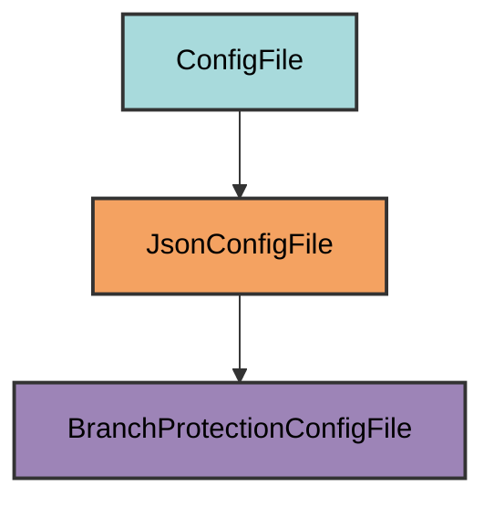

# branch-protection.json

Branch protection ruleset configuration for GitHub repository protection.

## Overview

The branch protection configuration file defines the ruleset that protects your
repository's main branch. This file is automatically generated by pyrig and used
by the `protect-repo` command to create or update GitHub branch protection
rules.

The `protect-repo` command loads this file and applies it to GitHub via the API.
It passes the json as a dict as is to the API, so if you make adjustments to the
json file make sure it is aligned with the API schema of GitHUbs REST API. I
suggest manually changing the settings in GitHub and then exporting the json
from GitHub to see the structure and just use that to overwrite the
`branch-protection.json` file by subclassing the `BranchProtectionConfigFile`
class.

## Inheritance



**Inherits from**: `JsonConfigFile`

**What this means**:

- Uses JSON format for configuration
- Loads/dumps with Python's `json` module
- Validation checks if configuration matches GitHub's ruleset schema
- File can be manually uploaded to GitHub
- Configuration is passed directly to GitHub's REST API

## File Location

**Path**: `branch-protection.json` (project root)

**Extension**: `.json` - JSON configuration file.

## Purpose

This configuration file serves as a declarative definition of your repository's
branch protection rules. Instead of hardcoding protection settings in Python,
pyrig generates a JSON file that:

- Matches GitHub's ruleset export/import format
- Can be manually uploaded to GitHub if needed
- Provides transparency into protection rules

## Configuration Structure

The file contains a complete GitHub ruleset definition:

```json
{
  "name": "main-protection",
  "target": "branch",
  "enforcement": "active",
  "conditions": {
    "ref_name": {
      "exclude": [],
      "include": ["~DEFAULT_BRANCH"]
    }
  },
  "rules": [
    { "type": "creation" },
    { "type": "update" },
    { "type": "deletion" },
    { "type": "required_linear_history" },
    { "type": "required_signatures" },
    {
      "type": "pull_request",
      "parameters": {
        "required_approving_review_count": 1,
        "dismiss_stale_reviews_on_push": true,
        "required_reviewers": [],
        "require_code_owner_review": true,
        "require_last_push_approval": true,
        "required_review_thread_resolution": true,
        "allowed_merge_methods": ["squash", "rebase"]
      }
    },
    {
      "type": "required_status_checks",
      "parameters": {
        "strict_required_status_checks_policy": true,
        "do_not_enforce_on_create": true,
        "required_status_checks": [{ "context": "health_check" }]
      }
    },
    { "type": "non_fast_forward" }
  ],
  "bypass_actors": [
    {
      "actor_id": 5,
      "actor_type": "RepositoryRole",
      "bypass_mode": "always"
    }
  ]
}
```

## Key Configuration Elements

### Ruleset Name

- **Value**: `"main-protection"`
- **Purpose**: Identifies the ruleset in GitHub

### Target

- **Value**: `"branch"`
- **Purpose**: Applies rules to branches (not tags or pushes)

### Enforcement

- **Value**: `"active"`
- **Purpose**: Rules are enforced (alternatives: `"disabled"`, `"evaluate"`)

### Conditions

- **Include**: `["~DEFAULT_BRANCH"]` (applies to main branch)
- **Exclude**: `[]` (no exclusions)

### Rules

**Creation/Update/Deletion Protection**:

- Prevents unauthorized branch operations

**Required Linear History**:

- Enforces linear commit history (no merge commits)

**Required Signatures**:

- Requires signed commits for security

**Pull Request Requirements**:

- 1 approving review required
- Stale reviews dismissed on new pushes
- Code owner approval required
- Last push must be approved
- All review threads must be resolved
- Only squash and rebase merges allowed

**Required Status Checks**:

- `health_check` job must pass
- Branch must be up to date before merging and pass tests and other checks
- Not enforced on branch creation

**Non-Fast-Forward Protection**:

- Prevents force pushes

### Bypass Actors

- **Actor ID 5**: Repository admins
- **Bypass Mode**: Always allowed to bypass rules

## How It Works

### Automatic Generation

When initialized via `uv run pyrig mkroot`, the `branch-protection.json` file is
created by:

1. **Generating ruleset configuration**:
   `BranchProtectionConfigFile.get_configs()` creates the complete ruleset
2. **Setting required status checks**: Uses health check workflow job IDs
3. **Configuring bypass actors**: Adds repository admin bypass permissions
4. **Applying security defaults**: Enforces pyrig's opinionated protection rules

The class programmatically generates the configuration using:

- Health check workflow job IDs for required status checks
- Standard GitHub actor IDs for bypass permissions (actor_id: 5 = Repository
  admins)
- Pyrig's opinionated security defaults

### Application to GitHub

The `protect-repo` command loads this file and applies it to GitHub:

```bash
uv run pyrig protect-repo
```

This command:

1. Loads `branch-protection.json` using `BranchProtectionConfigFile.load()`
2. Checks if a ruleset with the same name exists
3. Creates or updates the ruleset via GitHub API
4. Applies all protection rules to the main branch

The configuration is passed directly to GitHub's REST API as a dictionary, so
any manual modifications must align with GitHub's ruleset schema.

## Usage

### Automatic Creation

The file is automatically created when you initialize your project:

```bash
uv run pyrig mkroot
```

This generates `branch-protection.json` with pyrig's default protection rules.

### Applying to GitHub

The protection rules are automatically applied by the health check workflow. To
manually apply:

```bash
uv run pyrig protect-repo
```

This requires the `REPO_TOKEN` secret to be configured in your repository.

### Manual Upload to GitHub

You can also manually upload this file to GitHub:

1. Go to repository Settings → Rules → Rulesets
2. Click "New ruleset" → "Import a ruleset"
3. Upload `branch-protection.json`
4. Review and create

You probably will not need this because the CI/CD pipeline will handle it for
you via the `protect-repo` command.

### Customization

To customize branch protection rules, subclass `BranchProtectionConfigFile`:

```python
from typing import Any
from pyrig.dev.configs.branch_protection import BranchProtectionConfigFile

class MyBranchProtectionConfigFile(BranchProtectionConfigFile):
    @classmethod
    def get_configs(cls) -> dict[str, Any]:
        """Custom branch protection configuration."""
        config = super().get_configs()
        # Require 2 approvals instead of 1
        for rule in config["rules"]:
            if rule.get("type") == "pull_request":
                rule["parameters"]["required_approving_review_count"] = 2
        return config
```

Place in `myapp/dev/configs/branch_protection.py` and it will override the
default configuration.

### Verifying Configuration

After applying, verify the ruleset in GitHub after the CI/CD pipeline runs and
activated it with the command `uv run pyrig protect-repo`:

1. Go to repository Settings → Rules → Rulesets
2. Find the `main-protection` ruleset
3. Review the applied rules

Or export the current ruleset from GitHub and compare with your local file.

## Best Practices

1. **Don't modify the file directly**: Use subclassing to customize rules
   instead of editing the generated file
2. **Align with GitHub's schema**: If you manually edit the JSON, ensure it
   matches GitHub's ruleset API schema
3. **Export from GitHub for reference**: Manually configure rules in GitHub UI,
   export the ruleset, and use that structure for customization
4. **Test in a separate repository**: Test custom protection rules in a test
   repository before applying to production
5. **Keep bypass actors minimal**: Only allow repository admins to bypass rules
6. **Use the CI/CD pipeline**: Let the health check workflow apply protection
   automatically instead of manual uploads

## Related

- [protect-repo Command](../cli/commands/protect-repo.md) - Uses this file to
  apply protection
- [Health Check Workflow](workflows/health_check.md) - Runs protect-repo
  automatically
- [JsonConfigFile](architecture.md#jsonconfigfile) - Base class for JSON
  configuration files
- [GitHub Rulesets API](https://docs.github.com/en/rest/repos/rules) - GitHub
  API documentation
