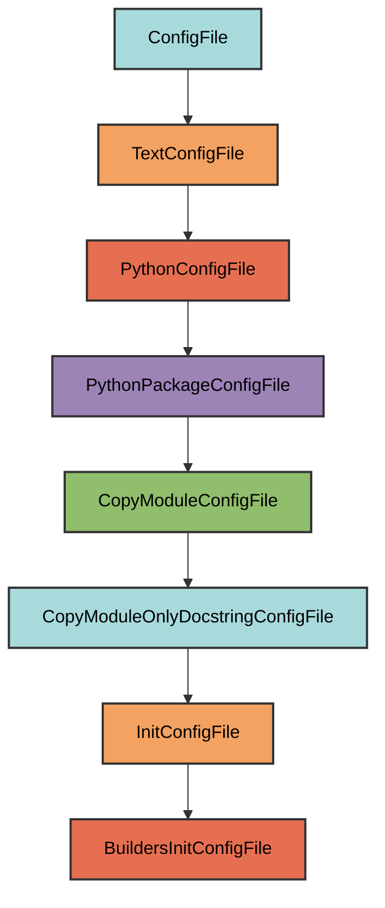

# builders/**init**.py Configuration

The `BuildersInitConfigFile` manages the `dev/artifacts/builders/__init__.py` file.

## Overview

Creates a builders package that:

- Mirrors the structure of `pyrig.dev.builders`
- Copies only the docstring from the source module
- Ensures the builders directory exists with proper package structure
- Provides a place for custom builder implementations

## Inheritance



**Inherits from**: `InitConfigFile`

**What this means**:

- Creates `__init__.py` files for package initialization
- Copies only the docstring from `pyrig.dev.builders`
- Automatically determines target path
- Ensures parent directory is a valid Python package

## File Location

**Path**: `{package_name}/dev/artifacts/builders/__init__.py`

**Source module**: `pyrig.dev.builders`

**Path transformation**: `pyrig.dev.builders` → `{package_name}.dev.artifacts.builders` → `{package_name}/dev/artifacts/builders/__init__.py`

## How It Works

### Automatic Generation

When initialized via `uv run pyrig mkroot`, the file is created with:

1. **Docstring copy**: Only the docstring from `pyrig.dev.builders.__init__.py` is copied
2. **Package structure**: The `dev/artifacts/builders/` directory is created
3. **Package initialization**: Parent directories get `__init__.py` files

### Generated Content

```python
"""Builders package for creating project artifacts."""
```

The file contains only the docstring, allowing you to add custom builder implementations.

## Usage

### Automatic Creation

```bash
uv run pyrig mkroot
```

### Purpose

This package is where you can add custom builders for your project. The builders system is used to create project artifacts.

See the [Builders documentation](../builders/index.md) for details on creating custom builders.

## Best Practices

1. **Don't modify the docstring**: Keep the copied docstring intact
2. **Add custom builders**: Create builder modules in this directory
3. **Follow pyrig patterns**: Use the same structure as pyrig's builders

