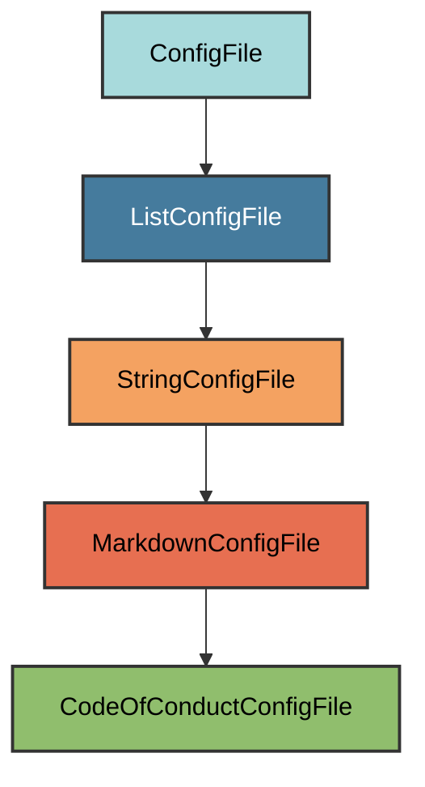

# Code of Conduct Configuration

The `CodeOfConductConfigFile` manages the `CODE_OF_CONDUCT.md` file for the
project.

## Overview

Creates a CODE_OF_CONDUCT.md file that:

- Uses the Contributor Covenant 2.1, the most widely adopted code of conduct
- Fetches from GitHub's MVG (Minimum Viable Governance) repository
- Falls back to bundled template if fetch fails
- Inserts user's email from git config as the contact method
- Located at the project root
- Works for both private and public repositories

## Inheritance



**Inherits from**: `MarkdownConfigFile`

**What this means**:

- Markdown file format (`.md` extension)
- Text-based validation
- User can replace with their own code of conduct
- File is considered correct if it exists and is non-empty

## File Location

**Path**: `CODE_OF_CONDUCT.md` (project root)

**Extension**: `.md` - Standard Markdown extension.

**Filename**: `CODE_OF_CONDUCT` (uppercase) - The standard community health file
recognized by GitHub and other platforms.

## How It Works

### Automatic Generation

When initialized via `uv run pyrig mkroot`, the file is created by:

1. **Fetch Contributor Covenant**: Downloads from GitHub's MVG repository
2. **Fallback**: Uses bundled template if fetch fails
3. **Insert contact method**: Replaces `[INSERT CONTACT METHOD]` with the user's
   email from git config (`git config --get user.email`)
4. **Write file**: Creates CODE_OF_CONDUCT.md with content

### Content Fetching

Pyrig fetches the Contributor Covenant 2.1 from GitHub's MVG repository at
`https://raw.githubusercontent.com/github/MVG/main/org-docs/CODE-OF-CONDUCT.md`.
If the request fails, it uses a bundled template from
`pyrig/resources/CONTRIBUTOR_COVENANT_CODE_OF_CONDUCT.md`.

## Usage

### Automatic Creation

```bash
uv run pyrig mkroot
```

### Generated Content

The Contributor Covenant includes:

- **Our Pledge**: Commitment to harassment-free participation
- **Our Standards**: Examples of positive and unacceptable behavior
- **Enforcement Responsibilities**: Community leader obligations
- **Scope**: Where the code of conduct applies
- **Enforcement**: How to report violations
- **Enforcement Guidelines**: Correction, warning, temporary ban, permanent ban
- **Attribution**: Credits to Contributor Covenant

### Using a Different Code of Conduct

Replace the CODE_OF_CONDUCT.md file content with your preferred code of conduct:
The file will be considered valid as long as it exists and contains content.

## Validation Logic

The validation checks if CODE_OF_CONDUCT.md exists and is non-empty. This allows
users to replace the Contributor Covenant with their own code of conduct.

**Required element**: File must exist and contain text.

## Why Contributor Covenant?

The Contributor Covenant is the most widely adopted code of conduct for open
source projects. It is used by:

- Linux
- Kubernetes
- Rails
- Swift
- Thousands of other projects

It provides a clear, professional standard that:

- Sets expectations for community behavior
- Provides enforcement guidelines
- Creates a welcoming environment for contributors

## Best Practices

1. **Review the content**: Ensure the Contributor Covenant fits your project
2. **Customize if needed**: Replace with a different code of conduct if required
3. **Enforce consistently**: Apply the standards fairly to all contributors
4. **Link from README**: Consider referencing the code of conduct in your README
5. **Set up reporting**: Establish a way for people to report violations

**Tip**: GitHub automatically detects CODE_OF_CONDUCT.md and displays it in the
repository's community health files.
