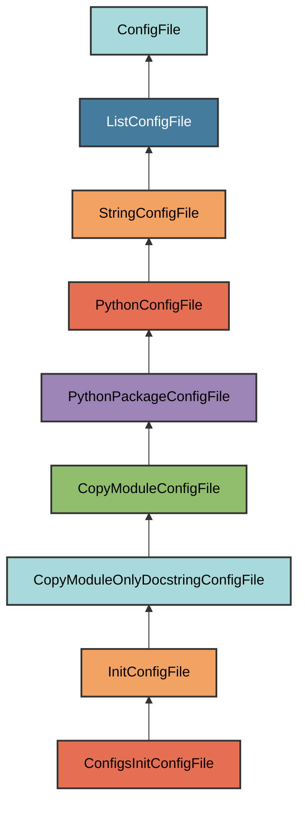

# configs/**init**.py Configuration

The `ConfigsInitConfigFile` manages the `{package_name}/dev/configs/__init__.py`
file.

## Overview

Creates a configs package that:

- Mirrors the structure of `pyrig.dev.configs`
- Copies only the docstring from the source module
- Ensures the configs directory exists with proper package structure
- Provides a place for custom config file implementations

## Inheritance



**Inherits from**: `InitConfigFile`

**What this means**:

- Creates `__init__.py` files for package initialization
- Copies only the docstring from `pyrig.dev.configs`
- Automatically determines target path
- Ensures parent directory is a valid Python package

## File Location

**Path**: `{package_name}/dev/configs/__init__.py`

**Source module**: `pyrig.dev.configs`

**Path transformation**: `pyrig.dev.configs` → `{package_name}.dev.configs` →
`{package_name}/dev/configs/__init__.py`

## How It Works

### Automatic Generation

When initialized via `uv run pyrig mkroot`, the file is created with:

1. **Docstring copy**: Only the docstring from `pyrig.dev.configs.__init__.py`
   is copied
2. **Package structure**: The `dev/configs/` directory is created
3. **Package initialization**: Parent directories get `__init__.py` files

### Generated Content

```python
"""Custom configuration file definitions.

Add custom ConfigFile subclasses here to manage project-specific configuration
files. ConfigFile subclasses are automatically discovered and initialized when
running `pyrig mkroot`. """
```

The file contains only the docstring from `pyrig.dev.configs`, allowing you to
add custom config file implementations.

## Usage

### Automatic Creation

```bash
uv run pyrig mkroot
```

### Purpose

This package is where you can add custom configuration file managers for your
project. All ConfigFile subclasses are automatically discovered.

See the [Config Files documentation](index.md) for details on creating custom
config files.

## Best Practices

1. **Don't modify the docstring**: Keep the copied docstring intact
2. **Add custom configs**: Create config file classes in this directory
3. **Follow pyrig patterns**: Use the same structure as pyrig's config files
