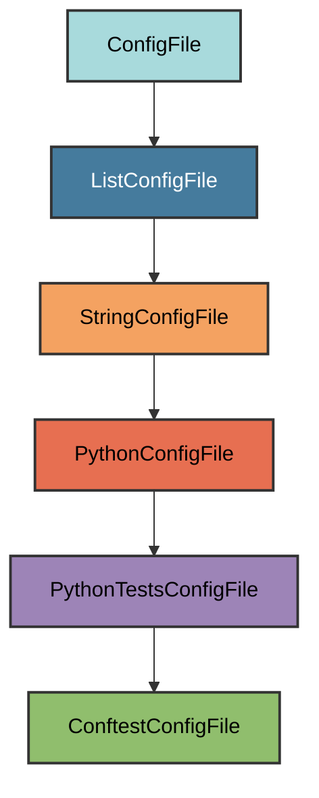

# conftest.py Configuration

The `ConftestConfigFile` manages the `tests/conftest.py` file.

## Overview

Creates a conftest.py file that:

- Imports pyrig's test fixtures and plugins as a pytest plugin
- Configures pytest for the test suite
- Sets up fixtures and hooks for all test scopes
- Ensures consistent test infrastructure across projects

## Inheritance



**Inherits from**: `PythonTestsConfigFile` (via `ListConfigFile`)

**What this means**:

- Python file in the tests directory
- Located at `tests/conftest.py`
- Text-based validation (checks for required content)
- Allows modifications as long as required import exists

## File Location

**Path**: `tests/conftest.py`

**Extension**: `.py` - Python source file.

**Filename**: `conftest` - Special pytest configuration file.

## How It Works

### Automatic Generation

When initialized via `uv run pyrig mkroot`, the file is created with:

1. **Plugin import**: Imports `pyrig.dev.tests.conftest` as a pytest plugin
2. **Docstring**: Explains the file's purpose and warns against manual
   modification
3. **Pytest integration**: Automatically loads pyrig's fixtures and hooks

### Generated Content

```python
"""Pytest configuration for tests.

This module configures pytest plugins for the test suite, setting up the
necessary fixtures and hooks for the different test scopes (function, class,
module, package, session). It also import custom plugins from tests/base/scopes.
This file should not be modified manually. """

pytest_plugins = ["pyrig.dev.tests.conftest"]
```

The `pytest_plugins` list tells pytest to load pyrig's conftest module, making
all pyrig fixtures available.

## Validation Logic

The `is_correct()` method checks for the required plugin import:

```python
@classmethod
def is_correct(cls) -> bool:
    """Check if the conftest.py file is valid."""
    return super().is_correct() or (
        f'pytest_plugins = ["{make_obj_importpath(conftest)}"]'
        in cls.get_file_content()
    )
```

**Required element**: The `pytest_plugins` list with pyrig's conftest import.

**Flexible content**: You can add additional plugins or configuration as long as
the required import exists.

## Usage

### Automatic Creation

```bash
uv run pyrig mkroot
```

### Purpose

This file configures pytest to use pyrig's test infrastructure, including:

- Autouse fixtures (session, package, module, class, function scopes)
- Factory fixtures (`config_file_factory`)
- Custom pytest hooks and plugins

See the [Testing documentation](../tests/index.md) for details on the test
infrastructure.

## Best Practices

1. **Don't remove the import**: Keep the `pytest_plugins` import intact
2. **Add custom plugins**: You can add additional pytest plugins to the list
3. **Avoid manual modification**: The file is auto-generated and should rarely
   need changes
4. **Use fixtures package**: Add custom fixtures in `dev/tests/fixtures/`
   instead
