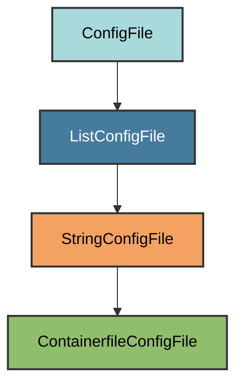

# Containerfile Configuration

The `ContainerfileConfigFile` manages the project's Containerfile for building
container images with Podman or Docker.

## Overview

Creates a production-ready Containerfile in the project root that:

- Uses the latest compatible Python slim image
- Installs dependencies with uv
- Runs as non-root user for security
- Sets up proper entrypoint and command
- Optimizes for layer caching

## Inheritance



**Inherits from**: `StringConfigFile`

**What this means**:

- File is plain text (not YAML/TOML/JSON)
- Validation checks if required content is present
- Users can add custom content before or after required layers
- File is considered correct if all required layers exist in the file

## File Location

**Path**: `Containerfile` (project root)

**No extension**: The file is named exactly `Containerfile` with no extension,
following Podman/Buildah conventions.

## How It Works

### Automatic Generation

When initialized via `uv run pyrig mkroot`, the Containerfile is automatically
created with all required layers:

1. **Base image**: Uses Python slim image matching your `requires-python`
   constraint
2. **Working directory**: Sets up workspace named after your project
3. **UV installation**: Copies uv binary from official image
4. **Dependency files**: Copies metadata files for dependency installation
5. **User setup**: Creates non-root `appuser` for security
6. **Source code**: Copies your package with proper ownership
7. **Dependencies**: Installs runtime dependencies (excludes dev group)
8. **Cleanup**: Removes unnecessary files to reduce image size
9. **Entrypoint**: Sets up `uv run <project>` as entrypoint
10. **Default command**: Runs your main module by default

### Layer Structure

The Containerfile is built from discrete layers returned by `get_layers()`:

```python
[
    "FROM python:3.12-slim",
    "WORKDIR /my-project",
    "COPY --from=ghcr.io/astral-sh/uv:latest /uv /usr/local/bin/uv",
    "COPY README.md LICENSE pyproject.toml uv.lock ./",
    "RUN useradd -m -u 1000 appuser",
    "RUN chown -R appuser:appuser .",
    "USER appuser",
    "COPY --chown=appuser:appuser my_project my_project",
    "RUN uv sync --no-group dev",
    "RUN rm README.md LICENSE pyproject.toml uv.lock",
    'ENTRYPOINT ["uv", "run", "my-project"]',
    'CMD ["main"]'
]
```

### Validation Logic

Validation checks that all required layers are present. You can add comments,
custom layers, or build arguments as long as all required layers exist.

## Dynamic Configuration

The Containerfile adapts automatically:

- **Python version**: Uses the highest version allowed by `requires-python`
- **Project names**: Uses project/package names from `pyproject.toml`
- **Entrypoint**: Configured to run your project via uv

## Usage

### Building the Image

```bash
# With Podman (recommended)
podman build -t my-project .
```

Docker should work as well, but Podman is recommended for its daemonless and
rootless architecture.

### Running the Container

The entrypoint and default command allow running the container directly. The
default command runs the main module, but you can pass custom arguments.

```bash
# Run with default command (main module)
podman run my-project

# Run with custom command
podman run my-project --help

# Run with custom subcommand
podman run my-project mysubcommand --option value
```

### Customization

You can add custom layers while keeping pyrig's required layers:

```dockerfile
# Custom build argument
ARG BUILD_DATE

# Required pyrig layers...
FROM python:3.12-slim
WORKDIR /myproject
# ... rest of required layers ...

# Custom copy
COPY my_custom_file.txt ./
```

As long as all required layers are present, validation passes.

## Security Features

- **Non-root user**: Runs as `appuser` (UID 1000) instead of root
- **Minimal base**: Uses slim Python image to reduce attack surface and keep
  container size small and lightweight
- **No dev dependencies**: Only installs runtime dependencies
- **Proper ownership**: Files owned by appuser, not root

## Best Practices

1. **Keep required layers**: Don't remove pyrig's generated layers
2. **Add custom layers after**: Append your customizations at the end
3. **Do not use .containerignore**: Should not be necessary as we only copy the
   package folder and not the entire project. All copied config file are deleted
   in the last layer.
