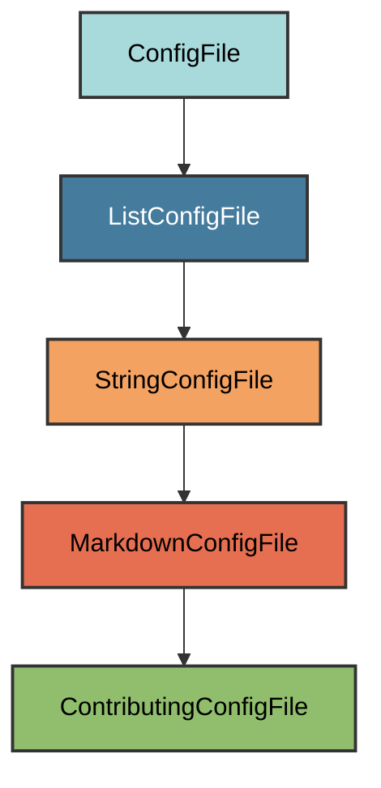

# Contributing Configuration

The `ContributingConfigFile` manages the `CONTRIBUTING.md` file for the project.

## Overview

Creates a CONTRIBUTING.md file that:

- Uses a minimal best practices template
- Covers issues, pull requests, and guidelines
- References the Code of Conduct
- Located at the project root
- Works for both private and public repositories

## Inheritance



**Inherits from**: `MarkdownConfigFile`

**What this means**:

- Markdown file format (`.md` extension)
- Text-based validation
- User can replace with their own contributing guidelines
- File is considered correct if it exists and is non-empty

## File Location

**Path**: `CONTRIBUTING.md` (project root)

**Extension**: `.md` - Standard Markdown extension.

**Filename**: `CONTRIBUTING` (uppercase) - The standard community health file
recognized by GitHub and other platforms.

## How It Works

### Automatic Generation

When initialized via `uv run pyrig mkroot`, the file is created using the
embedded template. No network request is made.

### Template Content

The template includes:

1. **Issues section**: How to report ideas, problems, and questions
2. **Pull Requests section**: Fork/branch/commit/PR workflow
3. **Guidelines subsection**: Best practices for PRs
4. **Code of Conduct reference**: Links to CODE_OF_CONDUCT.md

## Usage

### Automatic Creation

```bash
uv run pyrig mkroot
```

### Generated Content

The template creates a CONTRIBUTING.md with:

- **Issues**: Ideas, Problems, Questions - with guidance to search first
- **Pull Requests**: 5-step workflow (fork, branch, commit, push, PR)
- **Guidelines**: Reference issues, atomic changes, documentation, code style,
  tests
- **Code of Conduct**: Link to CODE_OF_CONDUCT.md

### Using Custom Guidelines

Replace the CONTRIBUTING.md file content with your own guidelines. The file will
be considered valid as long as it exists and contains content.

## Validation Logic

The validation checks if CONTRIBUTING.md exists and is non-empty. This allows
users to replace the template with their own contributing guidelines.

**Required element**: File must exist and contain text.

## Why This Template?

The template follows minimal best practices common across open source projects:

- **Universal**: Works for any project type
- **Concise**: ~35 lines covering essentials
- **Actionable**: Clear steps for contributors
- **Linked**: References the Code of Conduct

## Best Practices

1. **Review the content**: Ensure the template fits your project
2. **Customize if needed**: Add project-specific setup instructions
3. **Link from README**: Consider referencing CONTRIBUTING.md in your README
4. **Keep it updated**: Update guidelines as your workflow evolves
5. **Be welcoming**: Encourage contributions from newcomers

**Tip**: GitHub automatically detects CONTRIBUTING.md and displays it in the
repository's community health files and when users open new issues or PRs.
