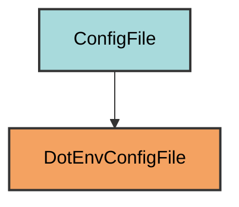

# .env Configuration

The `DotEnvConfigFile` manages the `.env` file for local environment variables.

## Overview

Creates a .env file that:

- Stores local environment variables
- Automatically excluded from version control (in `.gitignore`)
- Located at the project root
- User-managed content (pyrig doesn't write to it)
- Loaded using python-dotenv library

## Inheritance



**Inherits from**: `ConfigFile`

**What this means**:

- Direct inheritance from ConfigFile
- Custom `load()` and `dump()` implementations
- Read-only from pyrig's perspective
- Users manage content manually

## File Location

**Path**: `.env` (project root)

**Extension**: `.env` - Environment file.

**Filename**: Empty string to produce `.env` (not `env.env`).

**Special filename handling**: `get_filename()` returns `""` to create a
dotfile.

## How It Works

### Automatic Generation

When initialized via `uv run pyrig mkroot`, the file is created:

1. **Empty file**: Created if it doesn't exist
2. **Git exclusion**: Automatically added to `.gitignore`
3. **User-managed**: Pyrig doesn't write to this file

### Loading Environment Variables

The `.env` file is loaded using the `python-dotenv` library's `dotenv_values()`
function, which parses the file and returns a dictionary mapping variable names
to their values.

### Dump Protection

Pyrig prevents accidental writes to `.env` files. If you attempt to dump
configuration to this file, it will raise a `ValueError`. This is intentional -
the `.env` file is user-managed and should be edited manually.

## Usage

### Automatic Creation

```bash
uv run pyrig mkroot
```

### Adding Environment Variables

Manually edit the `.env` file:

```bash
# .env
DATABASE_URL=postgresql://localhost/mydb
API_KEY=your-secret-key
DEBUG=true
```

### Loading in Python

```python
from dotenv import load_dotenv
import os

# Load .env file
load_dotenv()

# Access variables
database_url = os.getenv("DATABASE_URL")
api_key = os.getenv("API_KEY")
debug = os.getenv("DEBUG", "false").lower() == "true"
```

### Using with pyrig

```python
from pyrig.dev.configs.dot_env import DotEnvConfigFile

# Load all variables
env_vars = DotEnvConfigFile.load()
print(env_vars["DATABASE_URL"])
```

## Validation Logic

The validation checks if the `.env` file exists. The file can be empty - pyrig
only requires that it exists on disk.

**Required element**: File must exist (can be empty).

## Best Practices

1. **Never commit**: Keep `.env` out of version control
2. **Use .env.example**: Create a template with dummy values
3. **Document variables**: Add comments explaining each variable
4. **Keep secrets safe**: Don't share `.env` files
5. **Use different files**: `.env.local`, `.env.test` for different environments
