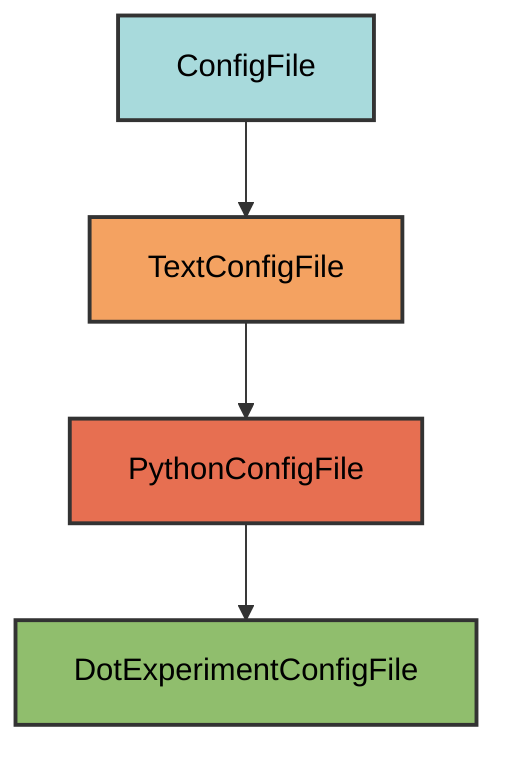

# .experiment.py Configuration

The `DotExperimentConfigFile` manages the `.experiment.py` file, which serves as a scratch file for local experimentation.

## Overview

Creates a .experiment.py file that:

- Provides a scratch space for testing code locally
- Automatically excluded from version control (in `.gitignore`)
- Located at the project root for easy access
- Contains minimal boilerplate (just a docstring)
- Safe to modify without affecting the project
- Useful for quick experiments and debugging

## Inheritance



**Inherits from**: `PythonConfigFile`

**What this means**:

- Python file format (`.py` extension)
- Text-based validation (checks if required content exists)
- Users can add any content after the docstring
- File is considered correct if it contains the required docstring
- Simple structure without complex validation

## File Location

**Path**: `.experiment.py` (project root)

**Extension**: `.py` - Python source file.

**Filename**: `.experiment` - Dotfile convention for hidden/local files.

**Special filename handling**: `get_filename()` returns `".experiment"` to create a dotfile.

## How It Works

### Automatic Generation

When initialized via `uv run pyrig mkroot`, the `.experiment.py` file is created with:

1. **Minimal content**: Just a docstring explaining the file's purpose
2. **Git exclusion**: Automatically added to `.gitignore`
3. **Root location**: Placed at project root for easy access

### Generated Content

```python
"""This file is for experimentation and is ignored by git."""
```

That's it! The file contains only a single-line docstring.

The minimal content allows you to add whatever code you want without worrying about validation.

## Git Integration

The `.experiment.py` file is automatically added to `.gitignore`:

```gitignore
# Pyrig-specific patterns
.experiment.py
```

This ensures your local experiments never get committed to version control.

## Usage

### Quick Experiments

Use `.experiment.py` for testing code snippets:

```python
"""This file is for experimentation and is ignored by git."""

from myapp.src.utils import some_function

# Test the function
result = some_function(42)
print(f"Result: {result}")
```

Run it directly:

```bash
python .experiment.py
```

### Debugging

Test imports and module structure:

```python
"""This file is for experimentation and is ignored by git."""

import sys
from pathlib import Path

# Add src to path
sys.path.insert(0, str(Path(__file__).parent / "myapp" / "src"))

from myapp.src.module import MyClass

# Debug the class
obj = MyClass()
print(obj.some_method())
```

### Prototyping

Try out new features before adding them to the codebase:

```python
"""This file is for experimentation and is ignored by git."""

from myapp.src.api import API

def new_feature():
    """Prototype for a new feature."""
    api = API()
    data = api.fetch_data()
    # Process data...
    return processed_data

if __name__ == "__main__":
    result = new_feature()
    print(result)
```

### Testing API Calls

Experiment with external APIs without creating test files:

```python
"""This file is for experimentation and is ignored by git."""

import requests

response = requests.get("https://api.example.com/data")
print(response.json())
```

## Best Practices

1. **Use freely**: This file is meant for experimentation, not production code
2. **Don't commit**: The file is gitignored, but double-check before committing
3. **Clean up**: Delete experimental code when done, or keep it for reference
4. **No dependencies**: Don't rely on this file in your actual codebase
5. **Quick iterations**: Use for rapid prototyping and testing

## Validation Logic

The validation is inherited from `TextConfigFile` and checks if the required docstring exists somewhere in the file.

**Required element**: The docstring must exist somewhere in the file.

**Flexible content**: You can add anything before or after the docstring.

## Common Use Cases

### 1. Testing Imports

```python
"""This file is for experimentation and is ignored by git."""

# Test if all imports work
from myapp.src.module1 import Class1
from myapp.src.module2 import Class2
from myapp.src.module3 import function1

print("All imports successful!")
```

### 2. Data Exploration

```python
"""This file is for experimentation and is ignored by git."""

import pandas as pd

# Load and explore data
df = pd.read_csv("data.csv")
print(df.head())
print(df.describe())
```

### 3. Algorithm Testing

```python
"""This file is for experimentation and is ignored by git."""

def algorithm_v1(data):
    """First version."""
    return sum(data) / len(data)

def algorithm_v2(data):
    """Improved version."""
    return sum(x * 2 for x in data) / len(data)

# Compare performance
data = list(range(1000))
print(f"V1: {algorithm_v1(data)}")
print(f"V2: {algorithm_v2(data)}")
```

### 4. Configuration Testing

```python
"""This file is for experimentation and is ignored by git."""

from myapp.src.config import Config

# Test different configurations
config1 = Config(debug=True, verbose=True)
config2 = Config(debug=False, verbose=False)

print(f"Config 1: {config1}")
print(f"Config 2: {config2}")
```

## Troubleshooting

### File gets committed to git

Check your `.gitignore`:

```bash
cat .gitignore | grep experiment
```

Should show:

```text
.experiment.py
```

If missing, run `uv run pyrig mkroot` to regenerate `.gitignore`.
