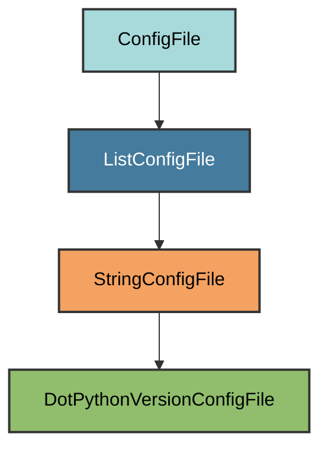

# .python-version Configuration

The `DotPythonVersionConfigFile` manages the `.python-version` file for Python
version managers.

## Overview

Creates a .python-version file that:

- Specifies the Python version for the project
- Used by pyenv and similar version managers
- Automatically set to the first supported Python version from pyproject.toml
- Located at the project root
- Ensures consistent Python version across environments

## Inheritance



**Inherits from**: `StringConfigFile`

**What this means**:

- String-based config file (single text content)
- Reads Python version from pyproject.toml
- Simple text file format

## File Location

**Path**: `.python-version` (project root)

**Extension**: `.python-version` - Version file.

**Filename**: Empty string to produce `.python-version`.

**Special filename handling**:

- `filename()` returns `""`
- `extension()` returns `"python-version"`
- Combined: `.python-version`

## How It Works

### Automatic Generation

When initialized via `uv run pyrig mkroot`, the file is created with:

1. **Version extraction**: Reads `requires-python` from pyproject.toml
2. **First version**: Uses the first supported Python version
3. **File creation**: Writes the version to `.python-version`

### Version Configuration

The version is automatically determined from the `requires-python` field in
`pyproject.toml`. Pyrig extracts the first (minimum) supported Python version
and writes it to the file.

Example: If `requires-python = ">=3.10"`, the file contains `3.10`.

## Usage

### Automatic Creation

```bash
uv run pyrig mkroot
```

### File Content

```text
3.10
```

Just the version number, nothing else.

### Using with pyenv

```bash
# pyenv automatically uses .python-version
cd /path/to/project
python --version  # Uses version from .python-version
```

### Using with other tools

- **asdf**: Reads `.python-version`
- **mise**: Reads `.python-version`
- **rtx**: Reads `.python-version`

## Dynamic Configuration

The version is determined from `pyproject.toml`:

```toml
[project]
requires-python = ">=3.12"
```

Pyrig extracts the first supported version (`3.12`) and writes it to
`.python-version`.

## Best Practices

1. **Keep in sync**: Ensure `.python-version` matches `requires-python` in
   pyproject.toml
2. **Commit the file**: Include `.python-version` in version control
3. **Use version managers**: Install pyenv, asdf, mise, or similar tools to
   manage Python versions
4. **Update when needed**: Re-run `uv run pyrig mkroot` when updating
   `requires-python`
