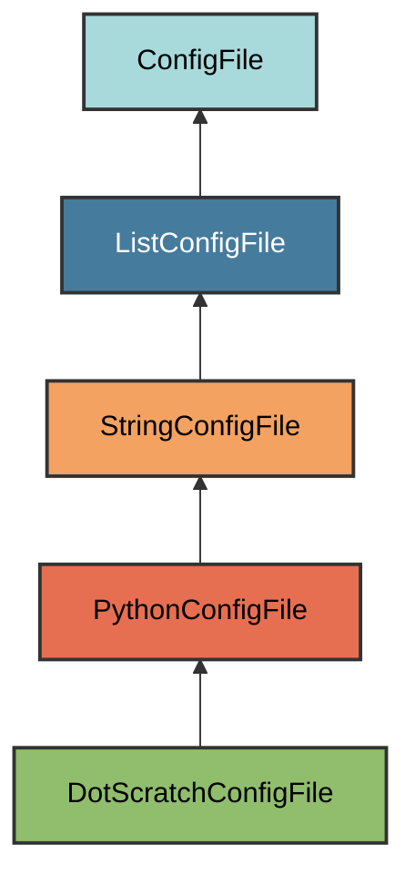

# .scratch.py Configuration

The `DotScratchConfigFile` manages the `.scratch.py` file, which serves as
a scratch file for local experimentation.

## Overview

Creates a .scratch.py file that:

- Provides a scratch space for testing code locally
- Automatically excluded from version control (in `.gitignore`)
- Located at the project root for easy access
- Contains minimal boilerplate (just a docstring)
- Safe to modify without affecting the project
- Useful for quick experiments and debugging

## Inheritance



**Inherits from**: `PythonConfigFile`

**What this means**:

- Python file format (`.py` extension)
- Overrides `is_correct()` to only check file existence
- Users can freely modify the file content
- File is considered correct if it exists
- Simple structure without strict content validation

## File Location

**Path**: `.scratch.py` (project root)

**Extension**: `.py` - Python source file.

**Filename**: `.scratch` - Dotfile convention for hidden/local files.

**Special filename handling**: `get_filename()` returns `".scratch"` to
create a dotfile.

## How It Works

### Automatic Generation

When initialized via `uv run pyrig mkroot`, the `.scratch.py` file is created
with:

1. **Minimal content**: Just a docstring explaining the file's purpose
2. **Git exclusion**: Automatically added to `.gitignore`
3. **Root location**: Placed at project root for easy access

## Git Integration

The `.scratch.py` file is automatically added to `.gitignore`:

```gitignore
# pyrig stuff
.scratch.py
```

This ensures your local scratch work never gets committed to version control.

## Usage

Use `.scratch.py` for quick experiments, testing code snippets, debugging
imports, or prototyping features. Run it directly with `python .scratch.py`.

## Best Practices

1. **Use freely**: This file is meant for scratch work, not production code
2. **Don't commit**: The file is gitignored, but double-check before committing
3. **Clean up**: Delete scratch code when done, or keep it for reference
4. **No dependencies**: Don't rely on this file in your actual codebase
5. **Quick iterations**: Use for rapid prototyping and testing

## Validation Logic

The `DotScratchConfigFile` overrides the `is_correct()` method to only check
for file existence via `cls.get_path().exists()`. This is more permissive than
the standard `StringConfigFile` validation.

**Required**: The file must exist.

**Flexible content**: You can modify the file content freely; validation
only checks that the file exists.

## Troubleshooting

### File gets committed to git

Check your `.gitignore` contains `.scratch.py`. If missing, run
`uv run pyrig mkroot` to regenerate it.
