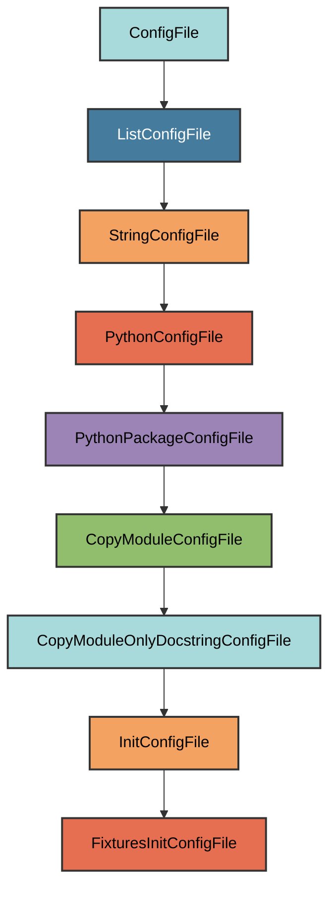

# fixtures/**init**.py Configuration

The `FixturesInitConfigFile` manages the `dev/tests/fixtures/__init__.py` file.

## Overview

Creates a fixtures package that:

- Mirrors the structure of `pyrig.dev.tests.fixtures`
- Copies only the docstring from the source module
- Ensures the fixtures directory exists with proper package structure
- Provides a place for custom test fixtures

## Inheritance



**Inherits from**: `InitConfigFile` (via `ListConfigFile`)

**What this means**:

- Creates `__init__.py` files for package initialization
- Copies only the docstring from `pyrig.dev.tests.fixtures`
- Automatically determines target path
- Ensures parent directory is a valid Python package

## File Location

**Path**: `{package_name}/dev/tests/fixtures/__init__.py`

**Source module**: `pyrig.dev.tests.fixtures`

**Path transformation**: `pyrig.dev.tests.fixtures` →
`{package_name}.dev.tests.fixtures` →
`{package_name}/dev/tests/fixtures/__init__.py`

## How It Works

### Automatic Generation

When initialized via `uv run pyrig mkroot`, the file is created with:

1. **Docstring copy**: Only the docstring from
   `pyrig.dev.tests.fixtures.__init__.py` is copied
2. **Package structure**: The `dev/tests/fixtures/` directory is created
3. **Package initialization**: Parent directories get `__init__.py` files

### Generated Content

```python
"""Test fixtures package for custom pytest fixtures."""
```

The file contains only the docstring, allowing you to add custom fixture
modules.

## Usage

### Automatic Creation

```bash
uv run pyrig mkroot
```

### Purpose

This package is where you can add custom test fixtures for your project.
Fixtures defined here are automatically discovered and available to all tests.

See the [Fixtures documentation](../tests/fixtures.md) for details on creating
custom fixtures.

## Best Practices

1. **Don't modify the docstring**: Keep the copied docstring intact
2. **Add fixture modules**: Create fixture files in this directory
3. **Use pytest decorators**: Decorate fixtures with `@pytest.fixture` or
   pyrig's scope decorators
4. **Follow naming conventions**: Use descriptive names for fixture modules
