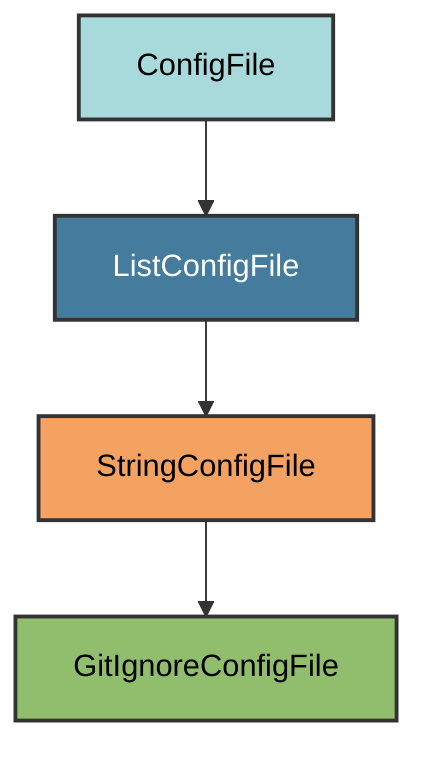

# GitIgnore Configuration

The `GitIgnoreConfigFile` manages the project's `.gitignore` file for excluding
files from version control.

## Overview

Creates a comprehensive `.gitignore` file that:

- Fetches GitHub's standard Python.gitignore patterns
- Includes pyrig-specific patterns
- Covers common cache directories
- Preserves user customizations while adding missing patterns

## Inheritance



**Inherits from**: `StringConfigFile`

**What this means**:

- Works with list of patterns (list-based config type via StringConfigFile →
  ListConfigFile)
- Validation checks if all required patterns exist
- Users can add custom patterns
- File is considered correct if it's a superset of required patterns

## File Location

**Path**: `.gitignore` (project root)

**Extension**: `.gitignore` - The filename is constructed specially to produce
the dotfile name.

**Special filename handling**: `get_filename()` returns empty string so the path
becomes `.gitignore` instead of `gitignore.gitignore`.

## How It Works

### Automatic Generation

When initialized via `uv run pyrig mkroot`, the `.gitignore` file is created by:

1. **Fetching GitHub's Python.gitignore**: Downloads the latest standard Python
   patterns from GitHub. Falls back to bundled resource in pyrig's resources
   package if network fails.
2. **Adding pyrig-specific patterns**: Includes patterns for pyrig tools and
   workflows
3. **Merging with existing**: Preserves any patterns already in the file
4. **Avoiding duplicates**: Only adds patterns that don't already exist

### Pattern Sources

The `.gitignore` file combines patterns from multiple sources:

1. **GitHub's standard Python patterns** - Comprehensive Python-specific
   patterns
2. **Pyrig-specific patterns** - `.scratch.py`, `.env`
3. **Tool caches** - `.pytest_cache/`, `.ruff_cache/`, `.rumdl_cache/`
4. **Coverage reports** - `.coverage`, `coverage.xml`
5. **Build artifacts** - `.venv/`, `dist/`, `/site/`

### Validation Logic

The configuration implements smart merging that ensures:

- User patterns are never removed
- Required patterns are always added
- No duplicate patterns
- Comments and organization are preserved

## Dynamic Configuration

The GitIgnore config adapts to your project automatically:

### GitHub Python Patterns

Pyrig fetches the latest standard Python patterns from GitHub's official
gitignore repository at
`https://raw.githubusercontent.com/github/gitignore/main/Python.gitignore`.

**Fallback mechanism**: If the network request fails, pyrig uses a bundled
resource file from `pyrig/resources/GITIGNORE` to ensure the `.gitignore` file
is always created successfully.

### Project-Specific Files

Automatically includes paths to other config files that should be ignored:

- `.scratch.py` - Scratch code file
- `.env` - Environment variables and secrets

## Usage

### Automatic Updates

The `.gitignore` file is automatically updated when:

- Running `uv run pyrig mkroot`
- New pyrig patterns are added in updates
- GitHub's Python.gitignore is updated (on next initialization)

### Adding Custom Patterns

Simply edit `.gitignore` and add your patterns:

```gitignore
# Your custom patterns
*.local
secrets/
temp_data/
```

These will be preserved when pyrig adds new required patterns.

## Included Patterns

### From GitHub's Python.gitignore

- `__pycache__/` - Python bytecode cache
- `*.py[cod]` - Compiled Python files
- `*.so` - C extensions
- `dist/`, `build/`, `*.egg-info/` - Distribution files
- `.pytest_cache/`, `.coverage` - Test artifacts
- `.venv/`, `venv/` - Virtual environments
- And many more standard Python patterns

### Pyrig-Specific

- `.scratch.py` - Scratch code file
- `.env` - Environment variables and secrets

### Tool Caches

- `.pytest_cache/` - Pytest cache
- `.ruff_cache/` - Ruff linter cache
- `.rumdl_cache/` - Rumdl markdown linter cache
- `.coverage`, `coverage.xml` - Coverage reports

### Build Artifacts

- `dist/` - Distribution packages (from `uv publish`)
- `/site/` - MkDocs build output

## Best Practices

1. **Don't remove required patterns**: Keep pyrig's patterns in the file
2. **Add project-specific patterns**: Append your own patterns as needed,
best via subclassing
3. **Use comments**: Organize patterns with comments for clarity

## Advanced Features

### Network Failure Handling

If GitHub is unreachable, pyrig uses a bundled fallback resource file at
`pyrig/resources/GITIGNORE` which contains a recent copy of GitHub's
Python.gitignore. This ensures the `.gitignore` file is always created
successfully, even without internet access.
