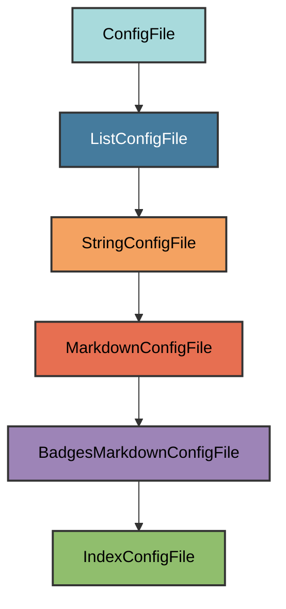

# Index.md Configuration

The `IndexConfigFile` manages the `docs/index.md` file, which serves as the
homepage for your MkDocs documentation site.

## Overview

Creates a documentation index file that:

- Uses the project name with "Documentation" suffix as the header
- Includes all standard badges (tooling, code quality, testing, project info,
  security, CI/CD, documentation)
- Displays the project description from `pyproject.toml`
- Provides a professional starting point for documentation
- Allows users to add custom content below the header

## Inheritance



**Inherits from**: `BadgesMarkdownConfigFile`

**What this means**:

- Markdown file format (`.md` extension)
- Automatically generates badges from project metadata
- Includes project name and description
- Validation checks for required elements (badges, description, project name)
- Users can add content after the generated header
- File is considered correct if it contains all required elements

## File Location

**Path**: `docs/index.md` (docs directory)

**Extension**: `.md` - Standard Markdown extension.

**Filename**: `index` - The homepage for MkDocs documentation sites.

## How It Works

### Automatic Generation

When initialized via `uv run pyrig mkroot`, the `docs/index.md` file is created
with:

1. **Project name header**: Uses project name from `pyproject.toml` with "
   Documentation" suffix
2. **Badge sections**: Seven categories of badges (tooling, code quality,
   testing, project info, security, CI/CD, documentation)
3. **Project description**: Quoted description from `pyproject.toml`
4. **Horizontal rules**: Visual separators for clean layout

### Generated Content

For a project named "myapp" with description "A sample application", it will
generate the header and some badges for you like in the Readme.

### Content Generation Logic

The content generation inherits from `BadgesMarkdownConfigFile` and adds "
Documentation" suffix to the project name.

**Key behavior**:

- Calls parent class to generate base content with badges
- Replaces first occurrence of project name with "{project_name} Documentation"
- This transforms "# myapp" into "# myapp Documentation"

## Dynamic Configuration

The index file adapts to your project automatically:

### Project Name

Automatically uses your project name from `pyproject.toml` `[project]` `name`
field with " Documentation" suffix.

### Project Description

Displays the project description from `pyproject.toml` `[project]` `description`
field as a blockquote below the badges.

### Repository Information

Extracts repository owner and name from Git remote URL for badge links.

### Python Versions

Shows supported Python versions from `pyproject.toml` `requires-python` field in
the Python badge (e.g., `3.12|3.13|3.14`).

## Badge Categories

### 1. Tooling Badges

- **pyrig**: Built with pyrig
- **uv**: Package manager
- **podman**: Container engine
- **git**: Version control
- **github**: Remote repository and stars

### 2. Code Quality Badges

- **prek**: Pre-commit hooks
- **ruff**: Linting and formatting
- **ty**: Strict type checking
- **rumdl**: Markdown linting

### 3. Testing Badges

- **pytest**: Testing framework
- **pytest-cov**: Code coverage (Codecov)

### 4. Security Badges

- **bandit**: Security scanning
- **pip-audit**: Dependency auditing

### 5. Project Info Badges

- **PyPI**: Package version and link
- **Python**: Supported Python versions
- **License**: Project license

### 6. CI/CD Badges

- **CI**: Health check workflow status
- **CD**: Release workflow status

### 7. Documentation Badges

- **MkDocs**: Documentation generator
- **Documentation**: Link to GitHub Pages docs

## Usage

### Automatic Creation

The file is automatically created when you run:

```bash
uv run pyrig mkroot
```

### Adding Custom Content

Simply add your content after the generated header:

```markdown
# myapp Documentation

<!-- badges here -->

---

> A sample application

---

## Welcome

This is the documentation for myapp.

## Features

- Feature 1
- Feature 2

## Getting Started

...
```

The validation only checks that required elements exist, so you can add as much
content as you want.

### Validation Logic

The validation checks that the index file contains all required elements
(inherited from `BadgesMarkdownConfigFile`):

**Required elements**:

1. All badges from all categories
2. Project description
3. Project name

**Flexible structure**: As long as these elements exist somewhere in the file,
it's considered valid. You can add custom content anywhere.

## Best Practices

1. **Keep the header**: Don't remove the generated badges and description
2. **Add content below**: Append your documentation after the horizontal rules
3. **Organize with sections**: Use `##` headers for main sections
4. **Link to other pages**: Reference other documentation pages
5. **Update description**: Keep `pyproject.toml` description current

## Integration with MkDocs

The `docs/index.md` file is referenced in `mkdocs.yml`:

```yaml
site_name: myapp
nav:
  - Home: index.md
```

This makes it the homepage of your documentation site.

## Difference from README.md

| Feature      | `docs/index.md`           | `README.md`         |
| ------------ | ------------------------- | ------------------- |
| **Location** | `docs/` directory         | Project root        |
| **Purpose**  | Documentation homepage    | Repository homepage |
| **Header**   | "{project} Documentation" | "{project}"         |
| **Audience** | Documentation readers     | GitHub visitors     |
| **Content**  | Detailed docs structure   | Quick overview      |

Both files share the same badges and description, but serve different purposes.

## Customization

You can add custom badges after the generated ones or add content after the
horizontal rules. To permanently change badge categories or order, subclass
`BadgesMarkdownConfigFile` and override the relevant methods.

If badges aren't rendering or content isn't updating, ensure your
`pyproject.toml` is correct and run `uv run pyrig mkroot` to regenerate.
