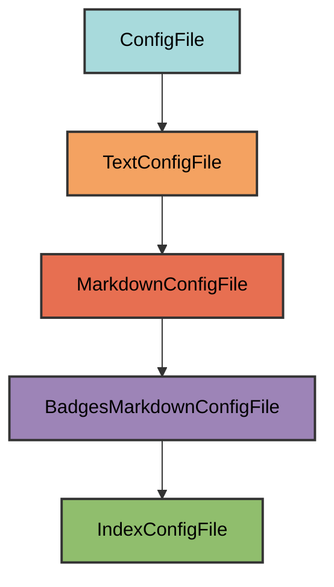

# Index.md Configuration

The `IndexConfigFile` manages the `docs/index.md` file, which serves as the homepage for your MkDocs documentation site.

## Overview

Creates a documentation index file that:
- Uses the project name with "Documentation" suffix as the header
- Includes all standard badges (tooling, code quality, package info, CI/CD, documentation)
- Displays the project description from `pyproject.toml`
- Provides a professional starting point for documentation
- Allows users to add custom content below the header

## Inheritance



**Inherits from**: `BadgesMarkdownConfigFile`

**What this means**:
- Markdown file format (`.md` extension)
- Automatically generates badges from project metadata
- Includes project name and description
- Validation checks for required elements (badges, description, project name)
- Users can add content after the generated header
- File is considered correct if it contains all required elements

## File Location

**Path**: `docs/index.md` (docs directory)

**Extension**: `.md` - Standard Markdown extension.

**Filename**: `index` - The homepage for MkDocs documentation sites.

## How It Works

### Automatic Generation

When initialized via `uv run myapp mkroot`, the `docs/index.md` file is created with:

1. **Project name header**: Uses project name from `pyproject.toml` with " Documentation" suffix
2. **Badge sections**: Five categories of badges (tooling, code quality, package info, CI/CD, documentation)
3. **Project description**: Quoted description from `pyproject.toml`
4. **Horizontal rules**: Visual separators for clean layout

### Generated Content

For a project named "myapp" with description "A sample application":

```markdown
# myapp Documentation

<!-- tooling -->
[](https://github.com/Winipedia/pyrig)
[](https://github.com/astral-sh/uv)
[](https://podman.io/)
[](https://pre-commit.com/)
[](https://www.mkdocs.org/)
<!-- code-quality -->
[](https://github.com/astral-sh/ruff)
[](https://github.com/astral-sh/ty)
[](https://mypy-lang.org/)
[](https://github.com/PyCQA/bandit)
[](https://pytest.org/)
[](https://codecov.io/gh/owner/myapp)
<!-- package-info -->
[](https://pypi.org/project/myapp/)
[](https://www.python.org/)
[](https://github.com/owner/myapp/blob/main/LICENSE)
<!-- ci/cd -->
[](https://github.com/owner/myapp/actions/workflows/health_check.yaml)
[](https://github.com/owner/myapp/actions/workflows/release.yaml)
<!-- documentation -->
[](https://owner.github.io/myapp)

---

> A sample application

---
```

### Content Generation Logic

The `get_content_str()` method:

```python
@classmethod
def get_content_str(cls) -> str:
    """Get the index file content."""
    content = super().get_content_str()  # Get BadgesMarkdownConfigFile content
    project_name = PyprojectConfigFile.get_project_name()
    return content.replace(project_name, f"{project_name} Documentation", 1)
```

**Key behavior**:
- Calls parent class to generate base content with badges
- Replaces first occurrence of project name with "{project_name} Documentation"
- This transforms "# myapp" into "# myapp Documentation"

## Dynamic Configuration

The index file adapts to your project automatically:

### Project Name

```python
PyprojectConfigFile.get_project_name()  # From pyproject.toml [project] name
```

Automatically uses your project name with " Documentation" suffix.

### Project Description

```python
PyprojectConfigFile.get_project_description()  # From pyproject.toml [project] description
```

Displays as a blockquote below the badges.

### Repository Information

```python
repo_owner, repo_name = get_repo_owner_and_name_from_git(check_repo_url=False)
```

Extracts from Git remote URL for badge links.

### Python Versions

```python
python_versions = PyprojectConfigFile.get_supported_python_versions()
joined_python_versions = "|".join(str(v) for v in python_versions)
```

Shows supported Python versions in the Python badge.

## Badge Categories

### 1. Tooling Badges

- **pyrig**: Built with pyrig
- **uv**: Package manager
- **Container**: Podman containerization
- **pre-commit**: Pre-commit hooks enabled
- **MkDocs**: Documentation generator

### 2. Code Quality Badges

- **ruff**: Linting and formatting
- **ty**: Type checking
- **mypy**: Static type checking
- **bandit**: Security scanning
- **pytest**: Testing framework
- **codecov**: Code coverage

### 3. Package Info Badges

- **PyPI**: Package version and link
- **Python**: Supported Python versions
- **License**: Project license

### 4. CI/CD Badges

- **CI**: Health check workflow status
- **CD**: Release workflow status

### 5. Documentation Badge

- **Documentation**: Link to GitHub Pages docs

## Usage

### Automatic Creation

The file is automatically created when you run:

```bash
uv run myapp mkroot
```

### Adding Custom Content

Simply add your content after the generated header:

```markdown
# myapp Documentation

<!-- badges here -->

---

> A sample application

---

## Welcome

This is the documentation for myapp.

## Features

- Feature 1
- Feature 2

## Getting Started

...
```

The validation only checks that required elements exist, so you can add as much content as you want.

### Validation Logic

The `is_correct()` method checks:

```python
@classmethod
def is_correct(cls) -> bool:
    """Check if the index file is valid."""
    file_content = cls.get_file_content()
    badges = [badge for _group, badges in cls.get_badges().items() for badge in badges]
    all_badges_in_file = all(badge in file_content for badge in badges)
    description_in_file = PyprojectConfigFile.get_project_description() in file_content
    project_name_in_file = PyprojectConfigFile.get_project_name() in file_content
    return super().is_correct() or (
        all_badges_in_file and description_in_file and project_name_in_file
    )
```

**Required elements**:
1. All badges from all categories
2. Project description
3. Project name

**Flexible structure**: As long as these elements exist somewhere in the file, it's considered valid.

## Best Practices

1. **Keep the header**: Don't remove the generated badges and description
2. **Add content below**: Append your documentation after the horizontal rules
3. **Organize with sections**: Use `##` headers for main sections
4. **Link to other pages**: Reference other documentation pages
5. **Update description**: Keep `pyproject.toml` description current


## Integration with MkDocs

The `docs/index.md` file is referenced in `mkdocs.yml`:

```yaml
site_name: myapp
nav:
  - Home: index.md
```

This makes it the homepage of your documentation site.

## Difference from README.md

| Feature | `docs/index.md` | `README.md` |
|---------|----------------|-------------|
| **Location** | `docs/` directory | Project root |
| **Purpose** | Documentation homepage | Repository homepage |
| **Header** | "{project} Documentation" | "{project}" |
| **Audience** | Documentation readers | GitHub visitors |
| **Content** | Detailed docs structure | Quick overview |

Both files share the same badges and description, but serve different purposes.

## Troubleshooting

### Badges not rendering

Make sure:
- Repository is public or badges support private repos
- GitHub Actions workflows exist
- PyPI package is published (for PyPI badge)
- Codecov is configured (for coverage badge)

### Description not updating

Update `pyproject.toml`:

```toml
[project]
description = "Your new description"
```

Then run `uv run myapp mkroot` to regenerate.

### Project name incorrect

The project name comes from `pyproject.toml`:

```toml
[project]
name = "myapp"
```

## Advanced Customization

### Custom Badges

Add your own badges after the generated ones:

```markdown
# myapp Documentation

<!-- tooling -->
...
<!-- documentation -->
...

<!-- custom badges -->
[](https://example.com)

---

> A sample application

---
```

### Removing Badge Categories

You can remove entire badge categories by editing the file, but they'll be re-added if missing. To permanently remove, you'd need to override `get_badges()` in a custom subclass.

### Changing Badge Order

The badges are organized in this order:
1. tooling
2. code-quality
3. package-info
4. ci/cd
5. documentation

This order is defined in `BadgesMarkdownConfigFile.get_badges()` and can be customized by overriding the method.


