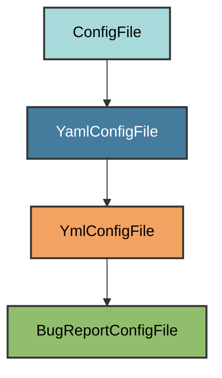

# Bug Report Template Configuration

The `BugReportConfigFile` manages the `.github/ISSUE_TEMPLATE/bug_report.yml`
file.

## Overview

Creates a bug report issue template that:

- Provides structured fields for bug reports
- Uses GitHub's YAML issue forms
- Auto-labels issues with `bug`

## Inheritance



**Inherits from**: `YmlConfigFile`

## File Location

**Path**: `.github/ISSUE_TEMPLATE/bug_report.yml`

## Template Fields

| Field | Type | Required |
|-------|------|----------|
| Description | textarea | ✅ |
| Steps to Reproduce | textarea | ✅ |
| Expected Behavior | textarea | ✅ |
| Actual Behavior | textarea | ✅ |
| Environment | textarea | ❌ |
| Logs | textarea | ❌ |

## Automatic Creation

```bash
uv run pyrig mkroot
```

## Validation Logic

File must exist and contain text. Users can customize the template.

## See Also

- [GitHub Docs: Issue Forms](https://docs.github.com/en/communities/using-templates-to-encourage-useful-issues-and-pull-requests/syntax-for-issue-forms)
