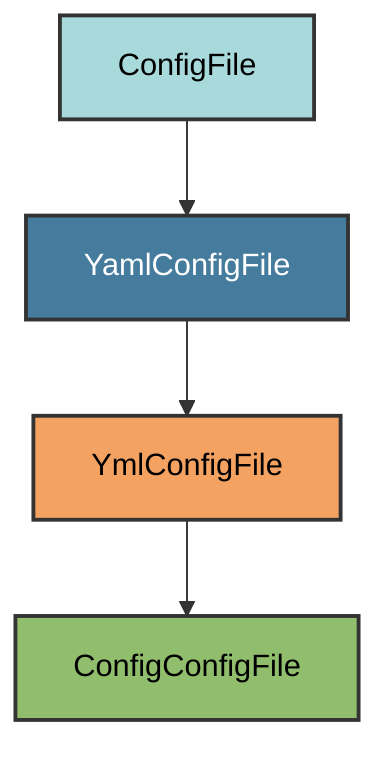

# Issue Template Config Configuration

The `ConfigConfigFile` manages the `.github/ISSUE_TEMPLATE/config.yml` file.

## Overview

Creates an issue template chooser configuration that:

- Controls the template chooser behavior
- Disables blank issues by default
- Can add external links to the chooser

## Inheritance



**Inherits from**: `YmlConfigFile`

**What this means**:

- YAML file format (`.yml` extension)
- Dict-based configuration
- Uses PyYAML for parsing/writing

## File Location

**Path**: `.github/ISSUE_TEMPLATE/config.yml`

**Extension**: `.yml` - GitHub configuration format.

## Generated Content

```yaml
blank_issues_enabled: false
```

This configuration:

- **Disables blank issues**: Users must use a template
- Forces structured issue reports
- Improves issue quality and actionability

## Automatic Creation

```bash
uv run pyrig mkroot
```

## Validation Logic

The validation checks if `config.yml` exists and is non-empty. This allows
users to customize the configuration while still being considered valid.

**Required element**: File must exist and contain text.

## Customization

Edit the generated YAML file to:

### Enable Blank Issues

```yaml
blank_issues_enabled: true
```

### Add External Links

```yaml
blank_issues_enabled: false
contact_links:
  - name: Documentation
    url: https://example.com/docs
    about: Read the documentation before opening an issue
  - name: Discussions
    url: https://github.com/owner/repo/discussions
    about: Ask questions in GitHub Discussions
```

## See Also

- [GitHub Docs: Configuring Issue Templates](https://docs.github.com/en/communities/using-templates-to-encourage-useful-issues-and-pull-requests/configuring-issue-templates-for-your-repository)
