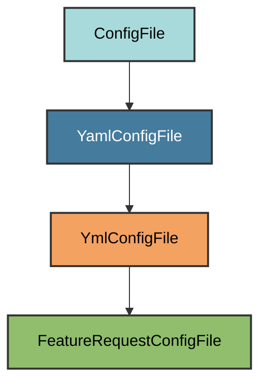

# Feature Request Template Configuration

The `FeatureRequestConfigFile` manages the
`.github/ISSUE_TEMPLATE/feature_request.yml` file.

## Overview

Creates a feature request issue template that:

- Provides structured fields for feature requests
- Uses GitHub's YAML issue forms
- Auto-labels issues with `enhancement`

## Inheritance



**Inherits from**: `YmlConfigFile`

## File Location

**Path**: `.github/ISSUE_TEMPLATE/feature_request.yml`

## Template Fields

| Field | Type | Required |
|-------|------|----------|
| Summary | textarea | ✅ |
| Use Case | textarea | ✅ |
| Proposed Solution | textarea | ❌ |
| Alternatives Considered | textarea | ❌ |

## Automatic Creation

```bash
uv run pyrig mkroot
```

## Validation Logic

File must exist and contain text. Users can customize the template.

## See Also

- [GitHub Docs: Issue Forms](https://docs.github.com/en/communities/using-templates-to-encourage-useful-issues-and-pull-requests/syntax-for-issue-forms)
