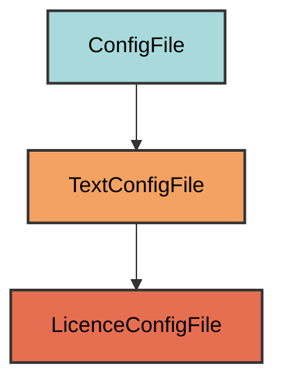

# LICENSE Configuration

The `LicenceConfigFile` manages the `LICENSE` file for the project.

## Overview

Creates a LICENSE file that:

- Defaults to MIT License with current year and repo owner
- Fetches license text from GitHub's SPDX API
- Falls back to bundled template if API fails
- Located at the project root
- Automatically fills in year and owner from git

## Inheritance



**Inherits from**: `TextConfigFile`

**What this means**:

- Text-based validation
- Simple content generation
- No structured format (YAML/TOML)
- User can modify freely

## File Location

**Path**: `LICENSE` (project root)

**Extension**: None - LICENSE has no extension.

**Filename**: `LICENSE` (all caps, no extension).

## How It Works

### Automatic Generation

When initialized via `uv run pyrig mkroot`, the file is created with:

1. **Fetch MIT License**: Downloads from GitHub's SPDX API
2. **Fill placeholders**: Replaces `[year]` and `[fullname]`
3. **Fallback**: Uses bundled template if API fails
4. **Write file**: Creates LICENSE with filled content

### License Fetching

Pyrig fetches the MIT license text from GitHub's SPDX API at `https://api.github.com/licenses/mit`. If the API call fails, it uses a bundled MIT license template from `pyrig/resources/MIT_LICENSE_TEMPLATE`.

### Placeholder Replacement

The license text contains placeholders that are automatically filled in:

- `[year]` → Current year (e.g., `2025`)
- `[fullname]` → Git repo owner extracted from git config (e.g., `Winipedia`)

## Usage

### Automatic Creation

```bash
uv run pyrig mkroot
```

### Generated Content

```text
MIT License

Copyright (c) 2025 Winipedia

Permission is hereby granted, free of charge, to any person obtaining a copy
of this software and associated documentation files (the "Software"), to deal
in the Software without restriction, including without limitation the rights
to use, copy, modify, merge, publish, distribute, sublicense, and/or sell
copies of the Software, and to permit persons to whom the Software is
furnished to do so, subject to the following conditions:

...
```

### Using a Different License

Replace the LICENSE file content with your preferred license:

```bash
# Apache 2.0
curl https://www.apache.org/licenses/LICENSE-2.0.txt > LICENSE

# GPL 3.0
curl https://www.gnu.org/licenses/gpl-3.0.txt > LICENSE
```

## Validation Logic

The validation checks if the LICENSE file exists and contains text (is non-empty).

**Required element**: File must exist and contain text.

## Best Practices

1. **Review the license**: Make sure MIT is appropriate for your project
2. **Commit the file**: Include LICENSE in version control
3. **Update copyright**: Add additional copyright holders if needed
4. **Choose wisely**: Consider GPL, Apache, or other licenses for different use cases
5. **Add to README**: Reference the license in your README badges

Note: I recommend choosing the right licence for you at repo creation time in github. This way pyrig will not overwrite it.

