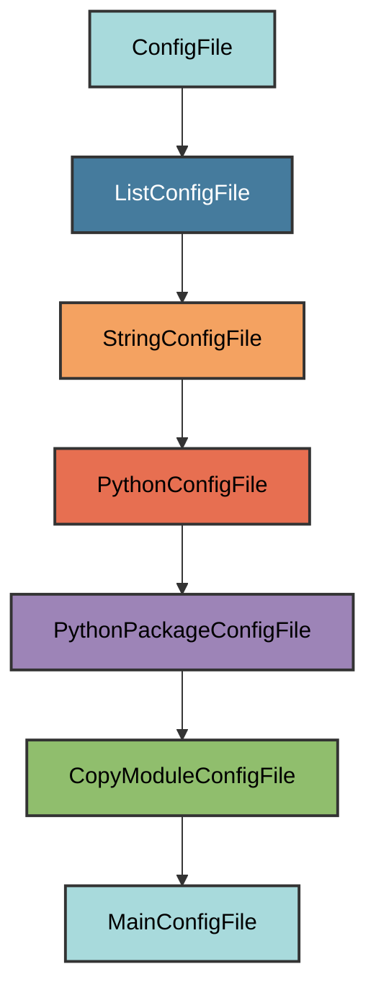

# main.py Configuration

The `MainConfigFile` manages the `main.py` file, which provides a template
`main()` function that gets registered as a CLI command by pyrig's command
discovery system.

## Overview

Creates a main.py file that:

- Provides an empty `main()` function template for your application logic
- Copies the template implementation from `pyrig.main`
- Gets automatically discovered and registered as a CLI command by
  `pyrig.rig.cli.cli`
- Automatically cleans up legacy root-level main.py files
- Allows customization while maintaining required structure (`def main` and
  `if __name__ == "__main__":`)
- Located in the `{package_name}/` directory (not project root)

## Inheritance



**Inherits from**: `CopyModuleConfigFile`

**What this means**:

- Python file format (`.py` extension)
- Copies entire module content from `pyrig.main`
- Automatically determines target path by replacing `pyrig` with your package
  name
- Ensures parent directory is a valid Python package
- Validation checks for required structure (`def main` and
  `if __name__ == "__main__":`)
- Users can modify the implementation while keeping required elements

## File Location

**Path**: `{package_name}/main.py` (e.g., `myapp/main.py`)

**Extension**: `.py` - Python source file.

**Filename**: `main` - Extracted from the source module name (`pyrig.main`).

**Path transformation**: `pyrig.main` → `{package_name}.main` →
`{package_name}/main.py`

## How It Works

### Automatic Generation

When initialized via `uv run pyrig mkroot`, the `main.py` file is created with:

1. **Module copy**: Complete source code from `pyrig.main` is copied
2. **Path transformation**: Module path is transformed to match your package
   structure
3. **Package creation**: Parent directory becomes a valid Python package with
   `__init__.py`
4. **Legacy cleanup**: Any root-level `main.py` is deleted (uv creates one at
   initialization when doing uv init)

### Source Module

The entire content of `pyrig/main.py` is copied to your project.

### Generated Content

The copied `main.py` includes an empty `main()` function template:

```python
"""Main entrypoint for the project."""


def main() -> None:
    """Main entrypoint for the project."""


if __name__ == "__main__":
    main()
```

This template provides:

- An empty `main()` function where you can add your application logic
- A docstring that should be customized for your project
- The `if __name__ == "__main__":` guard for direct script execution
- No CLI functionality by default - that comes from pyrig's command discovery
  system

### Legacy Cleanup

When running `uv run pyrig mkroot` (or commands that invoke it, such as
`uv run pyrig init`), any root-level `main.py` file is automatically deleted.

**Why this is needed**: uv creates a `main.py` at the project root during
initialization. This cleanup ensures the file is only in `{package_name}/`.

## Dynamic Configuration

### Package Name

The package name from `pyproject.toml` `[project]` `name` determines the target
path:

- Project name: `my-app`
- Package name: `my_app`
- Target path: `my_app/main.py`

### Module Path Transformation

The module path is automatically transformed from `pyrig.main` to
`{package_name}.main` to ensure the file is placed in the correct location for
your project.

## Validation Logic

The validation checks for required structure:

**Required elements**:

1. A `def main` function definition
2. The `if __name__ == "__main__":` guard

**Flexible implementation**: As long as these elements exist, you can customize
the implementation.

## Usage

### Automatic Creation

The file is automatically created when you run:

```bash
uv run pyrig mkroot
```

Or via init or pyrigs autouse fixtures when running pytest:

```bash
uv run pyrig init
```

```bash
uv run pytest
```

### Running the CLI

Once created, you can run your CLI:

```bash
# will display help text
uv run myapp
# runs main
uv run myapp main
```

### Customizing main.py

You can modify the implementation while keeping required elements:

```python
"""CLI entry point for the application."""

def main() -> None:
    """Main entry point for the CLI."""
    print("Custom initialization")

if __name__ == "__main__":
    main()
```

As long as `def main` and `if __name__ == "__main__":` exist, validation passes.

## Best Practices

1. **Keep the structure**: Maintain `def main()` and
   `if __name__ == "__main__":`
2. **Keep it simple**: main.py should be a thin entry point, not business logic
3. **Don't move it**: Keep main.py in `myapp/`, not at project root

## CLI Architecture

The main.py file integrates with pyrig's CLI system. The CLI class discovers and
registers commands from multiple sources:

```text
CLI class (pyrig.rig.cli.cli)
  ├─> main() from {package_name}/main.py (registered as "main" command)
  ├─> Subcommands (from {package_name}/rig/cli/subcommands.py)
  └─> Shared subcommands (from {package_name}/rig/cli/shared_subcommands.py)
```

See the [CLI documentation](../cli/architecture.md) for details on adding custom
commands.
