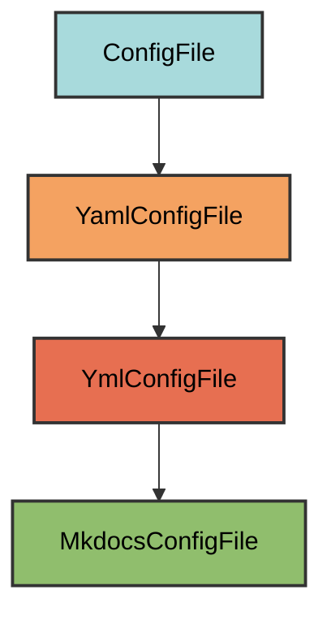

# MkDocs Configuration

The `MkdocsConfigFile` manages the project's `mkdocs.yml` configuration file for
generating documentation websites with MkDocs.

## Overview

Creates a minimal MkDocs configuration that:

- Sets the site name from your project name
- Configures basic navigation with home page and API reference
- Enables search, Mermaid diagram, and mkdocstrings plugins
- Uses Material theme for modern, professional documentation
- Allows user customization while maintaining required structure

## Inheritance



**Inherits from**: `YmlConfigFile`

**What this means**:

- File is YAML format with `.yml` extension (not `.yaml`)
- Uses PyYAML for parsing and serialization
- Validation checks if required keys exist in the file
- Users can add custom configuration keys
- File is considered correct if it's a superset of required config

## File Location

**Path**: `mkdocs.yml` (project root)

**Extension**: `.yml` (not `.yaml`) - MkDocs convention prefers the shorter
extension.

## How It Works

### Automatic Generation

When initialized via `uv run pyrig mkroot`, the `mkdocs.yml` file is created
with minimal required configuration:

```yaml
site_name: my-project
nav:
  - Home: index.md
  - API: api.md
plugins:
  - search
  - mermaid2
  - mkdocstrings:
      handlers:
        python:
          options:
            docstring_style: google
            members: true
            show_source: true
            inherited_members: true
            filters: []
            show_submodules: true
theme:
  name: material
  palette:
    - scheme: slate
      toggle:
        icon: material/brightness-4
        name: Light mode
    - scheme: default
      toggle:
        icon: material/brightness-7
        name: Dark mode
```

### Required Configuration

**Four required keys**:

1. **`site_name`**: Automatically pulled from `pyproject.toml` project name
2. **`nav`**: Navigation with at least Home and API entries pointing to
   `index.md` and `api.md` in the docs directory
3. **`plugins`**: Search, Mermaid2, and mkdocstrings plugins enabled
   - `search`: Full-text search across documentation
   - `mermaid2`: Beautiful diagrams in markdown (included via `pyrig-dev`)
   - `mkdocstrings`: Automatic API documentation from Python docstrings
4. **`theme`**: Material theme with dark mode as default and light/dark toggle

### Validation Logic

Inherits standard YAML validation from `YmlConfigFile`:

- Loads existing `mkdocs.yml` file
- Checks if all required keys are present with the standard subset/superset
  logic
- Verifies values match or extend required configuration
- Adds missing keys without overwriting user customizations

The file is valid if it contains at least the required keys with compatible
values.

## Dynamic Configuration

The MkDocs config adapts to your project automatically:

### Site Name

Automatically uses your project name from `pyproject.toml`. If your project is
named `my-awesome-project`, the site name becomes `my-awesome-project`.

### Navigation

The navigation automatically includes two pages:

- **Home** (`index.md`): Created by pyrig's `IndexConfigFile`, serves as the
  documentation homepage
- **API** (`api.md`): Created by pyrig's `ApiConfigFile`, provides automatic API
  reference documentation from Python docstrings

This ensures both the homepage and API documentation are always correctly
referenced.

### Material Theme

Pyrig uses the Material theme by default, which provides:

- Modern, responsive design
- Built-in search functionality
- Mobile-friendly navigation
- **Dark mode as default** (slate scheme) with toggle to switch to light mode
- Extensive customization options

The Material theme is included as a dependency via `pyrig-dev`, so it's
automatically available.

**Color Schemes**:

- **`slate`** (default): Dark mode optimized for developers who prefer dark
  themes
- **`default`**: Light mode available via toggle button in the header

## Usage

### Building Documentation

```bash
# Serve documentation locally with live reload
uv run mkdocs serve

# Build static site
uv run mkdocs build
```

Note: pyrig auto publishes the documentation to github pages via the
`publish.yml` github workflow. So you don't even need to deploy it manually and
can just visit the github pages website to view your documentation.

### Customization

You can extend the configuration while keeping pyrig's required keys:

```yaml
# Required by pyrig
site_name: my-project
nav:
  - Home: index.md
  # Add your own navigation
  - User Guide:
      - Installation: guide/installation.md
      - Configuration: guide/configuration.md
  - API Reference: api/index.md
plugins:
  - search
  - mermaid2
  # Add your own plugins
  - autorefs
  - mkdocstrings:
      handlers:
        python:
          paths: [.]

# Required by pyrig, but you can customize
theme:
  name: material
  # Pyrig's default dark/light toggle (required)
  palette:
    - scheme: slate
      toggle:
        icon: material/brightness-4
        name: Light mode
    - scheme: default
      toggle:
        icon: material/brightness-7
        name: Dark mode
  # Add custom theme features
  features:
    - navigation.tabs
    - navigation.sections

# Add custom configuration
markdown_extensions:
  - admonition
  - codehilite
  - pymdownx.superfences

extra:
  social:
    - icon: fontawesome/brands/github
      link: https://github.com/yourusername/my-project
```

As long as the four required keys (`site_name`, `nav`, `plugins`, `theme`) are
present with valid values, validation passes.

### Adding Documentation Pages

1. Create markdown files in the `docs/` directory:

   ```bash
   mkdir -p docs/guide
   echo "# Installation" > docs/guide/installation.md
   ```

2. Add them to navigation in `mkdocs.yml`:

   ```yaml
   nav:
     - Home: index.md
     - Installation: guide/installation.md
   ```

3. Serve to preview:

   ```bash
   uv run mkdocs serve
   ```

## Plugin Details

- **search**: Full-text search across documentation pages
- **mermaid2**: Mermaid diagram rendering in markdown (enables architecture
  diagrams)
- **mkdocstrings**: Generates API documentation from Python docstrings using
  Google-style format. See [api.md](api_md.md) for usage details.

## Best Practices

1. **Keep required keys**: Don't remove `site_name`, `nav`, `plugins`, or
   `theme`
2. **Extend navigation**: Add your pages to the `nav` list
3. **Organize docs**: Use subdirectories in `docs/` for structure
4. **Preview locally**: Always run `uv run mkdocs serve` before deploying via
   the `publish.yml` github workflow by pushing to main
