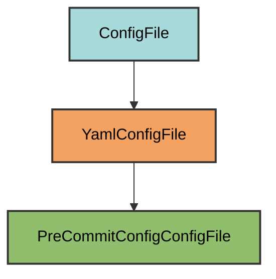

# Pre-Commit Configuration

The `PreCommitConfigConfigFile` manages the `.pre-commit-config.yaml` file for automated code quality checks before commits.

## Overview

Creates a pre-commit configuration that:

- Runs linting with Ruff
- Formats code with Ruff
- Checks types with `ty` and MyPy
- Scans for security issues with Bandit
- Uses local hooks (no external repositories)
- Runs on every commit automatically

Note: Future plans are to only use ty and not mypy. However, astral-sh/ty is still very new and so for now we keep both.

## Inheritance



**Inherits from**: `YamlConfigFile`

**What this means**:

- Uses YAML format for configuration
- Loads/dumps with PyYAML
- Validation checks if all required hooks exist
- Users can add additional hooks
- File is considered correct if it's a superset of required configuration

## File Location

**Path**: `.pre-commit-config.yaml` (project root)

**Extension**: `.yaml` - Standard pre-commit configuration file extension.

**Special filename handling**: `get_filename()` transforms the class name by adding a dot prefix and replacing underscores with hyphens: `PreCommitConfigConfigFile` → `.pre-commit-config`.

## How It Works

### Automatic Generation

When initialized via `uv run pyrig mkroot`, the `.pre-commit-config.yaml` file is created with:

1. **Local repository configuration**: All hooks run locally using system tools
2. **Five quality check hooks**: Linting, formatting, type checking (2 types), and security scanning
3. **Automatic execution**: Hooks run on every commit before changes are committed

### Generated Configuration

```yaml
repos:
  - repo: local
    hooks:
      - id: lint-code
        name: lint-code
        entry: ruff check --fix
        language: system
        always_run: true
        pass_filenames: false
      - id: format-code
        name: format-code
        entry: ruff format
        language: system
        always_run: true
        pass_filenames: false
      - id: check-types
        name: check-types
        entry: ty check
        language: system
        always_run: true
        pass_filenames: false
      - id: check-static-types
        name: check-static-types
        entry: mypy --exclude-gitignore
        language: system
        always_run: true
        pass_filenames: false
      - id: check-security
        name: check-security
        entry: bandit -c pyproject.toml -r .
        language: system
        always_run: true
        pass_filenames: false
```

### Hook Configuration

Each hook is configured with these key settings:

- **language: "system"** - Uses tools from your environment (not isolated)
- **always_run: true** - Runs on every commit, even if no matching files changed
- **pass_filenames: false** - Runs on entire codebase, not just changed files

This ensures comprehensive quality checks on every commit.

## Configured Hooks

### 1. lint-code (Ruff Linting)

**Command**: `ruff check --fix`

**Purpose**: Checks code for style violations and common errors, automatically fixing issues when possible.

**What it checks**:

- PEP 8 style violations
- Unused imports and variables
- Code complexity
- Common anti-patterns
- And 700+ other rules

### 2. format-code (Ruff Formatting)

**Command**: `ruff format`

**Purpose**: Automatically formats code to a consistent style (similar to Black).

**What it does**:

- Consistent indentation
- Line length enforcement
- Quote normalization
- Trailing comma handling

### 3. check-types (Ty Type Checking)

**Command**: `ty check`

**Purpose**: Modern type checker from Astral (creators of Ruff) that validates type annotations.

**What it checks**:

- Type annotation correctness
- Type consistency
- Runtime type validation

### 4. check-static-types (MyPy Type Checking)

**Command**: `mypy --exclude-gitignore`

**Purpose**: Industry-standard static type checker for Python.

**What it checks**:

- Type annotation correctness
- Type compatibility
- Missing type annotations
- Excludes files in `.gitignore`

### 5. check-security (Bandit Security Scanning)

**Command**: `bandit -c pyproject.toml -r .`

**Purpose**: Scans code for common security vulnerabilities.

**What it checks**:

- Hardcoded passwords
- SQL injection risks
- Use of insecure functions
- Weak cryptography
- And many other security issues

## Usage

### Installation

Pre-commit hooks are automatically installed when you run:

```bash
uv run pyrig init
```

Or when running tests

```bash
uv run pytest
```

This runs `pre-commit install` to set up the Git hooks.

### Manual Installation

```bash
uv run pre-commit install
```

### Running Hooks Manually

Run all hooks on all files:

```bash
uv run pre-commit run --all-files
```

Run a specific hook:

```bash
uv run pre-commit run lint-code
```

Run with verbose output:

```bash
uv run pre-commit run --all-files --verbose
```

### Automatic Execution

Once installed, hooks run automatically:

1. **On commit**: When you run `git commit`, all hooks execute
2. **Before commit completes**: If any hook fails, the commit is aborted
3. **Fix and retry**: Fix the issues and commit again

Example workflow:

```bash
git add .
git commit -m "Add new feature"
# Hooks run automatically...
# If they pass, commit succeeds
# If they fail, commit is aborted and you see the errors
```

### Skipping Hooks

To skip hooks for a specific commit (not recommended):

```bash
git commit --no-verify -m "Emergency fix"
```

## Adding Custom Hooks

You can extend the configuration with additional hooks:

```yaml
repos:
  - repo: local
    hooks:
      # ... existing pyrig hooks ...
      - id: check-yaml
        name: check-yaml
        entry: check-yaml
        language: system
        types: [yaml]
      - id: check-json
        name: check-json
        entry: check-json
        language: system
        types: [json]
```

Or add hooks from external repositories:

```yaml
repos:
  - repo: local
    hooks:
      # ... existing pyrig hooks ...

  - repo: https://github.com/pre-commit/pre-commit-hooks
    rev: v4.5.0
    hooks:
      - id: trailing-whitespace
      - id: end-of-file-fixer
      - id: check-added-large-files
```

## Best Practices

1. **Keep pyrig hooks**: Don't remove the default hooks - they ensure code quality
2. **Run manually before committing**: Use `uv run pre-commit run --all-files` to catch issues early
3. **Fix issues, don't skip**: Avoid `--no-verify` - fix the actual problems
4. **Keep tools updated**: Update tool versions in `pyproject.toml` to get latest features
5. **Use in CI/CD**: pyrig runs the same hooks in CI/CD pipeline health check

## Why Local Hooks?

Pyrig uses `repo: local` instead of external repositories because:

1. **Version consistency**: Uses the exact tool versions from your `pyproject.toml`
2. **No network dependency**: Works offline, no downloading hook repositories
3. **Faster execution**: No repository cloning or environment setup
4. **Custom tools**: Can use pyrig-specific tools like `ty check`
5. **Simpler configuration**: All tools managed by `uv` in one place

## Integration with CI/CD

The same hooks run in GitHub Actions workflows. See the workflow documentation for how pre-commit integrates with continuous integration.

Example from a workflow:

```yaml
- name: Run pre-commit hooks
  run: uv run pre-commit run --all-files
```

This ensures the same quality checks run locally and in CI.

## Troubleshooting

### Hook fails but code looks correct

Try running the tool directly to see more details:

```bash
uv run ruff check --fix
uv run mypy --exclude-gitignore
```

### Hooks are slow

The hooks run on the entire codebase (`always_run: true`). This is intentional to catch all issues, but you can modify specific hooks to only run on changed files:

```yaml
- id: lint-code
  name: lint-code
  entry: ruff check --fix
  language: system
  always_run: false  # Changed from true
  pass_filenames: true  # Changed from false
  types: [python]
```

### Pre-commit not installed

If hooks don't run, reinstall:

```bash
uv run pre-commit install
```

### Hooks run but tools not found

Make sure you're in a virtual environment with dependencies installed:

```bash
uv sync
source .venv/bin/activate  # or activate.fish, activate.ps1
```
