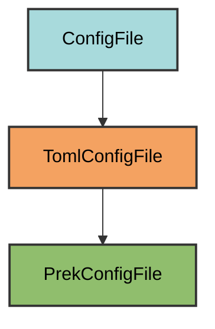

# Prek Configuration

The `PrekConfigFile` manages the `prek.toml` file for
automated code quality checks before commits.

## Overview

Creates a prek configuration that:

- Runs linting with Ruff
- Formats code with Ruff
- Checks types with `ty`
- Scans for security issues with Bandit
- Lints markdown with rumdl
- Uses local hooks (no external repositories)
- Runs on every commit automatically

## Inheritance



**Inherits from**: `TomlConfigFile`

**What this means**:

- Uses TOML format for configuration
- Loads/dumps with tomlkit
- Validation checks if all required hooks exist
- Users can add additional hooks
- File is considered correct if it's a superset of required configuration

## File Location

**Path**: `prek.toml` (project root)

**Extension**: `.toml` - Standard prek configuration file extension.

**Filename**: Derived automatically from the class name `PrekConfigFile` →
`prek`.

## How It Works

### Automatic Generation

When initialized via `uv run pyrig mkroot`, the `prek.toml` file
is created with:

1. **Local repository configuration**: All hooks run locally using system tools
2. **Code quality check hooks**: Linting, formatting, type checking, security
   scanning, and markdown linting
3. **Automatic execution**: Hooks run on every commit before changes are
   committed

### Generated Configuration

```toml
[[repos]]
repo = "local"

[[repos.hooks]]
id = "format-code"
name = "format-code"
entry = "ruff format"
language = "system"
always_run = true
pass_filenames = false

[[repos.hooks]]
id = "lint-code"
name = "lint-code"
entry = "ruff check --fix"
language = "system"
always_run = true
pass_filenames = false

[[repos.hooks]]
id = "check-types"
name = "check-types"
entry = "ty check"
language = "system"
always_run = true
pass_filenames = false

[[repos.hooks]]
id = "check-security"
name = "check-security"
entry = "bandit -c pyproject.toml -r ."
language = "system"
always_run = true
pass_filenames = false

[[repos.hooks]]
id = "check-markdown"
name = "check-markdown"
entry = "rumdl check --fix"
language = "system"
always_run = true
pass_filenames = false
```

### Hook Configuration

Each hook is configured with these key settings:

- **language: "system"** - Uses tools from your environment (not isolated)
- **always_run: true** - Runs on every commit, even if no matching files changed
- **pass_filenames: false** - Runs on entire codebase, not just changed files

This ensures comprehensive quality checks on every commit.

## Configured Hooks

| Hook             | Command                     | Purpose                                      |
| ---------------- | --------------------------- | -------------------------------------------- |
| `lint-code`      | `ruff check --fix`          | Linting with auto-fix                        |
| `format-code`    | `ruff format`               | Code formatting                              |
| `check-types`    | `ty check`                  | Type checking                                |
| `check-security` | `bandit -c pyproject.toml -r .` | Security vulnerability scanning          |
| `check-markdown` | `rumdl check --fix`         | Markdown linting with auto-fix               |

Each hook uses `language: system` (runs tools from your environment),
`always_run: true` (runs on every commit), and `pass_filenames: false`
(checks entire codebase).

## Usage

### Installation

Prek hooks are automatically installed when you run:

```bash
uv run pyrig init
```

Or when running tests

```bash
uv run pytest
```

This runs `prek install` to set up the Git hooks.

### Manual Installation

```bash
uv run prek install
```

### Running Hooks Manually

Run all hooks on all files:

```bash
uv run prek run --all-files
```

Run a specific hook:

```bash
uv run prek run lint-code
```

Run with verbose output:

```bash
uv run prek run --all-files --verbose
```

### Automatic Execution

Once installed, hooks run automatically:

1. **On commit**: When you run `git commit`, all hooks execute
2. **Before commit completes**: If any hook fails, the commit is aborted
3. **Fix and retry**: Fix the issues and commit again

Example workflow:

```bash
git add .
git commit -m "Add new feature"
# Hooks run automatically...
# If they pass, commit succeeds
# If they fail, commit is aborted and you see the errors
```

### Skipping Hooks

To skip hooks for a specific commit (not recommended):

```bash
git commit --no-verify -m "Emergency fix"
```

## Adding Custom Hooks

You can extend the configuration with additional hooks in `prek.toml`:

```toml
# ... existing pyrig hooks ...

[[repos.hooks]]
id = "check-toml"
name = "check-toml"
entry = "check-toml"
language = "system"
types = ["toml"]

[[repos.hooks]]
id = "check-json"
name = "check-json"
entry = "check-json"
language = "system"
types = ["json"]
```

Or add hooks from external repositories:

```toml
[[repos]]
repo = "https://github.com/pre-commit/pre-commit-hooks"
rev = "v4.5.0"
hooks = [
    {id = "trailing-whitespace"},
    {id = "end-of-file-fixer"},
    {id = "check-added-large-files"},
]
```

## Best Practices

1. **Keep pyrig hooks**: Don't remove the default hooks - they ensure code
   quality
2. **Run manually before committing**: Use `uv run prek run --all-files`
   to catch issues early
3. **Fix issues, don't skip**: Avoid `--no-verify` - fix the actual problems
4. **Keep tools updated**: Update tool versions in `pyproject.toml` to get
   latest features
5. **Use in CI/CD**: pyrig runs the same hooks in CI/CD pipeline health check

## Why Local Hooks?

Pyrig uses `repo: local` instead of external repositories because:

1. **Version consistency**: Uses the exact tool versions from your
   `pyproject.toml`
2. **No network dependency**: Works offline, no downloading hook repositories
3. **Faster execution**: No repository cloning or environment setup
4. **Custom tools**: Can use pyrig-specific tools like `ty check`
5. **Simpler configuration**: All tools managed by `uv` in one place

## Integration with CI/CD

The same hooks run in GitHub Actions workflows. See the workflow documentation
for how prek integrates with continuous integration.

Example from a workflow:

```yaml
- name: Run prek hooks
  run: uv run prek run --all-files
```

This ensures the same quality checks run locally and in CI.

## Troubleshooting

- **Hook fails**: Run the tool directly (e.g., `uv run ruff check --fix`) for
  details
- **Hooks slow**: Hooks check entire codebase; modify `always_run` and
  `pass_filenames` to only check changed files
- **Hooks not running**: Run `uv run prek install` to reinstall
- **Tools not found**: Run `uv sync` to install dependencies
