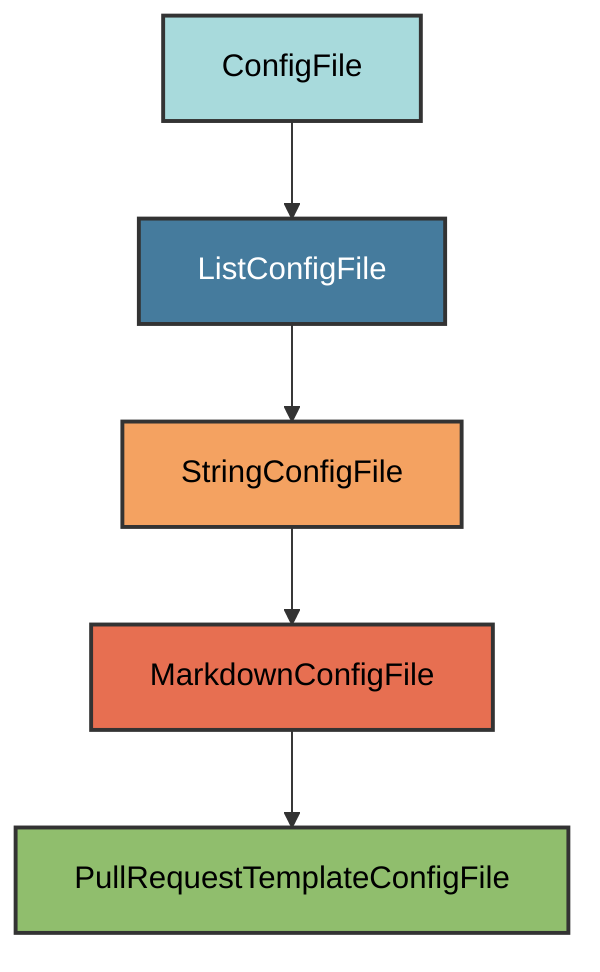

# Pull Request Template Configuration

The `PullRequestTemplateConfigFile` manages the
`.github/pull_request_template.md` file.

## Overview

Creates a pull request template that:

- Uses a minimal template inspired by React's PR template
- Contains Summary and Test Plan sections
- Includes reminder comments for best practices
- Located in `.github/` directory

## Inheritance



**Inherits from**: `MarkdownConfigFile`

## File Location

**Path**: `.github/pull_request_template.md`

## Template Sections

| Section | Purpose |
|---------|---------|
| Header Comment | Reminders for summary, title, and issue references |
| Summary | Purpose of the change and why |
| Test Plan | How the change was tested |

## Automatic Creation

```bash
uv run pyrig mkroot
```

## Validation Logic

File must exist and contain text. Users can customize the template.

## Why This Template?

The template follows a minimal approach:

- **2 sections only**: Summary and Test Plan
- **Short enough to fill out**: Developers actually complete it
- **Universal**: Works for any project type
- **Best practice reminders**: Comment header prompts for title and issue refs

## See Also

- [GitHub Docs: PR Templates](https://docs.github.com/en/communities/using-templates-to-encourage-useful-issues-and-pull-requests/creating-a-pull-request-template-for-your-repository) <!-- rumdl-disable-line MD013 -->
