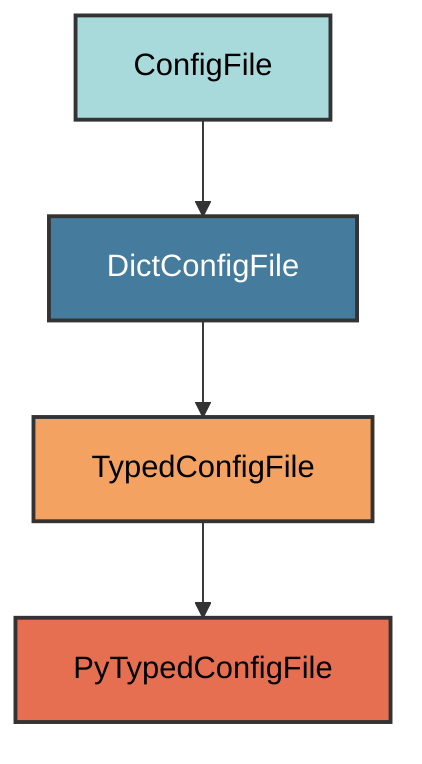

# py.typed Configuration

The `PyTypedConfigFile` manages the `py.typed` marker file for PEP 561
compliance.

## Overview

Creates a py.typed file that:

- Indicates the package supports type checking (PEP 561)
- Located in the source package directory
- Always empty (just a marker file)
- Enables type checkers like ty to use the package's type hints
- Required for distributing type information

## Inheritance



**Inherits from**: `TypedConfigFile` (via `DictConfigFile`)

**What this means**:

- Empty file (no content)
- Extension is `.typed`
- Located in package directory
- Marker for type checkers

## File Location

**Path**: `{package_name}/py.typed` (e.g., `myapp/py.typed`)

**Extension**: `.typed` - Type marker file.

**Filename**: `py` - Combined with extension: `py.typed`.

**Path transformation**: Uses package name from pyproject.toml.

## How It Works

### Automatic Generation

When initialized via `uv run pyrig mkroot`, the file is created:

1. **Package detection**: Reads package name from pyproject.toml
2. **File creation**: Creates empty `{package_name}/py.typed`
3. **Type checking**: Enables type checkers to use the package's type hints

### Empty File

The file is always empty - it's just a marker. Any attempt to add content will
be rejected during validation.

## Usage

### Automatic Creation

```bash
uv run pyrig mkroot
```

### File Content

```text
(empty file)
```

The file has no content - it's just a marker.

### What It Enables

With `py.typed` present:

```python
# Users can install your package and get type checking
pip install myapp

# Type checkers will use your package's type hints
from myapp import some_function

# Type checker knows the types
result: str = some_function()  # Type checked!
```

Without `py.typed`:

```python
# Type checkers treat your package as untyped
from myapp import some_function

# Type checker doesn't know the types
result = some_function()  # No type checking
```

## PEP 561 Compliance

The `py.typed` file indicates your package follows
[PEP 561](https://peps.python.org/pep-0561/):

- **Inline type hints**: Your package includes type annotations
- **Distributable types**: Type information is included in the package
- **Type checker support**: Tools like ty can use your types

## Best Practices

1. **Keep it empty**: Don't add content to py.typed
2. **Commit the file**: Include py.typed in version control
3. **Add type hints**: Ensure your code has proper type annotations
4. **Test with type checkers**: Run ty on your package to verify types
5. **Include in package**: Ensure py.typed is included in distributions

## Package Distribution

Make sure `py.typed` is included in your package:

```toml
# pyproject.toml
[tool.setuptools.package-data]
myapp = ["py.typed"]
```

Pyrig handles this automatically in the build configuration.
