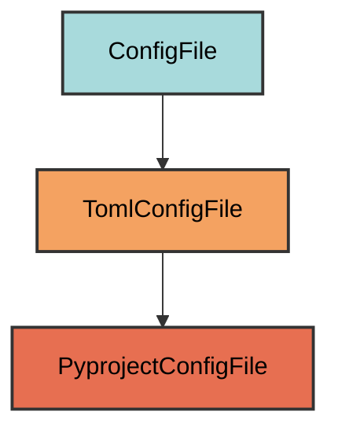
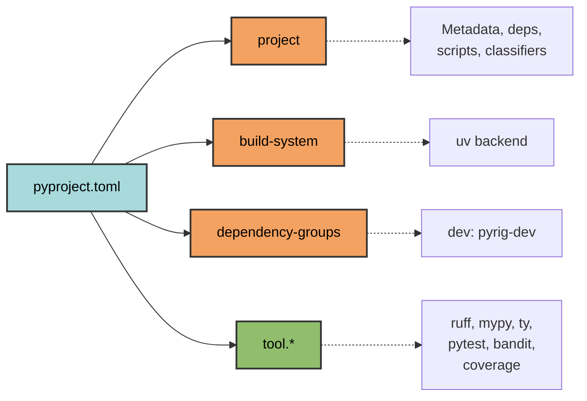

# pyproject.toml Configuration

The `PyprojectConfigFile` manages the `pyproject.toml` file - the central configuration for Python projects.

## Overview

Manages pyproject.toml with:
- Project metadata (name, version, description, authors)
- Dependencies (runtime and dev)
- Build system configuration (uv)
- Tool configurations (ruff, mypy, pytest, bandit, ty)
- CLI entry points
- Python version requirements

## Inheritance



**Inherits from**: `TomlConfigFile`

**What this means**:
- TOML format using tomlkit (preserves formatting and comments)
- Subset validation (user can add, not remove)
- Intelligent merging of configurations
- Dependency normalization on dump

## File Location

**Path**: `pyproject.toml` (project root)

**Extension**: `.toml` - TOML configuration file.

## Configuration Sections



### Project Metadata

```toml
[project]
name = "my-app"                    # Project name (from directory)
version = "0.1.0"                 # Semantic version
description = ""                  # Project description
readme = "README.md"              # README file
authors = [{name = "Owner"}]      # From git repo owner in remote or git config user.name
license-files = ["LICENSE"]       # License file
requires-python = ">=3.12"        # Minimum Python version
classifiers = [                   # PyPI classifiers
    "Programming Language :: Python :: 3.12",
    "Programming Language :: Python :: 3.13",
    # continues up to the latest Python version allowed by requires-python and found on python.org
]
dependencies = [                  # Runtime dependencies
    "pyrig>=2.2.29",
    # User dependencies (sorted)
]
```

**Why**: Standard Python packaging metadata for PyPI distribution.

### CLI Entry Points

```toml
[project.scripts]
my-app = "pyrig.dev.cli.cli:main"      # CLI command: my-app, but pyrig handles the calling of the main function in cli.py of pyrig
```

**Why**: Creates executable command when package is installed, so that you can call your code via `uv run my-app <command>`

### Dependencies

```toml

[dependency-groups]
dev = [                           # Development dependencies
    "pyrig-dev",                  # Pyrig development tools (auto-added)
    # User dev dependencies (sorted)
]
```

**Why**: 
- `dependencies`: Required for package to run
- `dev`: Only needed for development (testing, linting, etc.)
- `pyrig-dev` auto-added to ensure pyrig tools available

### Build System

```toml
[build-system]
requires = ["uv_build"]           # Build backend
build-backend = "uv_build"        # Use uv for building

[tool.uv.build-backend]
module-name = "my_app"             # Package name (underscores)
module-root = ""                  # Package at project root
```

**Why**: Uses uv's fast build backend instead of setuptools.

### Ruff (Linter & Formatter)

```toml
[tool.ruff]
exclude = [".*"]  # Ignore dotfiles and folders

[tool.ruff.lint]
select = ["ALL"]                  # Enable ALL rules
ignore = [
    "D203",                       # one-blank-line-before-class (conflicts with D211)
    "D213",                       # multi-line-summary-second-line (conflicts with D212)
    "COM812",                     # missing-trailing-comma (conflicts with formatter)
    "ANN401",                     # any-type (allow typing.Any)
]
fixable = ["ALL"]                 # Auto-fix all rules
per-file-ignores = {
    "**/tests/**/*.py" = ["S101"]  # Allow assert in tests and dev/tests/fixtures
}

[tool.ruff.lint.pydocstyle]
convention = "google"             # Use Google docstring style
```

**Why**:
- `select = ["ALL"]`: Maximum code quality enforcement
- Minimal ignores: Only conflicts and practical exceptions
- `fixable = ["ALL"]`: Auto-fix on `ruff check --fix`
- `S101` in tests: Pytest requires assert statements
- Google convention: Consistent docstring format

### ty (Type Checker)

```toml
[tool.ty]
terminal.error-on-warning = true  # Treat warnings as errors
```

**Why**: Strict type checking - no warnings allowed.

### MyPy (Static Type Checker)

```toml
[tool.mypy]
strict = true                     # Enable all strict checks
warn_unreachable = true           # Warn about unreachable code
show_error_codes = true           # Show error codes in output
files = "."                       # Check all files in the project from root
```

**Why**:
- `strict = true`: Maximum type safety (no implicit Any, no untyped defs, etc.)
- `warn_unreachable`: Catch dead code
- `show_error_codes`: Easier to configure ignores
- `files = "."`: Check entire project

### Pytest (Test Runner)

```toml
[tool.pytest.ini_options]
testpaths = ["tests"]             # Test directory
addopts = "--cov=my_app --cov-report=term-missing --cov-fail-under=90"
```

**Why**:
- `testpaths`: Where to find tests
- `--cov=my_app`: Measure code coverage
- `--cov-report=term-missing`: Show uncovered lines
- `--cov-fail-under=90`: Require 90% coverage minimum

### Bandit (Security Scanner)

```toml
[tool.bandit]
exclude_dirs = [".*"]             # Ignore dotfiles

[tool.bandit.assert_used]
skips = ["*/tests/*.py"]          # Allow assert in tests
```

**Why**:
- Security scanning for common vulnerabilities
- Allow assert in tests (required by pytest)
- Ignore dotfiles (e.g., .experiment.py)

## Dynamic Configuration

Several values are determined automatically:

| Setting | Source |
|---------|--------|
| `name` | Current directory name |
| `authors` | Git repo owner |
| `requires-python` | Existing value or `>=3.12` |
| `classifiers` | Generated from `requires-python` |
| `scripts` | Package name → CLI entry point |
| `module-name` | Package name (hyphens → underscores) |

## Dependency Management

### Normalization

When dumping, pyrig normalizes dependencies:
- Removes version specifiers for comparison
- Merges user deps with standard dev deps
- Sorts and deduplicates
- Preserves user-specified versions

### Standard Dev Dependencies

Pyrig automatically adds:
- `pyrig-dev`: Development tools

## Usage

### Automatic Creation

```bash
uv run pyrig mkroot
```

### Adding Dependencies

```bash
# Runtime dependency
uv add some-package

# Dev dependency
uv add --dev some-dev-package
```

### Updating Configuration

Edit pyproject.toml manually, then:

```bash
uv run pyrig mkroot  # Validates and merges changes
```

## Best Practices

1. **Don't remove pyrig settings**: You can add, but don't remove required configs
2. **Use uv for dependencies**: Don't manually edit dependency lists
3. **Keep coverage high**: 90% minimum enforced by pytest
4. **Follow strict typing**: MyPy strict mode catches bugs early
5. **Let ruff auto-fix**: Run `ruff check --fix` before committing


