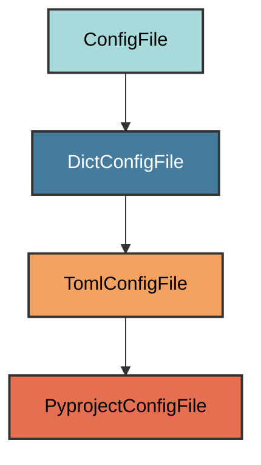
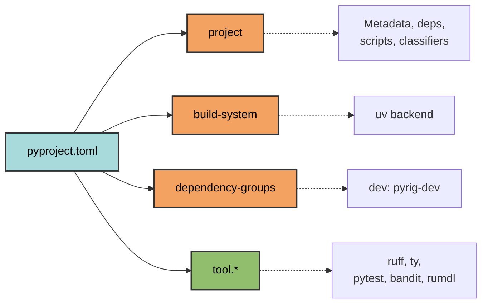

# pyproject.toml Configuration

The `PyprojectConfigFile` manages the `pyproject.toml` file - the central
configuration for Python projects.

## Overview

Manages pyproject.toml with:

- Project metadata (name, version, description, authors)
- Dependencies (runtime and dev)
- Build system configuration (uv)
- Tool configurations (ruff, ty, pytest, bandit, rumdl)
- CLI entry points
- Python version requirements

## Inheritance



**Inherits from**: `TomlConfigFile` (which extends `DictConfigFile`)

**What this means**:

- TOML format using tomlkit (preserves formatting and comments)
- Subset validation (user can add, not remove)
- Intelligent merging of configurations
- Dependency normalization on dump

## File Location

**Path**: `pyproject.toml` (project root)

**Extension**: `.toml` - TOML configuration file.

## Configuration Sections



### Project Metadata

```toml
[project]
name = "my-app"                    # Project name (from directory)
version = "0.1.0"                 # Semantic version
description = ""                  # Project description
readme = "README.md"              # README file
authors = [{name = "Owner"}]      # From git remote or git config user.name
maintainers = [{name = "Owner"}]  # From git remote or git config user.name
license = "MIT"                   # Auto-detected from LICENSE with SPDX
license-files = ["LICENSE"]       # License file
requires-python = ">=3.12"        # Minimum Python version
classifiers = [                   # PyPI classifiers
    "Programming Language :: Python :: 3.12",
    "Programming Language :: Python :: 3.13",
    # continues up to the latest Python version allowed 
    # by requires-python and found on python.org
    "Operating System :: OS Independent",
    "Typing :: Typed",
]
keywords = []                   # PyPI search keywords (user-defined, see below)
dependencies = [                # Runtime dependencies
    "pyrig",
    # User dependencies (sorted, normalized)
]

[project.urls]
Homepage = "https://github.com/owner/my-app"      # Repository URL
Documentation = "https://owner.github.io/my-app"  # GitHub Pages URL
Source = "https://github.com/owner/my-app"        # Source code URL
Issues = "https://github.com/owner/my-app/issues" # Issue tracker
Changelog = "https://github.com/owner/my-app/releases" # Release notes
```

**Note**: We recommend always using the latest version of pyrig (and all
dependencies). Pyrig follows semantic versioning and maintains backward
compatibility within major versions.

**Why**: Standard Python packaging metadata for PyPI distribution with enhanced
discoverability through project URLs and auto-detected license.

### Keywords

pyrig generates an **empty `keywords` list** as a placeholder. You should fill
this with 5-8 relevant search terms that help users discover your project on
PyPI.

**Best Practices**:

- Use 5-8 keywords (optimal for discoverability)
- Include primary use cases and features
- Use hyphenated compound terms (e.g., "task-runner", "cli-framework")
- Mix broad terms (e.g., "automation") with specific ones (e.g., "ci-cd")
- Avoid redundancy with classifiers (don't repeat "python", "testing" if already
  in classifiers)
- Focus on what users would actually search for

**Note**: You only need keywords if you plan to publish your package to PyPI and
add a `PYPI_TOKEN` to your repository secrets.

**Example for a web framework**:

```toml
keywords = ["web-framework", "async", "api", "rest", "microservices"]
```

**Example for a CLI tool**:

```toml
keywords = ["cli", "automation", "task-runner", "productivity", "devops"]
```

**Example for a data processing library**:

```toml
keywords = ["data-processing", "etl", "pipeline", "analytics", "big-data"]
```

### CLI Entry Points

```toml
[project.scripts]
# note the entry point is invoked via pyrig and not directly via your project 
# as pyrig handles the CLI infrastructure and discovers your CLI commands.
my-app = "pyrig.rig.cli.cli:main"      # Creates CLI command: my-app
```

**Why**: Creates an executable command when the package is installed. The entry
point references pyrig's CLI infrastructure, which automatically discovers and
runs your project's subcommands. You can invoke it via `uv run my-app <command>`
or just `my-app <command>` after activating the project's virtual environment.

### Dependencies

```toml
[project]
dependencies = [   # Runtime dependencies (preserved from existing config)
    "pyrig",
    # User dependencies (sorted, normalized)
]

[dependency-groups]
dev = [                           # Development dependencies
    "pyrig-dev",                  # Pyrig development tools (auto-added)
    # User dev dependencies (sorted)
]
```

**Why**:

- `dependencies`: Required for package to run
(read from existing pyproject.toml, normalized and sorted)
- `dev`: Only needed for development (testing, linting, etc.)
- `pyrig-dev` auto-added to dev dependencies to ensure development tools are
  available

### Build System

```toml
[build-system]
requires = ["uv_build"]           # Build backend
build-backend = "uv_build"        # Use uv for building

[tool.uv.build-backend]
module-name = "my_app"             # Package name (underscores)
module-root = ""                  # Package at project root
```

**Why**: Uses uv's fast build backend instead of setuptools.

### Ruff (Linter & Formatter)

```toml
[tool.ruff]
exclude = [".*"]  # Ignore dotfiles and folders

[tool.ruff.lint]
select = ["ALL"]                  # Enable ALL rules
ignore = [
    "D203",                       # (conflicts with D211)
    "D213",                       # (conflicts with D212)
    "COM812",                     # (conflicts with formatter)
    "ANN401",                     # any-type (allow typing.Any)
]
fixable = ["ALL"]                 # Auto-fix all rules

[tool.ruff.lint.per-file-ignores]
"**/tests/**/*.py" = ["S101"]     # Allow assert in tests

[tool.ruff.lint.pydocstyle]
convention = "google"             # Use Google docstring style
```

**Why**:

- `select = ["ALL"]`: Maximum code quality enforcement
- Minimal ignores: Only conflicts and practical exceptions
- `fixable = ["ALL"]`: Auto-fix on `ruff check --fix`
- `S101` in tests: Pytest requires assert statements
- Google convention: Consistent docstring format

### ty (Type Checker)

```toml
[tool.ty.terminal]
error-on-warning = true  # Treat warnings as errors
```

**Why**: Strict type checking - no warnings allowed.

### Pytest (Test Runner)

```toml
[tool.pytest.ini_options]
testpaths = ["tests"]             # Test directory
addopts = "--cov=my_app --cov-report=term-missing --cov-fail-under=90"
```

**Why**:

- `testpaths`: Where to find tests
- `--cov=my_app`: Measure code coverage
- `--cov-report=term-missing`: Show uncovered lines
- `--cov-fail-under=90`: Require 90% coverage minimum

### Bandit (Security Scanner)

```toml
[tool.bandit]
exclude_dirs = [".*"]             # Ignore dotfiles

[tool.bandit.assert_used]
skips = ["*/tests/*.py"]          # Allow assert in tests
```

**Why**:

- Security scanning for common vulnerabilities
- Allow assert in tests (required by pytest)
- Ignore dotfiles (e.g., .scratch.py)

### rumdl (Markdown Linter)

```toml
[tool.rumdl]
respect_gitignore = true          # Skip gitignored files
```

**Why**: Markdown linting that respects your gitignore patterns.

## Dynamic Configuration

Several values are determined automatically:

| Setting           | Source                                                                              |
| ----------------- | ----------------------------------------------------------------------------------- |
| `name`            | Current directory name                                                              |
| `authors`         | Git repo owner from remote URL or `git config user.name`                            |
| `maintainers`     | Git repo owner from remote URL or `git config user.name`                            |
| `license`         | Auto-detected from LICENSE file using spdx-matcher library                          |
| `requires-python` | Existing value or `>=3.12` (default)                                                |
| `classifiers`     | Generated from `requires-python` + OS Independent + Typing :: Typed                 |
| `keywords`        | Empty list (user should fill with 5-8 search terms for PyPI)                        |
| `urls`            | Auto-generated from git remote (Homepage, Documentation, Source, Issues, Changelog) |
| `scripts`         | Package name → pyrig CLI entry point                                                |
| `module-name`     | Package name (hyphens → underscores)                                                |

## Dependency Management

### Normalization

When dumping, pyrig normalizes dependencies:

- Removes version specifiers for comparison
- Merges user deps with standard dev deps
- Sorts and deduplicates
- Preserves user-specified versions

### Standard Dev Dependencies

Pyrig automatically adds:

- `pyrig-dev`: Development tools

## Usage

### Automatic Creation

```bash
uv run pyrig mkroot
```

### Adding Dependencies

```bash
# Runtime dependency
uv add some-package

# Dev dependency
uv add --group dev some-dev-package
```

### Updating Configuration

Edit pyproject.toml manually, then:

```bash
uv run pyrig mkroot  # Validates and merges changes
```

## Best Practices

1. **Don't remove pyrig settings**: You can add, but don't remove required
   configs
2. **Use uv for dependencies**: Don't manually edit dependency lists
3. **Keep coverage high**: 90% minimum enforced by pytest
4. **Follow strict typing**: ty strict mode catches bugs early
5. **Let ruff auto-fix**: Run `uv run ruff check --fix` before committing
