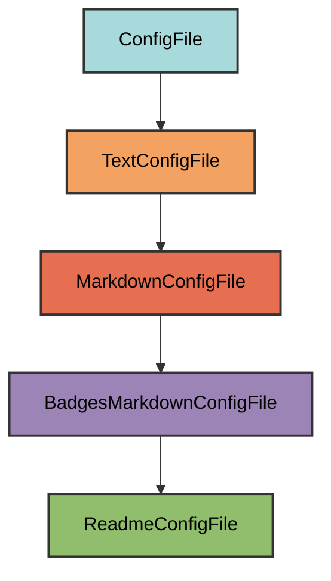

# README.md Configuration

The `ReadmeConfigFile` manages the `README.md` file, which serves as the homepage for your GitHub repository.

## Overview

Creates a README file that:
- Uses the project name as the header
- Includes all standard badges (tooling, code quality, package info, CI/CD, documentation)
- Displays the project description from `pyproject.toml`
- Provides a professional first impression for repository visitors
- Allows users to add custom content below the header
- Is always required (never marked as unwanted)

## Inheritance



**Inherits from**: `BadgesMarkdownConfigFile`

**What this means**:
- Markdown file format (`.md` extension)
- Automatically generates badges from project metadata
- Includes project name and description
- Validation checks for required elements (badges, description, project name)
- Users can add content after the generated header
- File is considered correct if it contains all required elements

## File Location

**Path**: `README.md` (project root)

**Extension**: `.md` - Standard Markdown extension.

**Filename**: `README` - The standard repository documentation file recognized by GitHub, GitLab, and other platforms.

**Special filename handling**: `get_filename()` returns `"README"` (uppercase) to follow convention.

## How It Works

### Automatic Generation

When initialized via `uv run myapp mkroot`, the `README.md` file is created with:

1. **Project name header**: Uses project name from `pyproject.toml`
2. **Badge sections**: Five categories of badges (tooling, code quality, package info, CI/CD, documentation)
3. **Project description**: Quoted description from `pyproject.toml`
4. **Horizontal rules**: Visual separators for clean layout

### Generated Content

For a project named "myapp" with description "A sample application":

```markdown
# myapp

<!-- tooling -->
[](https://github.com/Winipedia/pyrig)
[](https://github.com/astral-sh/uv)
[](https://podman.io/)
[](https://pre-commit.com/)
[](https://www.mkdocs.org/)
<!-- code-quality -->
[](https://github.com/astral-sh/ruff)
[](https://github.com/astral-sh/ty)
[](https://mypy-lang.org/)
[](https://github.com/PyCQA/bandit)
[](https://pytest.org/)
[](https://codecov.io/gh/owner/myapp)
<!-- package-info -->
[](https://pypi.org/project/myapp/)
[](https://www.python.org/)
[](https://github.com/owner/myapp/blob/main/LICENSE)
<!-- ci/cd -->
[](https://github.com/owner/myapp/actions/workflows/health_check.yaml)
[](https://github.com/owner/myapp/actions/workflows/release.yaml)
<!-- documentation -->
[](https://owner.github.io/myapp)

---

> A sample application

---
```

### Content Generation Logic

The `ReadmeConfigFile` uses the parent class `BadgesMarkdownConfigFile.get_content_str()` directly without modification:

```python
# Inherited from BadgesMarkdownConfigFile
@classmethod
def get_content_str(cls) -> str:
    """Generate the README content with project header."""
    project_name = PyprojectConfigFile.get_project_name()
    badges = cls.get_badges()
    badges_str = ""
    for badge_category, badge_list in badges.items():
        badges_str += f"<!-- {badge_category} -->\n"
        badges_str += "\n".join(badge_list) + "\n"
    badges_str = badges_str.removesuffix("\n")
    description = PyprojectConfigFile.get_project_description()
    return f"""# {project_name}

{badges_str}

---

> {description}

---
"""
```

**Key behavior**:
- Uses project name as-is (unlike `IndexConfigFile` which adds " Documentation")
- Organizes badges by category with HTML comments
- Wraps description in blockquote
- Adds horizontal rules for visual separation

## Dynamic Configuration

The README adapts to your project automatically:

### Project Name

```python
PyprojectConfigFile.get_project_name()  # From pyproject.toml [project] name
```

Automatically uses your project name.

### Project Description

```python
PyprojectConfigFile.get_project_description()  # From pyproject.toml [project] description
```

Displays as a blockquote below the badges.

### Repository Information

```python
repo_owner, repo_name = get_repo_owner_and_name_from_git(check_repo_url=False)
```

Extracts from Git remote URL for badge links.

### Python Versions

```python
python_versions = PyprojectConfigFile.get_supported_python_versions()
joined_python_versions = "|".join(str(v) for v in python_versions)
```

Shows supported Python versions in the Python badge.

## Badge Categories

### 1. Tooling Badges

- **pyrig**: Built with pyrig
- **uv**: Package manager
- **Container**: Podman containerization
- **pre-commit**: Pre-commit hooks enabled
- **MkDocs**: Documentation generator

### 2. Code Quality Badges

- **ruff**: Linting and formatting
- **ty**: Type checking
- **mypy**: Static type checking
- **bandit**: Security scanning
- **pytest**: Testing framework
- **codecov**: Code coverage

### 3. Package Info Badges

- **PyPI**: Package version and link
- **Python**: Supported Python versions
- **License**: Project license

### 4. CI/CD Badges

- **CI**: Health check workflow status
- **CD**: Release workflow status

### 5. Documentation Badge

- **Documentation**: Link to GitHub Pages docs

## Usage

### Automatic Creation

The file is automatically created when you run:

```bash
uv run myapp mkroot
```

### Adding Custom Content

Simply add your content after the generated header:

```markdown
# myapp

<!-- badges here -->

---

> A sample application

---

## Installation

```bash
pip install myapp
```

## Quick Start

```python
from myapp import main

main()
```

## Features

- Feature 1
- Feature 2
- Feature 3

## Documentation

Full documentation is available at [https://owner.github.io/myapp](https://owner.github.io/myapp)

## Contributing

Contributions are welcome! Please see [CONTRIBUTING.md](CONTRIBUTING.md) for details.

## License

This project is licensed under the MIT License - see the [LICENSE](LICENSE) file for details.
```

The validation only checks that required elements exist, so you can add as much content as you want.

### Validation Logic

The `is_correct()` method checks:

```python
@classmethod
def is_correct(cls) -> bool:
    """Check if the README file is valid."""
    file_content = cls.get_file_content()
    badges = [badge for _group, badges in cls.get_badges().items() for badge in badges]
    all_badges_in_file = all(badge in file_content for badge in badges)
    description_in_file = PyprojectConfigFile.get_project_description() in file_content
    project_name_in_file = PyprojectConfigFile.get_project_name() in file_content
    return super().is_correct() or (
        all_badges_in_file and description_in_file and project_name_in_file
    )
```

**Required elements**:
1. All badges from all categories
2. Project description
3. Project name

**Flexible structure**: As long as these elements exist somewhere in the file, it's considered valid.

### Always Required

The `is_unwanted()` method always returns `False`:

```python
@classmethod
def is_unwanted(cls) -> bool:
    """Check if README is unwanted (always False)."""
    return False
```

This ensures `README.md` is never removed or skipped during project initialization.
We can not think of a possible reason why you would not want a README.md file, but in case you want to override this behavior, you can subclass `ReadmeConfigFile` and override `is_unwanted()` to return `True` and then empty the file.

## Best Practices

1. **Keep the header**: Don't remove the generated badges and description
2. **Add content below**: Append your README content after the horizontal rules
3. **Be concise**: README should be a quick overview, not full documentation
4. **Include essentials**: Installation, quick start, features, links to docs
5. **Update description**: Keep `pyproject.toml` description current
6. **Link to documentation**: Point readers to full docs for details
