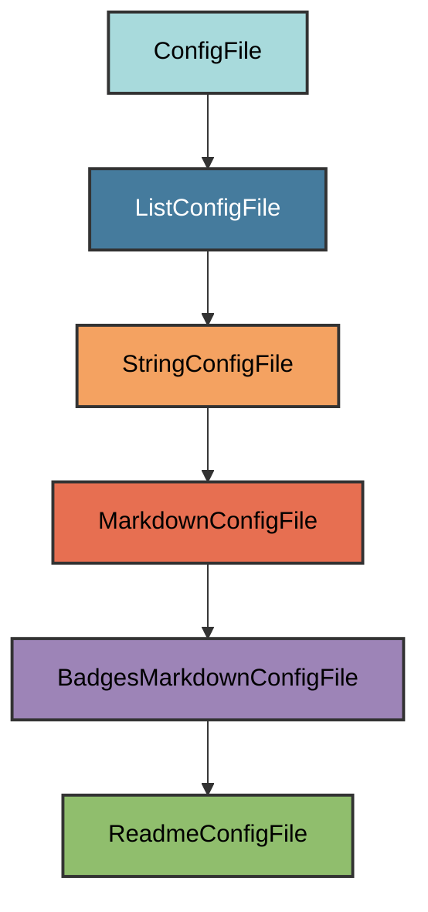

# README.md Configuration

The `ReadmeConfigFile` manages the `README.md` file, which serves as the
homepage for your GitHub repository.

## Overview

Creates a README file that:

- Uses the project name as the header
- Includes all standard badges (tooling, code quality, package info, CI/CD,
  documentation)
- Displays the project description from `pyproject.toml`
- Provides a professional first impression for repository visitors
- Allows users to add custom content below the header
- Is always required (never marked as unwanted)

## Inheritance



**Inherits from**: `BadgesMarkdownConfigFile`

**What this means**:

- Markdown file format (`.md` extension)
- Automatically generates badges from project metadata
- Includes project name and description
- Validation checks that all generated lines exist in the file
- Users can add content after the generated header
- File is considered correct if it contains all generated lines

## File Location

**Path**: `README.md` (project root)

**Extension**: `.md` - Standard Markdown extension.

**Filename**: `README` - The standard repository documentation file recognized
by GitHub, GitLab, and other platforms.

**Special filename handling**: `filename()` returns `"README"` (uppercase)
to follow convention.

## How It Works

### Automatic Generation

When initialized via `uv run pyrig mkroot`, the `README.md` file is created
with:

1. **Project name header**: Uses project name from `pyproject.toml`
2. **Badge sections**: Five categories of badges (tooling, code quality, package
   info, CI/CD, documentation)
3. **Project description**: Quoted description from `pyproject.toml`
4. **Horizontal rules**: Visual separators for clean layout

### Generated Content

The content contains several badges of the used tooling
and a description of the project extracted from the `pyproject.toml` file.

### Content Generation Logic

The `ReadmeConfigFile` inherits the `get_lines()` method from
`BadgesMarkdownConfigFile` without modification.

**Key behavior**:

- Uses project name as-is (unlike `IndexConfigFile` which adds " Documentation")
- Organizes badges by category with HTML comments
- Wraps description in blockquote
- Adds horizontal rules for visual separation

## Dynamic Configuration

The README adapts to your project automatically:

### Project Name

Automatically uses your project name from `pyproject.toml` `[project]` `name`
field.

### Project Description

Displays the project description from `pyproject.toml` `[project]` `description`
field as a blockquote below the badges.

### Repository Information

Extracts repository owner and name from Git remote URL for badge links.

### Python Versions

Shows supported Python versions from `pyproject.toml` `requires-python` field in
the Python badge (e.g., `3.10|3.11|3.12`).

## Badge Categories

Badges are organized into five categories: tooling, code quality, package info,
CI/CD, and documentation. See [Index.md](index_md.md) for the complete badge
list.

## Usage

### Automatic Creation

The file is automatically created when you run:

```bash
uv run pyrig mkroot
```

### Adding Custom Content

Simply add your content after the generated header.

The validation only checks that generated lines exist, so you can add as much
content as you want.

### Validation Logic

The validation (inherited from `StringConfigFile.is_correct()`) checks that the
README file contains all lines generated by `get_lines()`.

**What is validated**:

All lines from the generated content must exist somewhere in the file. This
includes the header, badges, horizontal rules, and description blockquote.

**Flexible structure**: As long as all generated lines exist somewhere in the
file, it's considered valid. You can add custom content anywhere.

### Always Required

The `README.md` file is always required and never marked as unwanted. This
ensures it's never removed or skipped during project initialization.

**Note**: We can't think of a reason why you would not want a README.md file,
but if you need to override this behavior, you can subclass `ReadmeConfigFile`
and override `is_unwanted()` to return `True`.

## Best Practices

1. **Keep the header**: Don't remove the generated badges and description
2. **Add content below**: Append your README content after the horizontal rules
3. **Be concise**: README should be a quick overview, not full documentation
4. **Include essentials**: Installation, quick start, features, links to docs
5. **Update description**: Keep `pyproject.toml` description current
6. **Link to documentation**: Point readers to full docs for details
