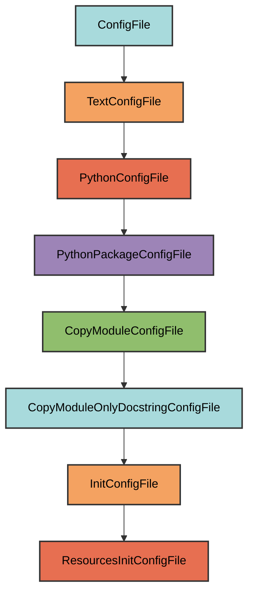

# resources/**init**.py Configuration

The `ResourcesInitConfigFile` manages the `dev/artifacts/resources/__init__.py` file.

## Overview

Creates a resources package that:

- Mirrors the structure of `pyrig.resources`
- Copies only the docstring from the source module
- Ensures the resources directory exists with proper package structure
- Provides a place for project resource files

## Inheritance



**Inherits from**: `InitConfigFile`

**What this means**:

- Creates `__init__.py` files for package initialization
- Copies only the docstring from `pyrig.resources`
- Automatically determines target path
- Ensures parent directory is a valid Python package

## File Location

**Path**: `{package_name}/resources/__init__.py`

**Source module**: `pyrig.resources`

**Path transformation**: `pyrig.resources` → `{package_name}.resources` → `{package_name}/resources/__init__.py`

## How It Works

### Automatic Generation

When initialized via `uv run pyrig mkroot`, the file is created with:

1. **Docstring copy**: Only the docstring from `pyrig.resources.__init__.py` is copied
2. **Package structure**: The `resources/` directory is created
3. **Package initialization**: Parent directories get `__init__.py` files

### Generated Content

```python
"""Resources package for managing project resource files."""
```

The file contains only the docstring, allowing you to add resource files to this directory.

## Usage

### Automatic Creation

```bash
uv run pyrig mkroot
```

### Purpose

This package is where you can add resource files for your project (templates, data files, etc.). Resources are bundled with your package and accessible at runtime.

See the [Resources documentation](../resources/index.md) for details on using the resources system.

## Best Practices

1. **Don't modify the docstring**: Keep the copied docstring intact
2. **Add resource files**: Place templates, data files, etc. in this directory
3. **Use get_resource_path**: Access resources using pyrig's resource utilities

